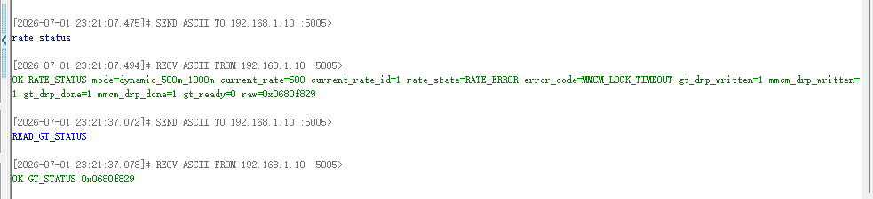
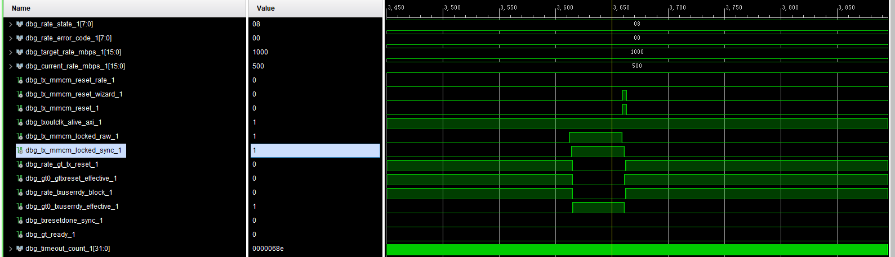
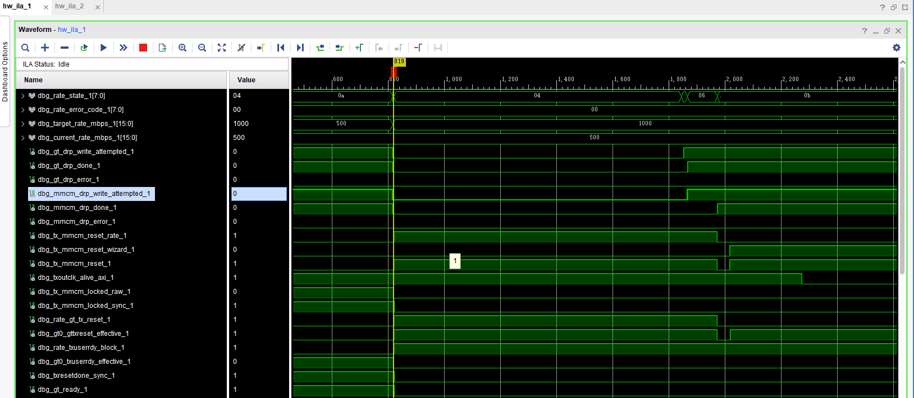
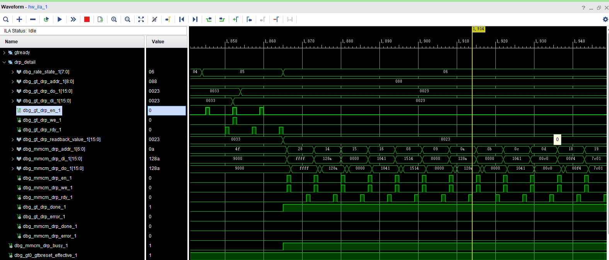
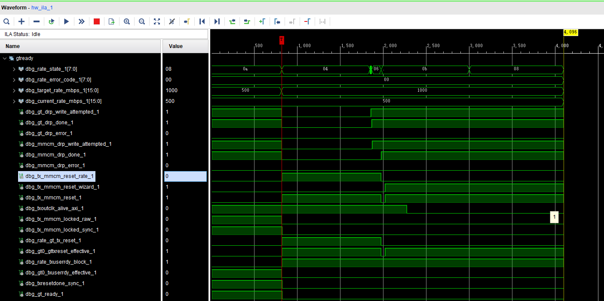
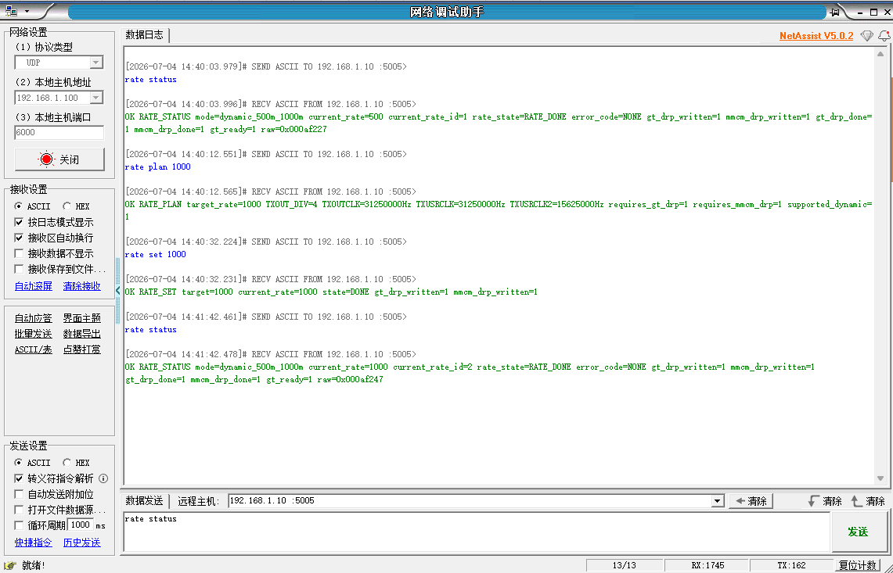
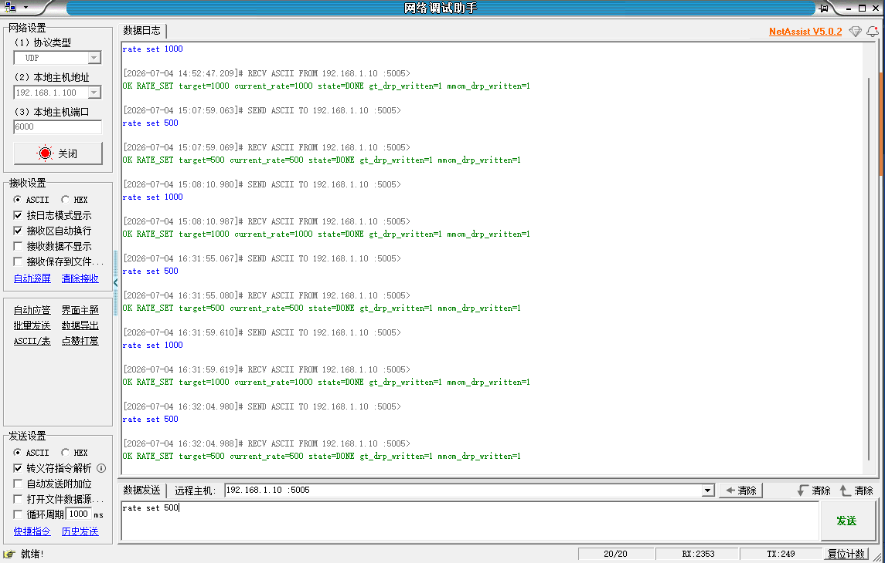

# 500M/1000M 动态切换 reset sequence 互锁定位与修复验证汇总报告

> 本报告为正式工程汇总报告，只整理既有 RTL 修复说明、Vivado 构建产物、ILA 截图与 UDP 截图证据。  
> 本次报告整理未修改 RTL、BD、XDC、Tcl、Vitis、ILA probe、DRP 参数或任何工程功能代码。

## 1. 背景与目标

本阶段目标是验证 `laser_tx` 在 500M 与 1000M 两档之间的真实动态切换能力，重点确认以下链路可以闭环：

```text
UDP rate set
-> rate controller
-> GT TXOUT_DIV DRP
-> MMCM DRP
-> reset release sequence
-> MMCM lock
-> GT txresetdone / gt_ready
-> current_rate 更新
-> UDP rate status 回读
```

本报告的技术主线为：

```text
初始 MMCM_LOCK_TIMEOUT
-> debug-only probe 增强
-> reset sequence 互锁定位
-> reset release sequence 修复
-> 500M→1000M ILA 代表性验证
-> 500M↔1000M UDP 往返循环验证
-> 当前边界声明
```

本报告中的“通过”仅对应当前 500M/1000M 两档动态切换在当前测试范围内通过；不表示任意速率、宽范围动态调速、长期稳定性、外部光口闭环、示波器或误码率验证已经完成。

## 2. 初始失败现象：MMCM_LOCK_TIMEOUT



首次 500M -> 1000M 真实动态切换失败时，UDP 与 ILA 证据显示切换流程已经被触发，GT/MMCM DRP 事务也已经执行，但系统最终停在 `MMCM_LOCK_TIMEOUT`：

- `rate set 1000` 已触发；
- GT DRP `done=1`；
- MMCM DRP `done=1`；
- CPLL lock 仍为 1；
- `txresetdone` / `gt_ready` 未恢复；
- `current_rate` 仍停留在 500；
- 最终 `error_code=MMCM_LOCK_TIMEOUT`。

该现象不能直接等价为“MMCM DRP 参数错误”。初始 ILA 只能看到 DRP attempted/done/error 与最终 error，尚不能区分：

- MMCM reset 是否真正释放；
- `tx_mmcm_reset` 是由 rate controller 拉高，还是由 GT Wizard 拉高；
- TXOUTCLK 是否仍然存在；
- MMCM locked raw 是否曾经拉高；
- locked raw 与 locked sync 是否一致；
- GT reset / TXUSERRDY 是否在 `RATE_WAIT_LOCK` 阶段仍被阻塞。

因此初始结论是：切换失败点位于 MMCM lock / GT ready 恢复阶段，但仅凭原始 ILA 不能优先判定为 DRP 参数错误。

## 3. debug-only probe 增强

为定位 `MMCM_LOCK_TIMEOUT` 根因，本阶段增加并观察了 debug-only probe。这些 probe 只用于 ILA 观测，不参与功能控制。

关键观测信号包括：

- `tx_mmcm_reset_rate`；
- `tx_mmcm_reset_wizard`；
- `tx_mmcm_reset`；
- `txoutclk_alive_axi`；
- `tx_mmcm_locked_raw`；
- `tx_mmcm_locked_sync`；
- `rate_gt_tx_reset`；
- `gt0_gttxreset_effective`；
- `rate_txuserrdy_block`；
- `gt0_txuserrdy_effective`；
- `txresetdone_sync`；
- `gt_ready`；
- GT/MMCM DRP `addr`、`di`、`do`、`en`、`we`、`rdy`、readback。

这些信号把 `RATE_WAIT_LOCK` 阶段拆成几个可验证条件：

```text
MMCM reset 是否释放
TXOUTCLK 是否存在
MMCM raw lock 是否出现
locked sync 是否正确
GT reset / TXUSERRDY 是否释放
GT ready 是否恢复
```

## 4. reset sequence 互锁定位



修复前在 `RATE_WAIT_LOCK` 阶段定位到以下因果链：

1. rate controller 已经释放 `rate_mmcm_reset`；
2. 但 `rate_gt_tx_reset` 仍为 1；
3. `soft_reset_tx_in = ctrl_rst | rate_gt_tx_reset`；
4. GT Wizard TX startup FSM 仍处于 reset 流程；
5. Wizard 输出 `tx_mmcm_reset_wizard=1`；
6. `tx_mmcm_reset = tx_mmcm_reset_wizard | tx_mmcm_reset_rate`；
7. 最终 `tx_mmcm_reset` 仍为 1；
8. MMCM 被 reset 按住，locked 无法稳定保持；
9. 状态机继续等待 `tx_mmcm_locked_sync`；
10. 最终进入 `MMCM_LOCK_TIMEOUT`。

结论：修复前失败更符合 reset sequence 互锁，而不是优先指向 MMCM DRP 参数本身错误。

## 5. reset release sequence 修复

修复方向不是修改 MMCM DRP 参数，而是调整 GT/MMCM DRP 完成后的 reset release 顺序。

修复后的核心顺序为：

1. GT/MMCM DRP 写完后，释放 `rate_gt_tx_reset`；
2. 让 GT Wizard TX startup FSM 有机会释放 `tx_mmcm_reset_wizard`；
3. 保持 `rate_txuserrdy_block=1`，避免 MMCM lock 前过早释放 TXUSERRDY；
4. 等待 MMCM reset 释放窗口；
5. 等待 `tx_mmcm_locked_raw` / `tx_mmcm_locked_sync` 稳定；
6. MMCM locked 后释放 `rate_txuserrdy_block`；
7. 最后等待 `txresetdone_sync` / `gt_ready`。

这次修复的核心原则是：

```text
不要在等待 MMCM lock 时继续通过 GT reset 路径间接按住 Wizard 的 MMCM reset；
同时不要在 MMCM lock 稳定前过早释放 TXUSERRDY。
```

## 6. 修复后 500M→1000M ILA 代表性验证

### 6.1 状态机过程总览



该图展示修复后状态机从切换请求进入 GT/MMCM DRP、等待 lock，并最终进入完成阶段。可以看到 `target_rate_mbps` 变为 1000，`rate_state` 走过动态切换流程，GT/MMCM DRP attempted/done 有动作，`error_code` 保持 0，最终 `current_rate_mbps` 更新到 1000。

结论：状态机没有再停在原先的 timeout 路径上，切换流程能够推进到完成状态。

### 6.2 GT/MMCM DRP 细节



该图展示 GT DRP 与 MMCM DRP 写流程。GT DRP 与 MMCM DRP 的 `addr/di/do/en/we/rdy` 均有实际动作，`done=1` 且 `error=0`。这说明 DRP 事务已发生并完成。

结论：修复后成功不是绕过 DRP，而是在 DRP 事务完成后通过正确 reset release sequence 恢复 lock/ready。

### 6.3 500M→1000M 修复后成功状态



图 6-1 展示一次代表性 500M→1000M 正向切换完成后的内部硬件状态。图中 `target_rate_mbps=current_rate_mbps=1000`，GT/MMCM DRP `done=1` 且 `error=0`，`tx_mmcm_reset_rate`、`tx_mmcm_reset_wizard`、`tx_mmcm_reset` 均为 0，`txoutclk_alive_axi=1`，`tx_mmcm_locked_raw/sync=1`，`gt0_txuserrdy_effective=1`，`txresetdone_sync=1`，`gt_ready=1`。

结论：该 ILA 图证明 500M→1000M 正向切换的 DRP、reset release、TXOUTCLK alive、MMCM lock、TXUSERRDY、TX reset done 和 GT ready 链路已经形成代表性闭环。

## 7. UDP 证据：软件状态与硬件状态对应

### 7.1 500M→1000M 单次 rate set/status



该图对应 500M→1000M 单次切换后的 UDP 状态回读。`rate set 1000` 与后续 `rate status` 显示目标速率和当前速率均为 1000，`rate_state=RATE_DONE` / `DONE`，`error_code=NONE`，`gt_ready=1`，并且 GT/MMCM DRP written 标志已置位。

结论：单次 500M→1000M 的 UDP 软件状态与第 6 节 ILA 硬件观测一致，说明软件可见状态没有提前假成功，而是在硬件 ready 后完成 current_rate 更新。

### 7.2 500M↔1000M 往返循环 UDP 验证



图 7-1 展示通过 UDP 交替执行 `rate set 1000`、`rate status`、`rate set 500`、`rate status` 后的状态验证结果。当前测试次数内，每次切换后 `current_rate` 与目标速率一致，`rate_state=RATE_DONE`，`error_code=NONE`，`gt_ready=1`。

结论：在当前测试次数内，500M→1000M、1000M→500M 以及多次往返循环均能回到 `RATE_DONE / error_code=NONE / gt_ready=1`。

### 7.3 ILA 与 UDP 证据关系

本阶段证据分工如下：

- 500M→1000M ILA 代表性图证明硬件内部 DRP、reset release、MMCM lock、GT ready 链路闭环；
- 500M→1000M 单次 UDP 图证明软件状态与该硬件状态一致；
- 500M↔1000M UDP 往返循环图证明当前测试次数内正向、反向、多次循环均可回到成功状态。

上述证据可以支撑当前 500M/1000M 双速率动态切换功能验证通过，但不能扩大为任意速率、宽范围动态调速、长期稳定性、外部光口闭环或示波器/误码率验证完成。

## 8. 修改前后对照表

| 项目 | 修复前 | 修复后 | 说明 |
|---|---|---|---|
| `tx_mmcm_reset_wizard` | 在 `RATE_WAIT_LOCK` 阶段保持为 1 | 成功状态为 0 | Wizard 不再持续按住 MMCM reset |
| `tx_mmcm_reset` | 仍为 1，MMCM 被 reset 按住 | 成功状态为 0 | MMCM reset 已释放 |
| `txoutclk_alive_axi` | 已观察到 alive，但 reset/lock 链路未闭环 | 为 1 | TXOUTCLK 存在，支撑 MMCM lock |
| `tx_mmcm_locked_sync` | 不能稳定满足等待条件，最终 timeout | 为 1 | MMCM lock 同步状态恢复 |
| `rate_gt_tx_reset` | `RATE_WAIT_LOCK` 阶段仍可能保持为 1 | 为 0 | 修复后先释放 GT reset 路径 |
| `rate_txuserrdy_block` | reset/lock 释放顺序耦合不清 | 最终为 0 | lock 稳定后释放 TXUSERRDY block |
| `gt0_txuserrdy_effective` | 为 0，GT TX user ready 未释放 | 为 1 | TXUSERRDY 有效恢复 |
| `txresetdone_sync` | 未恢复 | 为 1 | GT TX reset done 恢复 |
| `gt_ready` | 为 0 | 为 1 | GT ready 恢复 |
| `current_rate` | 停留在 500 | 可更新到 1000；反向可回到 500 | current_rate 在 ready 后更新 |
| UDP `rate_state` | 失败状态，`MMCM_LOCK_TIMEOUT` | `RATE_DONE` / `DONE` | 软件状态与硬件成功状态一致 |
| `error_code` | `MMCM_LOCK_TIMEOUT` | `NONE` / 0 | 当前测试未再报 MMCM lock timeout |

## 9. Timing / QoR / bit / LTX 结果

本节引用已有 Vivado 报告结果，不重新运行综合/实现。

### 9.1 Implementation / bitstream 状态

根据 `impl1_status_summary.txt`：

```text
impl_1_STATUS=write_bitstream Complete!
impl_1_PROGRESS=100%
bit_exists=1
ltx_exists=1
```

对应 bit/LTX 已生成：

```text
reports/dynamic_rate_500m_1000m/artifacts/laser_tx_board_top_dynamic_500m_1000m.bit
reports/dynamic_rate_500m_1000m/artifacts/laser_tx_board_top_dynamic_500m_1000m.ltx
```

### 9.2 Timing summary

根据 `impl1_timing_summary.rpt`：

```text
All user specified timing constraints are met.
```

| Metric | Result | 说明 |
|---|---:|---|
| Setup WNS | 7.029 ns | setup timing 通过 |
| Setup TNS | 0.000 ns | 无 setup 总违例 |
| Setup failing endpoints | 0 | 无 setup 失败端点 |
| Hold WHS | 0.042 ns | hold timing 通过 |
| Hold THS | 0.000 ns | 无 hold 总违例 |
| Hold failing endpoints | 0 | 无 hold 失败端点 |
| Pulse width WPWS | 3.358 ns | pulse width timing 通过 |
| Pulse width failing endpoints | 0 | 无 pulse width 失败端点 |

该 timing 结果只说明当前实现满足已约束时序；它不等价于长期硬件稳定性，也不证明未覆盖速率的动态切换可用。

### 9.3 Utilization / QoR 摘要

根据 `impl1_utilization.rpt`：

| Resource | Used | Available | Utilization |
|---|---:|---:|---:|
| Slice LUTs | 22527 | 277400 | 8.12% |
| Slice Registers | 21527 | 554800 | 3.88% |
| Block RAM Tile | 61 | 755 | 8.08% |
| DSPs | 0 | 2020 | 0.00% |
| BUFGCTRL | 6 | 32 | 18.75% |
| MMCME2_ADV | 1 | 8 | 12.50% |
| PLLE2_ADV | 0 | 8 | 0.00% |

QoR 结论：当前 500M/1000M 双速率动态切换实现资源占用较低，时序满足约束。后续如果扩展更多速率、更多 DRP profile、更多 ILA probe 或更复杂的软件状态管理，需要重新评估 timing、resource 和 debug hub 负载。

## 10. 当前边界声明

本报告证明当前阶段 500M/1000M 两档动态切换在当前测试范围内通过，证据由两部分组成：

1. ILA 代表性图证明一次 500M→1000M 内部硬件链路已经闭环；
2. UDP 往返循环图证明当前测试次数内 500M→1000M、1000M→500M 以及多次往返循环的软件状态结果正常。

不能扩大为：

- 任意速率动态切换完成；
- 宽范围动态调速完成；
- 长期稳定性验证完成；
- 外部光口闭环验证完成；
- 示波器验证完成；
- 误码率验证完成；
- AD9528 动态时钟树完成；
- FIFO / 预展开架构完成；
- 任意 direct pattern 长度支持。

## 11. 下一步建议

建议后续按以下顺序继续推进：

1. 冻结当前 500M/1000M 成功基线，归档 bit/LTX、timing、debug core report、ILA 图和 UDP 图；
2. 继续扩大 `500M <-> 1000M` 循环次数，形成更长时间的稳定性记录；
3. 如后续需要更高等级硬件证据，可补充 1000M→500M 的 ILA 代表性波形；但当前阶段收口以 500M→1000M ILA 代表性图 + 500M↔1000M UDP 循环图作为主要证据；
4. 对每次切换记录 `target_rate`、`current_rate`、reset、lock、TXUSERRDY、`txresetdone`、`gt_ready`、`error_code`；
5. 在进入更多速率前，先把 500/1000 rate controller 结构整理为 profile table；
6. 不要提前声明宽范围动态调速、外部光口闭环或示波器/误码率验证完成。

## 12. 相关路径

### 12.1 图片路径

| 类别 | 路径 | 状态 |
|---|---|---|
| 修复前 UDP timeout 图 | `docs/images/dynamic_rate/udp_status/udp_rate_status_mmcm_lock_timeout_500_to_1000.png` | 存在 |
| 修复前 WAIT_LOCK 互锁图 | `docs/images/dynamic_rate/500_to_1000_mmcm_lock_timeout/ila_500_to_1000_wait_lock_mmcm_reset_wizard_high.png` | 存在 |
| 修复后状态机过程总览图 | `docs/images/dynamic_rate/500_to_1000_reset_sequence_fix/ila_500_to_1000_after_fix_overview_state_sequence.png` | 存在 |
| 修复后 DRP 细节图 | `docs/images/dynamic_rate/500_to_1000_reset_sequence_fix/ila_500_to_1000_after_fix_drp_detail_gt_mmcm_writes.png` | 存在 |
| 修复后最终成功状态图 | `docs/images/dynamic_rate/500_to_1000_reset_sequence_fix/ila_500_to_1000_after_fix_success_current1000_lock_gtready.png` | 存在 |
| 修复后 500M→1000M UDP 图 | `docs/images/dynamic_rate/udp_status/udp_500_to_1000_rate_set_done_status_current_1000.png` | 存在 |
| 500M↔1000M UDP 往返循环图 | `docs/images/dynamic_rate/udp_status/udp_500_1000_loop_switch_rate_done_gtready.png` | 存在 |
| 原计划 UDP 循环图路径 | `docs/images/dynamic_rate/500_1000_loop_test/udp_500_1000_loop_switch_rate_done_gtready.png` | 不存在；正式报告引用实际存在路径 |
| 原计划第 9 节 UDP 路径 | `docs/images/dynamic_rate/500_to_1000_reset_sequence_fix/udp_500_to_1000_after_fix_rate_done_current_1000.png` | 不存在；正式报告引用实际存在路径 |

### 12.2 报告路径

| 报告 | 路径 |
|---|---|
| reset sequence 互锁修复报告 | `docs/debug_reports/20_dynamic_rate_reset_sequence_interlock_fix.md` |
| 本汇总报告 | `docs/debug_reports/20_dynamic_500_to_1000_reset_sequence_fix_summary.md` |
| dynamic rate build/artifact reports | `reports/dynamic_rate_500m_1000m/` |
| reset sequence fix build reports | `reports/dynamic_rate_500m_1000m/reset_sequence_fix/` |

### 12.3 bit/LTX 路径

| 类型 | 路径 |
|---|---|
| 主工程 bit | `laser_tx.runs/impl_1/laser_tx_board_top.bit` |
| 主工程 LTX | `laser_tx.runs/impl_1/laser_tx_board_top.ltx` |
| dynamic artifacts bit | `reports/dynamic_rate_500m_1000m/artifacts/laser_tx_board_top_dynamic_500m_1000m.bit` |
| dynamic artifacts LTX | `reports/dynamic_rate_500m_1000m/artifacts/laser_tx_board_top_dynamic_500m_1000m.ltx` |

## 13. 最终结论

当前 500M/1000M 双速率动态切换在当前测试范围内已经完成阶段性收口：

- 初始 `MMCM_LOCK_TIMEOUT` 已通过 debug-only probe 定位为 reset sequence 互锁；
- reset release sequence 修复后，500M→1000M ILA 代表性波形显示 DRP、reset release、MMCM lock、TXUSERRDY、txresetdone、gt_ready 链路闭环；
- UDP 单次 500M→1000M 状态回读与 ILA 观测一致；
- UDP 500M↔1000M 往返循环图显示当前测试次数内正向、反向、多次循环均回到 `RATE_DONE / error_code=NONE / gt_ready=1`；
- timing 满足当前已约束时序。

该结论仅覆盖 500M/1000M 两档动态切换，不覆盖任意速率、宽范围动态调速、长期稳定性、外部光口闭环、示波器或误码率验证。
