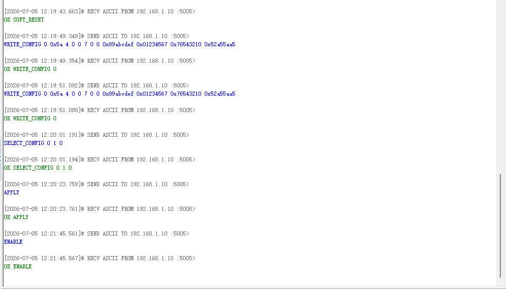
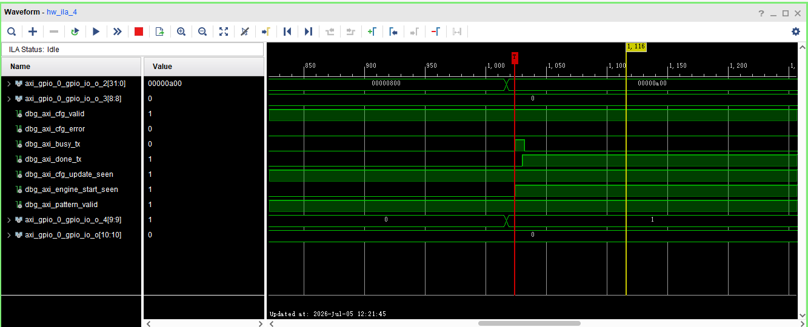
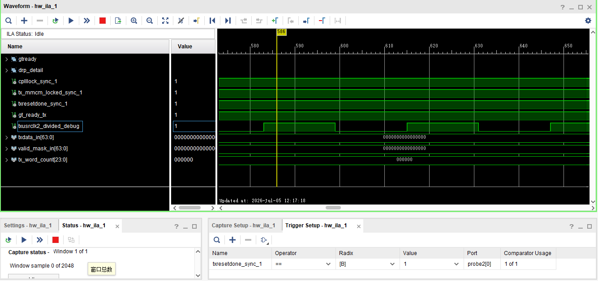
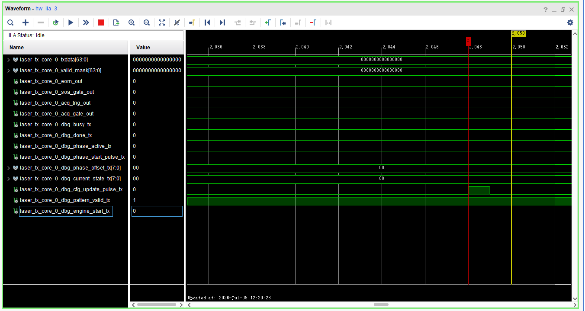

# 2.000G Static Profile Build 报告

## 1. 本阶段目标与边界

本阶段目标是建立一个独立的 `Profile2 / 2.000Gbps static TX` 工程路径，用于确认 2.000Gbps 在当前 125MHz REFCLK、CPLL、64-bit TXDATA、Encoding=None 的架构下能否完成 synthesis / implementation / bitstream / LTX 生成。

本阶段明确不做以下事项：

- 不修改现有 500M/1000M dynamic rate controller 功能行为；
- 不加入 `rate set 2000`；
- 不修改 Vitis / UDP 协议；
- 不实现 AD9528 动态输出；
- 不引入 156.25MHz REFCLK；
- 不切换 QPLL；
- 不修改 `laser_tx_core` 数据宽度和发送逻辑；
- 不修改已验证的 500M/1000M reset sequence；
- 不声明 2.000G 已上板通过。

## 2. 为什么选择 2.000G

前期 feasibility 分析表明，在 125MHz REFCLK 下，2.000Gbps 可以使用与 500M/1000M 相同的 CPLL 基础参数族，主要差异集中在 `TXOUT_DIV=2`。这使 2.000G 成为第三速率扩展的低风险候选：它避免了 156.25MHz REFCLK、AD9528 动态输出、QPLL 切换和更复杂 refclk 管理问题。

## 3. 2.000G GT Wizard / XCI 参数确认

2.000G comparison XCI 在隔离目录中生成，未覆盖现有 Profile0 / dynamic 工程 XCI。

参数来源：

- `D:/FPGA_Learn/laser_tx/reports/gt_dynamic_rate_2g_static/gtwizard_2000m_compare/gtwizard_2000m_selected_properties.txt`
- `D:/FPGA_Learn/laser_tx/reports/gt_dynamic_rate_2g_static/gtwizard_2000m_compare/generated_ip/gtwizard_0/gtwizard_0_gt.v`
- `D:/FPGA_Learn/laser_tx/reports/gt_dynamic_rate_2g_static/gtwizard_2000m_compare/generated_ip/gtwizard_0/gtwizard_0_init.v`

| 参数 | 2.000G static profile |
| --- | --- |
| TX line rate | 2.0Gbps |
| TX reference clock | 125.000MHz |
| TXDATA width | 64 |
| Encoding | None |
| TX internal datawidth | 32-bit 语义，generated primitive 中 `TX_INT_DATAWIDTH=1` |
| PLL | CPLL |
| QPLL used | `FALSE` |
| CPLL_FBDIV_45 | 4 |
| CPLL_FBDIV | 4 |
| CPLL_REFCLK_DIV | 1 |
| TXOUT_DIV | 2 |
| DRP | enabled |

注意：isolated GT Wizard property report 中 `gt0_val_rx_line_rate` 仍显示 0.5，本阶段只验证 TX 路径，不声明 RX / 全双工 2.000G。

## 4. 2.000G 与 500M/1000M 参数对比

| 项目 | 500M Profile0 | 1000M Profile1 | 2.000G Profile2 static |
| --- | --- | --- | --- |
| REFCLK | 125MHz | 125MHz | 125MHz |
| PLL | CPLL | CPLL | CPLL |
| CPLL_FBDIV_45 | 4 | 4 | 4 |
| CPLL_FBDIV | 4 | 4 | 4 |
| CPLL_REFCLK_DIV | 1 | 1 | 1 |
| TXOUT_DIV | 8 | 4 | 2 |
| TXDATA width | 64 | 64 | 64 |
| Encoding | None | None | None |
| TXUSRCLK | 15.625MHz | 31.25MHz | 62.5MHz |
| TXUSRCLK2 | 7.8125MHz | 15.625MHz | 31.25MHz |
| laser_tx_core 时钟域 | TXUSRCLK2 | TXUSRCLK2 | TXUSRCLK2 |
| 是否加入 dynamic table | 已支持 | 已支持 | 未加入 |

## 5. 2.000G user clocking / MMCM 参数

参数来自 2.000G GT Wizard example design 的 `gtwizard_0_gt_usrclk_source.v`，并固化到：

- `D:/FPGA_Learn/laser_tx/laser_tx.srcs/sources_1/new/laser_gt_usrclk_profile2_2000m.v`

| 项目 | 值 |
| --- | --- |
| MMCM input / TXOUTCLK | 62.5MHz / 16.0ns |
| CLKFBOUT_MULT | 10.0 |
| DIVCLK_DIVIDE | 1 |
| CLKOUT0_DIVIDE | 20.0 |
| CLKOUT1_DIVIDE | 10 |
| CLKOUT0 mapping | TXUSRCLK2 = 31.25MHz |
| CLKOUT1 mapping | TXUSRCLK = 62.5MHz |

实现后的 clock report 确认：

- `TXOUTCLK = 16.000ns`
- `clkout1_txusrclk = 16.000ns`
- `clkout0_txusrclk2 = 32.000ns`
- `clk_fpga_0 = 20.000ns`

## 6. 新增工程结构

| 文件 | 作用 |
| --- | --- |
| `D:/FPGA_Learn/laser_tx/scripts/create_gtwizard_2000m_compare.tcl` | 在隔离目录生成 2.000G GT Wizard comparison XCI / output products / example design |
| `D:/FPGA_Learn/laser_tx/scripts/build_gt_profile2_2000m_static.tcl` | 复制工程到短路径 `_p2_2g_vivado`，切换到 2.000G static top，执行 synth/impl/bit/debug report |
| `D:/FPGA_Learn/laser_tx/scripts/gt_profile2_2000m_impl_pre.tcl` | 检查 2.000G TXOUTCLK/TXUSRCLK/TXUSRCLK2 周期，补全 AXI/FCLK clock fallback，并插入 debug hook |
| `D:/FPGA_Learn/laser_tx/scripts/gt_profile2_2000m_axi_bringup_debug.tcl` | 插入 `ila_2000m_bringup_axi`，debug hub clock 使用 AXI/FCLK |
| `D:/FPGA_Learn/laser_tx/laser_tx.srcs/sources_1/new/laser_gt_tx_profile2_2000m.v` | 2.000G static GT wrapper |
| `D:/FPGA_Learn/laser_tx/laser_tx.srcs/sources_1/new/laser_gt_usrclk_profile2_2000m.v` | 2.000G static TX user clocking |
| `D:/FPGA_Learn/laser_tx/rtl/laser_tx_board_top_profile2_2000m.v` | 2.000G static top，仅用于独立 static build |
| `D:/FPGA_Learn/laser_tx/constraints/laser_tx_gt_profile2_2000m.xdc` | 2.000G static GT/refclk/top-level 约束 |

## 7. Build 结果

执行命令：

```bat
call D:\Vitis\2022.2\settings64.bat
vivado -mode batch -source scripts\build_gt_profile2_2000m_static.tcl
```

结果：

| 项目 | 结果 |
| --- | --- |
| synthesis | 通过 |
| implementation | 通过 |
| write_bitstream | 通过 |
| write_debug_probes | 通过 |
| timing | 通过 |
| DRC | 0 Error，4 Warning |
| hardware test | 已完成 2G static 上板初测；尚未完成 txusrclk2 频率计数精确验证，尚未捕获 txdata/valid_mask 有效发送窗口 |

Vivado implementation 状态：

```text
impl_1 status: write_bitstream Complete!
```

Timing summary：

| Metric | Result |
| --- | ---: |
| WNS | 7.029 ns |
| TNS | 0.000 ns |
| TNS failing endpoints | 0 |
| WHS | 0.053 ns |
| THS | 0.000 ns |
| THS failing endpoints | 0 |
| WPWS | 3.358 ns |
| TPWS | 0.000 ns |

Timing 通过只说明当前实现满足已约束时序，不等价于长期硬件稳定性或外部链路质量验证。

## 8. Utilization / debug core

Utilization 摘要：

| Resource | Used | Available | Utilization |
| --- | ---: | ---: | ---: |
| Slice LUTs | 24794 | 277400 | 8.94% |
| Slice Registers | 25444 | 554800 | 4.59% |
| Block RAM Tile | 74.5 | 755 | 9.87% |
| DSPs | 0 | 2020 | 0.00% |
| GTXE2_CHANNEL | 1 | 16 | 6.25% |
| MMCME2_ADV | 1 | 8 | 12.50% |
| BUFGCTRL | 5 | 32 | 15.63% |

Debug cores：

```text
dbg_hub
u_laser_gt_tx_profile2_2000m/u_ila_gt_profile2_2000m
u_system_wrapper/system_i/ila_laser_axi_cfg
u_system_wrapper/system_i/ila_laser_tx
ila_2000m_bringup_axi
```

`dbg_hub` 和 `ila_2000m_bringup_axi` 使用 AXI/FCLK (`gt_ctrl_clk / clk_fpga_0`) 作为 bring-up 主观察域；txusrclk2 域 ILA 保留为时钟稳定后的二级观察。

## 9. 生成产物路径

| 类型 | 路径 | 大小 |
| --- | --- | ---: |
| bit | `D:/FPGA_Learn/laser_tx/reports/gt_profile2_2000m_static/artifacts/laser_tx_board_top_profile2_2000m.bit` | 17,416,477 bytes |
| ltx | `D:/FPGA_Learn/laser_tx/reports/gt_profile2_2000m_static/artifacts/laser_tx_board_top_profile2_2000m.ltx` | 221,252 bytes |
| timing report | `D:/FPGA_Learn/laser_tx/reports/gt_profile2_2000m_static/reports/timing_summary.rpt` | - |
| utilization report | `D:/FPGA_Learn/laser_tx/reports/gt_profile2_2000m_static/reports/utilization.rpt` | - |
| clocks report | `D:/FPGA_Learn/laser_tx/reports/gt_profile2_2000m_static/reports/clocks.rpt` | - |
| DRC report | `D:/FPGA_Learn/laser_tx/reports/gt_profile2_2000m_static/reports/drc.rpt` | - |
| debug core report | `D:/FPGA_Learn/laser_tx/reports/gt_profile2_2000m_static/reports/debug_cores_full_path.rpt` | - |

bit/LTX 是本地生成产物，未纳入 Git 提交。

## 10. DRC / warning 说明

DRC 结果为 0 Error / 4 Warning：

- `PDCN-1569`：debug hub 相关 LUT equation term warning；
- `RTSTAT-10`：debug / unused debug-style nets no routable loads。

这些 warning 没有阻止 bitstream 生成，但上板前仍应保持关注，尤其是 Hardware Manager debug hub/ILA 稳定性。

`Project 1-840` 类 BD/IP OOC DCP warning 在 build log 中出现，当前没有证据表明它导致 implementation 失败；本阶段未继续处理该 DCP 生成警告。

## 11. 2.000G static 上板初测记录

本次 2.000G static bit/LTX 已执行上板初测，证据来自真实 UDP 返回和 Vivado ILA 截图。当前证据覆盖 GT/MMCM ready、APPLY/ENABLE 控制链路和配置校验链路；但本次 static ILA 没有 `txoutclk_alive_axi`、`txusrclk2_alive_axi`、`txusrclk2_freq_counter_axi`，因此不能声明已经精确验证 `TXUSRCLK2 = 31.25MHz`。

### 11.1 UDP 配置 / APPLY / ENABLE 返回



图中 UDP 命令 `SOFT_RESET`、`WRITE_CONFIG`、`SELECT_CONFIG`、`APPLY`、`ENABLE` 均返回 OK，说明 PS/lwIP/UDP 命令解析、Vitis 控制路径和基础控制命令返回链路可用。该图证明 UDP 控制链路进入了本次 2.000G static 测试流程，但不单独证明 PL 内部发送数据窗口已经被捕获。

### 11.2 AXI/FCLK ILA 配置链路证据



该 ILA 图显示：

- `cfg_valid = 1`；
- `cfg_error = 0`；
- `cfg_update_seen = 1`；
- `engine_start_seen = 1`；
- `pattern_valid = 1`；
- `done_tx = 1`。

这说明 2.000G static 下，PS/UDP -> AXI GPIO/BRAM -> PL 配置加载 -> ENABLE 启动事件 -> done 状态回报链路已经出现预期活动。由于 `done_tx=1` 出现在当前观察窗口内，说明本次有限发送序列已经结束；仍需另一次 trigger 捕获发送窗口内的 `txdata/valid_mask`。

### 11.3 GT/MMCM ready 与 TXUSRCLK2 域活动证据



该 ILA 图显示：

- `cplllock_sync = 1`；
- `tx_mmcm_locked_sync = 1`；
- `txresetdone_sync = 1`；
- `gt_ready_tx = 1`；
- `txusrclk2_divided_debug` 有周期性跳变。

这说明 2.000G static 下 GT/CPLL、TX MMCM、TX reset done 和 GT ready 状态已恢复，且 TXUSRCLK2 域存在活动迹象。需要注意，本次截图只能证明 divided debug 在跳变，不能替代 `txusrclk2_freq_counter_axi` 或示波器的精确频率测量，因此不能写成已精确验证 `TXUSRCLK2 = 31.25MHz`。

### 11.4 TX 域发送窗口未捕获说明



该图是可选辅助证据，用于说明当前 TX 域 ILA 光标/窗口可能落在有限短序列结束后，尚未捕获到有效 `txdata/valid_mask` 发送窗口。该图不能作为发送数据有效证据；后续应重新设置 trigger，在 `engine_start`、`busy` 或 `valid_mask != 0` 附近捕获。

### 11.5 初测结论

本轮 2.000G static 上板初测显示：

- UDP 配置、APPLY、ENABLE 命令返回 OK；
- AXI/FCLK ILA 中配置链路和启动事件可见；
- GT/MMCM ready 已恢复；
- `txusrclk2_divided_debug` 有周期性跳变，初步证明 TXUSRCLK2 域存在活动；
- 尚未完成 `TXUSRCLK2 = 31.25MHz` 的精确频率计数验证；
- 尚未捕获 `txdata[63:0] / valid_mask[63:0]` 的有效发送窗口。

因此，当前证据支持继续 2.000G static 后续 bring-up；但在 2.000G 加入 dynamic profile table 之前，建议补充 `txusrclk2_freq_counter_axi` 或等价频率证明，并重新捕获 `txdata/valid_mask` 有效发送窗口。

阶段性结论为：2G static build 已通过，2G static 上板初测显示 GT/MMCM ready 和配置链路可用；但尚未完成 txusrclk2 频率计数精确验证，也尚未捕获 txdata/valid_mask 有效发送窗口。当前证据支持继续后续 bring-up，但 2G 加入 dynamic profile table 前建议补充频率计数或等价证明。

## 12. 尚未完成的上板验证项

以下项目仍需补充：

- `txoutclk_alive_axi`；
- `txusrclk2_alive_axi`；
- `txusrclk2_freq_counter_axi` 或等价频率证明，确认 31.25MHz；
- APPLY / ENABLE 后 `txdata/valid_mask` 是否有效；
- 外部同步输出；
- 示波器 / 误码率 / 外部光口闭环。

## 13. 是否建议进入 2.000G 后续 bring-up

建议继续 2.000G static 后续 bring-up。原因是：

- 2.000G GT 参数已从 isolated XCI / generated HDL / primitive 参数确认；
- 2.000G user clocking 参数来自 GT Wizard example design；
- static build 已完成 bit/LTX；
- timing 已通过；
- AXI/FCLK bring-up ILA 已保留；
- 上板初测已显示 GT/MMCM ready 和配置链路可用；
- 2.000G 尚未引入 dynamic controller，风险边界清晰。

下一步应优先补充 TXUSRCLK2 频率计数或等价证明，并重新触发 TX 域 ILA 捕获 `txdata/valid_mask` 有效发送窗口。

## 14. 明确边界声明

本报告当前证明：

```text
2.000G static build 通过，bit/LTX 已生成，timing 满足当前约束。
2.000G static 上板初测显示 GT/MMCM ready 和配置链路可用。
```

本报告不证明：

```text
2.000G 完整发送链路通过；
TXUSRCLK2 已被精确验证为 31.25MHz；
txdata/valid_mask 有效发送窗口已捕获；
2.000G dynamic 切换通过；
rate set 2000 已实现；
AD9528/refclk 动态切换已实现；
外部光口闭环已通过；
长期稳定性或误码率已验证。
```
