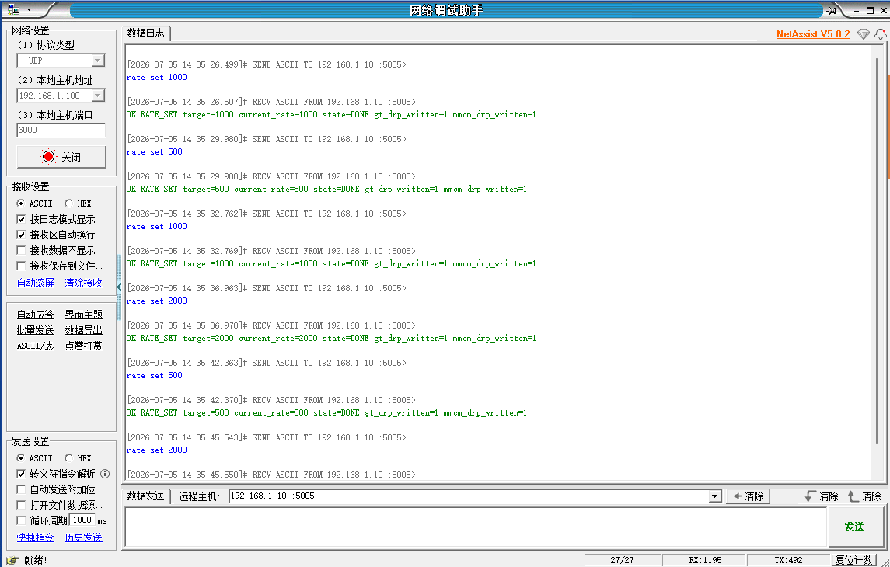
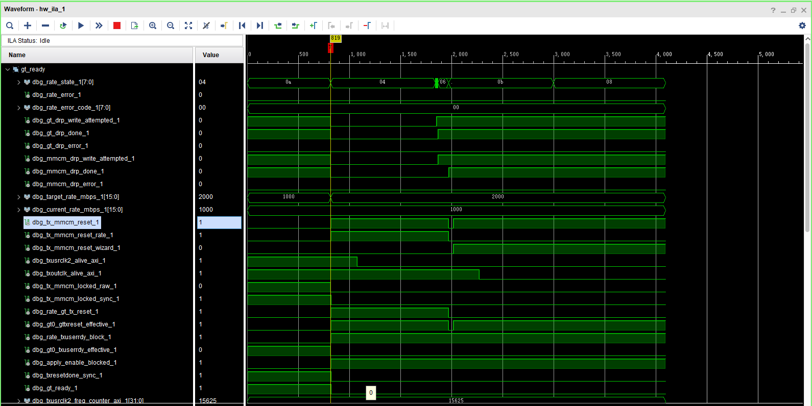
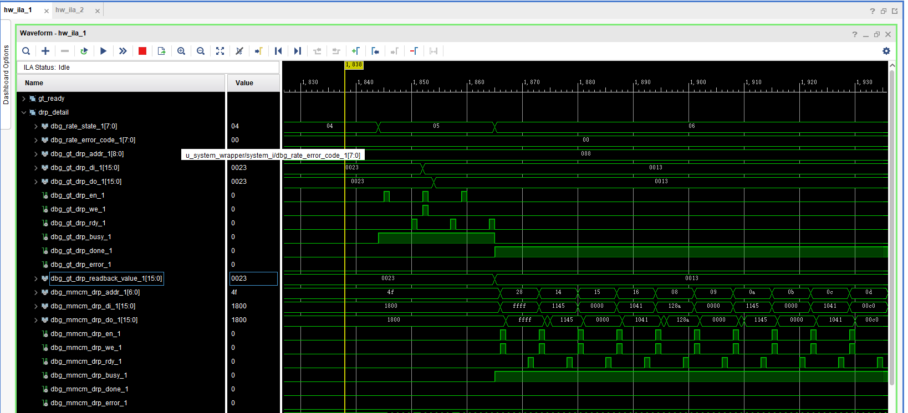
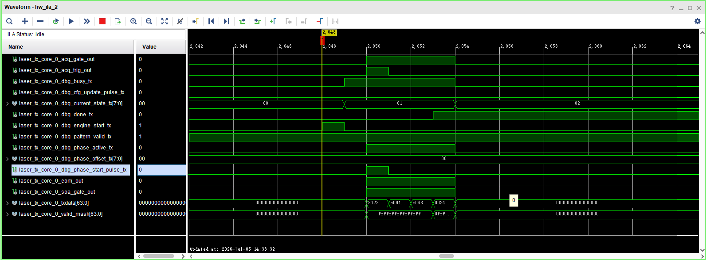
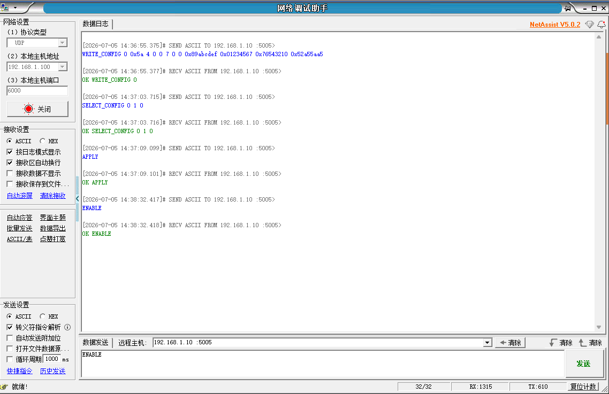

# 2.000G dynamic profile 集成与初步上板验证报告

## 1. 本阶段目标与边界

本阶段目标是在已通过的 500M/1000M dynamic profile table 基础上，将 2.000Gbps 作为第三个固化 profile 加入现有动态速率切换框架，使系统支持：

```text
rate set 500
rate set 1000
rate set 2000
```

本阶段仍然不是宽范围动态调速，也不是任意连续速率控制。2G 继续使用当前 125MHz REFCLK、CPLL、固定 profile table，以及既有 GT DRP + MMCM DRP + reset/lock/ready 闭环。

边界如下：

- 未实现 AD9528 动态输出；
- 未引入 156.25MHz refclk；
- 未切换 QPLL；
- 未修改 GT refclk 动态切换；
- 未修改 `laser_tx_core` 数据宽度和发送逻辑；
- 未修改 `pattern_tx_engine`；
- 未引入 FIFO 或任意 pattern 长度；
- 未改变 500M/1000M 已验证 reset sequence 的基本行为；
- 未把 2G static 临时 copied project 作为主工程替代；
- bit/LTX 仅作为本地构建产物保存，不提交 Git。

## 2. 改动前核查结果

改动前对当前工程做了只读核查：

- 500M profile 已存在于 `laser_gt_rate_switch_500m_1000m.v` 的 profile table/accessor 中；
- 1000M profile 已存在于同一 profile table/accessor 中；
- 2G static profile 已完成 feasibility、static build 和初步上板 bring-up；
- 2G static 采用 125MHz REFCLK、CPLL、TXOUT_DIV=2、TXDATA=64bit、Encoding=None；
- 2G static user clocking 目标为 TXUSRCLK=62.5MHz、TXUSRCLK2=31.25MHz；
- Vitis UDP parser 改动前只把 `rate set 500/1000` 映射为合法 profile，需要补充 2000M 映射。

## 3. 2G static 到 dynamic 的参数来源

2G GT 参数来自 static 2G XCI/generated HDL 和 static build 报告：

| 项目 | 2G 参数 | 来源 |
|---|---:|---|
| REFCLK | 125MHz | 2G static selected properties |
| PLL | CPLL | 2G static XCI/generated HDL |
| CPLL_REFCLK_DIV / M | 1 | 2G static selected properties |
| CPLL_FBDIV_45 / N1 | 4 | 2G static selected properties |
| CPLL_FBDIV / N2 | 4 | 2G static selected properties |
| CPLLCLKOUT | 2.000GHz | 125MHz × 4 × 4 |
| TXOUT_DIV | 2 | generated `GTXE2_CHANNEL` 参数 |
| line rate | 2.000Gbps | 2G static selected properties |
| TXDATA width | 64bit | 2G static selected properties |
| TX internal datawidth | 32-bit 语义 | 2G static selected properties |
| Encoding | None | 2G static selected properties |

2G MMCM 参数来自 `laser_gt_usrclk_profile2_2000m.v` 和 Xilinx MMCM DRP 生成公式复核：

| 项目 | 2G 参数 |
|---|---:|
| MMCM input / TXOUTCLK | 62.5MHz |
| CLKIN period | 16.0ns |
| CLKFBOUT_MULT | 10.0 |
| DIVCLK_DIVIDE | 1 |
| CLKOUT0_DIVIDE | 20 |
| CLKOUT1_DIVIDE | 10 |
| TXUSRCLK | 62.5MHz |
| TXUSRCLK2 | 31.25MHz |

MMCM DRP 写表不是凭规律手猜。先使用 Xilinx VPHY `xvphy_mmcme2.c` 中的 MMCM divider/lock/filter 公式复算 500M/1000M，确认与现有 RTL 表一致后，再生成 2G 表。

## 4. 500M / 1000M / 2000M profile table 对比

| profile | rate_mbps | REFCLK | PLL | CPLL M/N1/N2 | TXOUT_DIV | TXOUT_DIV encoding | TXUSRCLK | TXUSRCLK2 | freq counter window |
|---|---:|---:|---|---|---:|---|---:|---:|---|
| 500M | 500 | 125MHz | CPLL | 1 / 4 / 4 | 8 | `3'b011` | 15.625MHz | 7.8125MHz | 7700..7950 |
| 1000M | 1000 | 125MHz | CPLL | 1 / 4 / 4 | 4 | `3'b010` | 31.25MHz | 15.625MHz | 15400..15900 |
| 2000M | 2000 | 125MHz | CPLL | 1 / 4 / 4 | 2 | `3'b001` | 62.5MHz | 31.25MHz | 30800..31800 |

2G 的 `30800..31800` 为初始候选窗口，按 500M/1000M 已用窗口比例推导并已进入 RTL。

## 5. 2G GT DRP 参数

现有动态切换只改 GTX TXOUT_DIV，CPLL 参数保持与 500M/1000M 一致。当前 DRP 控制沿用既有地址/bitfield：

```text
GT DRP read/write address : 9'h088
TXOUT_DIV field           : [6:4]
500M TXOUT_DIV=8          : 3'b011
1000M TXOUT_DIV=4         : 3'b010
2000M TXOUT_DIV=2         : 3'b001
```

`3'b001` 对应 TXOUT_DIV=2 的依据是 2G static generated HDL 中 `GTXE2_CHANNEL.TXOUT_DIV = 2`，并与既有 500M/1000M DRP map 的编码关系一致。本阶段未修改 CPLL/QPLL、refclk 或 AD9528。

## 6. 2G MMCM DRP sequence

新增 `MMCM_DRP_SEQ_PROFILE2_2000M`，对应 MMCM DRP data：

| index | data |
|---:|---|
| 0 | `16'hffff` |
| 1 | `16'h1145` |
| 2 | `16'h0000` |
| 3 | `16'h1041` |
| 4 | `16'h128a` |
| 5 | `16'h0000` |
| 6 | `16'h1145` |
| 7 | `16'h0000` |
| 8 | `16'h1041` |
| 9 | `16'h00c0` |
| 10 | `16'h01e8` |
| 11 | `16'h7001` |
| 12 | `16'h71e9` |
| 13 | `16'h0800` |
| 14 | `16'h1100` |

该表来自与既有 500M/1000M 表相同的转换公式，且 500M/1000M 复算结果已和原 RTL 表一致，因此本轮没有引入另一套 MMCM DRP 生成机制。

## 7. reset sequence 保持情况

本轮保持 500M/1000M 已修复的 reset sequence，不重新设计流程：

```text
QUIESCE_TX
ASSERT_RESET
PROGRAM_GT_DRP
PROGRAM_MMCM_DRP
RELEASE_RESET
WAIT_MMCM_RESET_RELEASE
WAIT_LOCK
RELEASE_TXUSERRDY
WAIT_GT_READY
VERIFY_RATE
DONE / ERROR
```

关键行为保持不变：

- `current_rate` 只在 `VERIFY_RATE` 成功后更新；
- WAIT_LOCK 阶段不再重新通过 `rate_gt_tx_reset` 间接按住 GT Wizard 的 MMCM reset；
- MMCM locked raw/sync 稳定后再释放 TXUSERRDY block；
- `txresetdone` / `gt_ready` 恢复后再做频率窗口验证；
- 切换失败进入 ERROR，不假装成功；
- 失败时保留 `current_rate` 为 last good rate。

## 8. Vitis / UDP 修改

本轮 Vitis 修改是最小必要修改：现有 UDP 协议形态不变，只把 2000M 纳入已有 `rate plan` / `rate set` / `rate status` 流程。

| 文件 | 修改内容 |
|---|---|
| `vitis_bringup/bringup/src/laser_gpio.h` | 新增 `LASER_RATE_ID_2000M = 3U` |
| `vitis_bringup/bringup/src/laser_gt.c` | `rate_id=3` 映射为 2000Mbps |
| `vitis_bringup/bringup/src/laser_udp_server.c` | `rate set 2000` 映射到 2G profile；mode 字符串更新为 `dynamic_500m_1000m_2000m` |
| `vitis_bringup/bringup/src/gt_rate_plan.c` | 新增 2G plan entry |
| `vitis_bringup/bringup/src/main.c` | 启动模式字符串更新为 `MINIMAL_DYNAMIC_500M_1000M_2000M` |

未新增 AXI profile RAM，未新增 Vitis 参数下载协议，未让软件直接写 GT/MMCM DRP addr/data。软件仍只下发目标速率，PL 内部固化 profile table 负责执行 DRP、reset、lock、ready 和 frequency verify。

## 9. 构建 / timing / utilization / debug core 结果

Vivado project flow 已完成：

```text
synth_1       : synth_design Complete!
impl_1        : write_bitstream Complete!
Timing result : All user specified timing constraints are met.
```

Timing 摘要：

| Metric | Result |
|---|---:|
| WNS | 7.029 ns |
| TNS | 0.000 ns |
| WHS | 0.044 ns |
| THS | 0.000 ns |

Utilization 摘要：

| Resource | Used | Utilization |
|---|---:|---:|
| Slice LUTs | 22588 | 8.14% |
| Slice Registers | 21531 | 3.88% |
| Block RAM Tile | 61 | 8.08% |
| GTXE2_CHANNEL | 1 | 6.25% |
| BUFGCTRL | 6 | 18.75% |
| MMCME2_ADV | 1 | 12.50% |

Debug core 摘要：

| Core | Clock |
|---|---|
| `dbg_hub` | `gt_ctrl_clk`, 50MHz |
| `ila_laser_axi_cfg` | `u_system_wrapper/system_i/gt_ctrl_clk` |
| `ila_laser_tx` | `u_system_wrapper/system_i/txusrclk2` |

bit/LTX 本地路径：

```text
D:/FPGA_Learn/laser_tx/reports/dynamic_rate_500m_1000m_2000m/artifacts/laser_tx_board_top_dynamic_500m_1000m_2000m.bit
D:/FPGA_Learn/laser_tx/reports/dynamic_rate_500m_1000m_2000m/artifacts/laser_tx_board_top_dynamic_500m_1000m_2000m.ltx
```

Vitis app clean/build 已完成：

```text
ELF : D:/FPGA_Learn/laser_tx/vitis_bringup/bringup/Debug/bringup.elf
size: text=147055, data=3432, bss=3201088, dec=3351575
```

## 10. 初步上板验证结果

本轮已完成 2G dynamic profile 初步上板验证。UDP 日志显示 500M、1000M、2000M 三档 `rate set` 均可返回 DONE，`current_rate` 与目标速率一致，`error_code=NONE`。ILA 进一步显示 1000M -> 2000M 切换过程中 GT/MMCM DRP、reset/lock/ready 链路正常动作；DRP 细节图显示 2G 对应的 GT TXOUT_DIV 和 MMCM DRP sequence 被实际写入；TXUSRCLK2 域 ILA 捕获到 `engine_start`、`busy`、`txdata` 和 `valid_mask` 活动。

因此，本阶段结论限定为：

```text
500M/1000M/2000M 三档固化 profile 的初步动态切换验证通过。
```

### UDP 三档循环成功



该图证明 `rate set 500`、`rate set 1000`、`rate set 2000` 均返回 OK，`current_rate` 与目标一致，`state=DONE`，`gt_drp_written=1`，`mmcm_drp_written=1`。

### 1000M -> 2000M 切换过程总览



该图是切换过程图，不是最终 2G DONE 稳态图。图中 `target_rate_mbps` 已更新为 2000，状态机进入动态切换流程，GT/MMCM DRP、reset、lock、ready 链路有动作。此时 `current_rate_mbps` 仍为 1000、`txusrclk2_freq_counter_axi` 仍约为 15625 是合理的中间状态，表示尚未完成 VERIFY/DONE，系统仍保持 last good rate。

### 2G GT/MMCM DRP 细节



该图显示 GT DRP 与 MMCM DRP 写入过程实际发生。GT DRP addr=0x088，写入/readback 从 1000M 对应值切换到 2G 对应值；MMCM DRP addr/di/do/en/we/rdy 连续动作，DRP done 置位，`error_code=0`。

### 2G TX 域发送活动



该图显示 2G dynamic 切换后，TXUSRCLK2 域捕获到 `engine_start`、`busy`、`txdata[63:0]`、`valid_mask[63:0]` 活动，说明 `laser_tx_core` 发送链路能够启动。

### 2G 配置命令返回 OK



该图显示 `WRITE_CONFIG`、`SELECT_CONFIG`、`APPLY`、`ENABLE` 等 UDP 配置命令均返回 OK，说明 PS/UDP 到 PL 配置链路正常。

## 11. 关于 1000M -> 2000M 过程图中 freq_counter=15625 的解释

在 ILA 过程图中，`target_rate_mbps` 已经变为 2000，但 `current_rate_mbps` 仍为 1000，同时 `txusrclk2_freq_counter_axi` 仍显示约 15625。该现象不是异常，而是动态切换过程中的正常中间状态。

原因是：

1. `target_rate` 表示“请求目标”，收到 `rate set 2000` 后会先更新；
2. `current_rate` 表示“已验证通过的当前速率”，只有切换流程完成并通过 `VERIFY_RATE` 后才更新；
3. `txusrclk2_freq_counter_axi` 是统计窗口计数值，不会在 `target_rate` 改变的瞬间立即跳变；
4. 因此在切换执行过程中看到 `target_rate=2000`、`current_rate=1000`、`freq_counter≈15625` 是合理的；
5. 最终成功应以 `rate set 2000` 返回 `current_rate=2000`、`state=DONE`、`error_code=NONE`、`gt_ready=1` 为准。

不要把这张图解释成“2G 频率没有更新”或“2G 切换失败”。它记录的是切换尚未完成时的中间状态。

## 12. VERIFY_RATE 与 current_rate 更新条件

当前 rate controller 中 `current_rate` 不是收到命令后立即更新，而是在 `VERIFY_RATE` 成功后才更新。`VERIFY_RATE` 是动态切换最后的验收阶段，用于确认：

- GT DRP 完成且无错误；
- MMCM DRP 完成且无错误；
- MMCM locked raw/sync 已恢复；
- GT resetdone / gt_ready 已恢复；
- `txusrclk2_alive_axi` 有效；
- `txusrclk2_freq_counter_axi` 落入当前 profile 的预期窗口；
- 没有 timeout / error_code。

因此，当 UDP 返回：

```text
current_rate=2000
state=DONE
error_code=NONE
gt_ready=1
```

可以说明 2G profile 已通过 PL rate controller 的内部验收。这里的 `current_rate=2000` 不是单纯的软件打印，而是 PL rate controller 完成 `VERIFY_RATE` 后的结果。

## 13. 验证结果表

| 验证项 | 结果 | 证据 |
|---|---|---|
| `rate set 500` | PASS | UDP 返回 `current_rate=500 state=DONE` |
| `rate set 1000` | PASS | UDP 返回 `current_rate=1000 state=DONE` |
| `rate set 2000` | PASS | UDP 返回 `current_rate=2000 state=DONE` |
| 500/1000/2000 循环 | PASS | UDP 循环图 |
| 1000 -> 2000 状态机过程 | PASS | ILA process overview |
| 2G GT/MMCM DRP 写入 | PASS | ILA DRP detail |
| 2G TX 发送活动 | PASS | TX 域 ILA `txdata/valid_mask` |
| 外部光口/误码率 | NOT TESTED | 本轮未测 |
| 长期稳定性 | NOT TESTED | 本轮未测 |
| 156.25MHz/AD9528/QPLL | NOT INVOLVED | 本轮未涉及 |

## 14. 当前边界声明

本阶段只证明：

```text
500M/1000M/2000M 三档固化 profile 的初步动态切换验证通过。
```

不要扩大为：

- 宽范围动态调速完成；
- 任意连续速率支持；
- 156.25MHz refclk 支持；
- AD9528 动态输出支持；
- QPLL profile 支持；
- 外部光口闭环通过；
- 误码率验证通过；
- 长期稳定性验证完成。

后续如要继续扩展，应先冻结当前三档 profile 证据，再按路线图推进更多 static profile、profile table 扩展、失败回退和更高等级链路质量验证。

