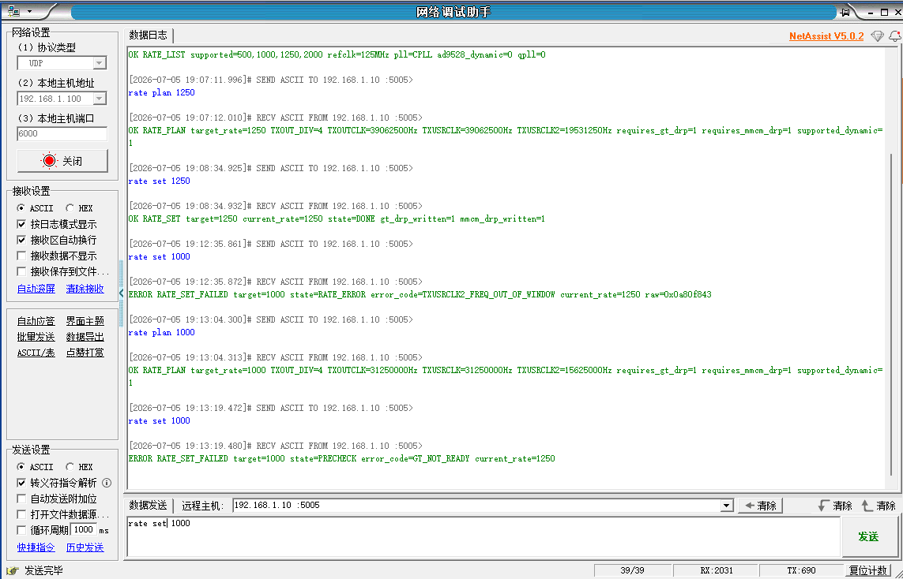
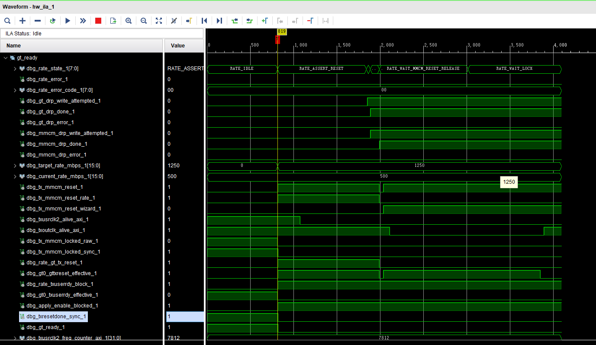
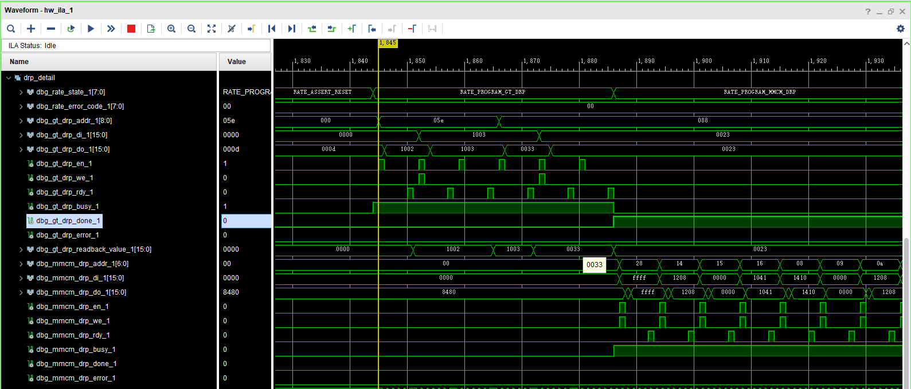

# 125MHz CPLL 参数动态 DRP profile 集成报告

## 1. 本阶段目标与边界

本阶段目标是在已经通过上板验证的 500M / 1000M / 2000M dynamic profile table 基础上，加入第一个“CPLL 参数发生变化”的固定 profile：1250M。

本阶段允许修改 dynamic rate controller、profile table、CPLL/MMCM DRP sequence、Vitis UDP rate parser 与构建/报告脚本；本阶段不做以下事项：

- 不新增 AD9528 动态输出；
- 不引入 156.25MHz REFCLK；
- 不切换 QPLL；
- 不修改 GT refclk 动态切换；
- 不修改 `laser_tx_core` 的发送数据宽度、`pattern_tx_engine` 或 BRAM 配置格式；
- 不实现任意连续速率；
- 不声明宽范围动态调速完成；
- 不声明外部光口链路质量、BER 或长期稳定性通过。

本轮新增 1250M 仅表示：在 125MHz REFCLK + CPLL 条件下，开始验证 CPLL divider DRP 动态写入能力。

## 2. 修改前问题

修改前 dynamic profile table 已支持 500M / 1000M / 2000M，这三档速率共用同一组 CPLL 参数：

| Rate | REFCLK | CPLL M | CPLL N1 | CPLL N2 | CPLLCLKOUT | TXOUT_DIV |
|---:|---:|---:|---:|---:|---:|---:|
| 500M | 125MHz | 1 | 4 | 4 | 2.0GHz | 8 |
| 1000M | 125MHz | 1 | 4 | 4 | 2.0GHz | 4 |
| 2000M | 125MHz | 1 | 4 | 4 | 2.0GHz | 2 |

因此原有 dynamic executor 已证明 TXOUT_DIV DRP、MMCM DRP、reset release、MMCM lock、GT ready 和 `VERIFY_RATE` 链路可用，但还没有证明 CPLL divider 参数可被动态写入并重新 lock。

同时，原 PS->PL 内部 GPIO 控制位中：

- `rate_id = gpio_ctrl[14:13]`
- `rate_request_toggle = gpio_ctrl[15]`

该 2-bit rate_id 最多只能表达 4 个编号。随着 1250M profile 加入，原映射已经不适合后续扩展。

## 3. 修改后结构

本轮保持既有 dynamic executor 主流程不变：

```text
REQUEST
-> VALIDATE
-> QUIESCE_TX
-> ASSERT_RESET
-> PROGRAM_GT_DRP
-> PROGRAM_MMCM_DRP
-> RELEASE_RESET
-> WAIT_MMCM_RESET_RELEASE
-> WAIT_LOCK
-> RELEASE_TXUSERRDY
-> WAIT_GT_READY
-> VERIFY_RATE
-> DONE / ERROR
```

新增内容集中在 profile table 与 DRP 执行数据：

- 新增 `RATE_ID_1250M = 4`；
- 新增 1250M profile；
- 新增 CPLL divider DRP read-modify-write-readback 分支；
- 新增 `rate_cpll_reset`，在需要 CPLL 参数变化的 profile 中对 CPLL 执行 reset / relock；
- 新增 `RATE_ERR_CPLL_LOCK_TIMEOUT`，用于区分 CPLL 未重新 lock 与 MMCM 未 lock；
- 新增 1250M MMCM DRP sequence；
- Vitis 侧新增 `rate set 1250`、`rate plan 1250`、`rate list` 支持；
- `current_rate` 仍只在 `VERIFY_RATE` 成功后更新，失败时保留 last good rate。

## 4. PS->PL rate_id 控制位映射变更

旧映射：

```text
rate_id             = gpio_ctrl[14:13]
rate_request_toggle = gpio_ctrl[15]
```

新映射：

```text
rate_id[3:0]        = gpio_ctrl[16:13]
rate_request_toggle = gpio_ctrl[17]
```

变更原因：

原 2-bit rate_id 只能表示最多 4 个编号，不适合继续扩展固定速率 profile。本轮为了支持 1.25G 以及后续更多经典 CPLL profile，将 rate_id 扩展为 4 bit。

兼容性说明：

这是 RTL/Vitis 内部控制位映射的有意变更。UDP 文本命令不变，例如仍使用 `rate set 1250`；但新 ELF 必须匹配新 bitstream。旧 ELF 不应搭配新 bit 使用，旧 bit 也不应搭配新 ELF 使用。

## 5. 1250M profile 参数来源

本轮没有新建 125MHz CPLL static board 工程，而是基于已确认的 CPLL DRP bitfield、现有 generated HDL / Xilinx VPHY driver 编码逻辑以及当前 dynamic executor 结构加入 profile。

1250M profile：

| 字段 | 值 |
|---|---:|
| rate_id | 4 |
| rate_mbps | 1250 |
| REFCLK | 125MHz |
| PLL | CPLL |
| CPLL M / REFCLK_DIV | 1 |
| CPLL N1 | 4 |
| CPLL N2 | 5 |
| CPLLCLKOUT | 2.5GHz |
| TXOUT_DIV | 4 |
| TXUSRCLK | 39.0625MHz |
| TXUSRCLK2 | 19.53125MHz |
| expected counter window | 19200 .. 19850 |
| AD9528 dynamic required | 0 |
| QPLL required | 0 |

## 6. CPLL / GT DRP 参数

已确认并采用的 CPLL divider DRP 字段：

| 字段 | DRP address | bitfield | mask | 1250M 写入含义 |
|---|---:|---|---:|---|
| CPLL_FBDIV / N2 | `0x05E` | `[6:0]` | `0x007F` | N2=5 编码 |
| CPLL_FBDIV_45 / N1 | `0x05E` | `[7]` | `0x0080` | N1=4 编码 |
| CPLL_REFCLK_DIV / M | `0x05E` | `[12:8]` | `0x1F00` | M=1 编码 |
| TXOUT_DIV | `0x088` | `[6:4]` | `0x0070` | TXOUT_DIV=4 编码 |

本轮 1250M 的 CPLL divider 目标值为：

```text
CPLL divider DRP addr 0x05E, mask 0x1FFF, target value 0x1003
```

对比：

```text
500M/1000M/2000M: M=1, N1=4, N2=4 -> 0x1002
1250M:           M=1, N1=4, N2=5 -> 0x1003
```

1250M 的 TXOUT_DIV=4，因此 TXOUT_DIV encoding 与 1000M 相同，差异主要在 CPLL N2 与 MMCM 参数。

## 7. MMCM DRP sequence

1250M 目标 user clocking：

| 项目 | 值 |
|---|---:|
| MMCM input / TXOUTCLK | 39.0625MHz |
| CLKFBOUT_MULT | 16 |
| DIVCLK_DIVIDE | 1 |
| CLKOUT1_DIVIDE | 16 |
| CLKOUT0_DIVIDE | 32 |
| TXUSRCLK | 39.0625MHz |
| TXUSRCLK2 | 19.53125MHz |

本轮 MMCM DRP data 使用工程既有 500M/1000M/2000M 的 DRP 写入顺序，并按 Xilinx MMCM DRP encoding 生成 1250M data。新增 sequence ID：

```text
MMCM_DRP_SEQ_PROFILE3_1250M
```

## 8. 修改前后差异表

| 项目 | 修改前 | 修改后 | 影响 |
|---|---|---|---|
| 支持 profile | 500/1000/2000 | 500/1000/1250/2000 | 新增第一个 CPLL 参数变化 profile |
| rate_id 宽度 | 2 bit | 4 bit | 支持更多固定 profile 编号 |
| request toggle | gpio_ctrl[15] | gpio_ctrl[17] | 内部 PS->PL bitfield 有意变更 |
| CPLL divider DRP | 未动态写入 | 对 1250M 执行 RMW/readback | 开始验证 CPLL 参数动态切换能力 |
| TXOUT_DIV DRP | 500/1000/2000 已支持 | 继续沿用 | 1250M TXOUT_DIV=4 |
| MMCM DRP | 500/1000/2000 | 新增 1250M sequence | 支持 19.53125MHz TXUSRCLK2 |
| reset sequence | 已修复互锁 | 保持主流程，新增 CPLL reset/relock | 不改变 500/1000/2000 基本流程 |
| current_rate 更新 | VERIFY_RATE 成功后更新 | 保持不变 | 失败不假装成功 |
| UDP 命令 | rate set 500/1000/2000 | 新增 1250，新增 rate list | 文本协议兼容，支持范围扩大 |
| AD9528/QPLL | 不涉及 | 不涉及 | 边界不变 |

## 9. 功能等价性说明

500M / 1000M / 2000M 的 profile 参数、reset/lock/ready 主流程和 `current_rate` 更新原则保持不变。本轮有意改变的是内部 PS->PL rate_id GPIO bitfield，因此旧 bit/ELF 与新 bit/ELF 不兼容。

`laser_tx_core` 的发送数据路径、配置格式、BRAM 访问、`pattern_tx_engine`、`txdata[63:0]`、`valid_mask[63:0]`、外部同步输出语义未改变。`laser_tx_core.v` 中同步更新的是 AXI/FCLK 域 debug mirror / rate dry-run 观测逻辑，用于让 ILA/状态显示与新的 4-bit rate_id 映射一致，不改变 TX 域发送功能。

功能等价性结论基于代码结构检查、Vivado build 通过和 Vitis build 通过；1250M 的上板动态切换尚未验证。

## 10. 构建与测试验证

### Vivado build

执行命令：

```powershell
& D:\Vivado\2022.2\bin\vivado.bat -mode batch -source scripts/run_dynamic_cpll_profile_project_flow.tcl
```

结果：

```text
synth_1_STATUS = synth_design Complete!
impl_1_STATUS  = write_bitstream Complete!
impl_1_PROGRESS = 100%
```

Timing：

| Metric | Result |
|---|---:|
| Setup WNS | 7.029 ns |
| Setup TNS | 0.000 ns |
| Setup failing endpoints | 0 |
| Hold WHS | 0.050 ns |
| Hold THS | 0.000 ns |

Vivado 报告显示：

```text
All user specified timing constraints are met.
```

### Vitis build

执行命令：

```powershell
cmd /c "call D:\Vitis\2022.2\settings64.bat && cd /d D:\FPGA_Learn\laser_tx\vitis_bringup\bringup\Debug && make clean all"
```

结果：

```text
Build passed
ELF: D:\FPGA_Learn\laser_tx\vitis_bringup\bringup\Debug\bringup.elf
ELF size: text=147503, data=3432, bss=3201088, dec=3352023
```

ELF strings 已确认包含：

```text
CPLL_DYNAMIC_500M_1000M_1250M_2000M
OK RATE_LIST supported=500,1000,1250,2000 refclk=125MHz pll=CPLL ad9528_dynamic=0 qpll=0
CPLL_LOCK_TIMEOUT
dynamic_500m_1000m_1250m_2000m
LASER_RATE_ID_1250M 4U
```

Hardware test was not run。

## 11. QoR / utilization

本轮实现后 utilization 摘要：

| Resource | Used | Available | Utilization |
|---|---:|---:|---:|
| Block RAM Tile | 61 | 755 | 8.08% |
| DSP | 0 | 2020 | 0.00% |
| GTXE2_CHANNEL | 1 | 16 | 6.25% |
| BUFGCTRL | 6 | 32 | 18.75% |
| MMCME2_ADV | 1 | 8 | 12.50% |

Timing/QoR 仅说明当前已约束实现满足时序，不等价于 1250M 上板动态切换、长期稳定性或外部光口链路质量已经通过。

## 12. Debug core / ILA

`report_debug_core -full_path` 显示当前 implemented design 包含：

```text
dbg_hub
ila_laser_axi_cfg
ila_laser_tx
```

`dbg_hub` 输入频率参数为 50MHz，连接两个 ILA：

```text
ila_laser_axi_cfg
ila_laser_tx
```

AXI/FCLK ILA 保留 rate controller 相关 probe，包括 rate state、target/current rate、GT/MMCM DRP busy/done/error、MMCM reset/lock、GT reset/user ready、TXOUTCLK alive、TXUSRCLK2 frequency counter 与 timeout counter。TX 域 ILA 保留 `txdata`、`valid_mask`、同步输出和发送状态机观测信号。

## 13. 生成文件与路径

主工程 bit/LTX：

```text
D:\FPGA_Learn\laser_tx\laser_tx.runs\impl_1\laser_tx_board_top.bit
D:\FPGA_Learn\laser_tx\laser_tx.runs\impl_1\laser_tx_board_top.ltx
```

归档 artifact：

```text
D:\FPGA_Learn\laser_tx\reports\dynamic_rate_cpll_drp_profile\artifacts\laser_tx_board_top_dynamic_cpll_drp_profile.bit
D:\FPGA_Learn\laser_tx\reports\dynamic_rate_cpll_drp_profile\artifacts\laser_tx_board_top_dynamic_cpll_drp_profile.ltx
```

报告：

```text
D:\FPGA_Learn\laser_tx\reports\dynamic_rate_cpll_drp_profile\timing_summary_dynamic_cpll_drp_profile.rpt
D:\FPGA_Learn\laser_tx\reports\dynamic_rate_cpll_drp_profile\utilization_dynamic_cpll_drp_profile.rpt
D:\FPGA_Learn\laser_tx\reports\dynamic_rate_cpll_drp_profile\debug_cores_dynamic_cpll_drp_profile.rpt
```

注意：bit/LTX/report artifacts 是本地构建产物，不建议提交到 Git。

## 14. XSA / Platform / BSP 影响

本轮未修改 BD、AXI 地址映射、外设实例或 XSA。Vitis 代码仍使用原有平台/BSP。由于 UDP 文本命令和 AXI 地址未改变，不需要重新导出 XSA。

但因为内部 GPIO rate_id/toggle bitfield 已改变，必须使用本轮重新 build 的 ELF 搭配本轮 dynamic bitstream。

## 15. 内存与启动风险说明

本轮未新增大块全局缓冲区，`.bss` 仍主要来自既有 lwIP/网络缓冲。Vitis build size：

```text
text=147503, data=3432, bss=3201088
```

Linker script 未修改。Memory usage 已通过 ELF size 初步确认，但上板运行仍需串口/UDP 验证。

## 16. 尚未完成的上板验证项

1250M dynamic profile 尚未上板验证。下一轮建议按以下顺序验证：

```text
1. Program dynamic CPLL bit/LTX；
2. rst -processor；
3. run 新 bringup.elf；
4. UDP PING；
5. rate list；
6. rate plan 1250；
7. rate set 1250；
8. rate status；
9. rate set 500 / 1000 / 2000 回归；
10. 500 -> 1250 -> 1000 -> 2000 -> 1250 -> 500 循环。
```

ILA 重点观察：

- `rate_state`；
- `rate_error_code`；
- `target_rate_mbps/current_rate_mbps`；
- CPLL reset / CPLL lock；
- GT DRP addr/di/do/en/we/rdy/readback；
- MMCM DRP addr/di/do/en/we/rdy；
- `tx_mmcm_reset`；
- `txoutclk_alive_axi`；
- `tx_mmcm_locked_raw/sync`；
- `txresetdone_sync`；
- `gt_ready`；
- `txusrclk2_freq_counter_axi` 是否落入 1250M 初始窗口 19200..19850。

## 17. 1250M 回切 1000M 失败现象与原因分析

本节记录第一次 1250M dynamic CPLL profile 上板后的失败定位证据。以下图片均为失败分析证据，不作为通过证据使用。

### 17.1 UDP 日志现象



图中可以看到，`rate list` 正常返回：

```text
OK RATE_LIST supported=500,1000,1250,2000 refclk=125MHz pll=CPLL ad9528_dynamic=0 qpll=0
```

`rate plan 1250` 也正确显示目标速率、TXOUT_DIV、TXUSRCLK/TXUSRCLK2 以及 dynamic 支持状态。随后 `rate set 1250` 成功返回：

```text
OK RATE_SET target=1250 current_rate=1250 state=DONE
```

但从 1250M 回切到 1000M 时，第一次 `rate set 1000` 失败在：

```text
TXUSRCLK2_FREQ_OUT_OF_WINDOW
```

再次尝试 `rate set 1000` 时，失败变为：

```text
GT_NOT_READY
```

这说明当前不是 UDP 命令解析失败，也不是 1250M profile 完全没有执行。更准确的阶段性结论是：1250M 切入路径已经初步跑通，但从 1250M 回切到原 500M/1000M/2000M CPLL 参数组的 restore 路径没有闭环。

### 17.2 500M -> 1250M 切换过程 ILA 总览



该图是切换过程图，不是最终 DONE 稳态图。图中可见：

```text
target_rate_mbps = 1250
current_rate_mbps = 500
txusrclk2_freq_counter_axi = 7812
```

该现象表示状态机已经收到 1250M 请求，但尚未完成 `VERIFY_RATE`，因此 `current_rate` 仍保持 last good rate = 500，`txusrclk2_freq_counter_axi` 仍对应 500M。这个状态本身是正常的中间状态，反而说明 `current_rate` 没有在 request 或 DRP done 阶段提前更新，仍符合“VERIFY_RATE 成功后再更新”的设计原则。

### 17.3 1250M 切入方向 CPLL/MMCM DRP 细节



该图显示切入 1250M 时，GT DRP 确实访问了 `0x05E`，CPLL divider 相关值从 `0x1002` 变为 `0x1003`，随后进入 MMCM DRP 写入流程。

因此，问题重点不是 UDP 没有触发，也不是 1250M profile 完全没有执行。现有证据更指向：切入 1250M 时 CPLL DRP 发生过，但从 1250M 回切到 1000M 时，尚未证明 CPLL divider 已从 `0x1003` 恢复为 `0x1002`。

### 17.4 根因假设

当前最可能的原因是：状态机只在目标 profile 为 1250M 时执行 CPLL DRP；而从 1250M 回切到 500M / 1000M / 2000M 时，没有把 CPLL divider 从 `0x1003` 恢复到 `0x1002`。

参数关系如下：

| Profile | CPLL M/N1/N2 | CPLL divider DRP value |
|---|---|---:|
| 500M | 1 / 4 / 4 | `0x1002` |
| 1000M | 1 / 4 / 4 | `0x1002` |
| 2000M | 1 / 4 / 4 | `0x1002` |
| 1250M | 1 / 4 / 5 | `0x1003` |

因此：

```text
1000M -> 1250M: 0x1002 -> 0x1003
1250M -> 1000M: 0x1003 -> 0x1002
1250M -> 500M : 0x1003 -> 0x1002
1250M -> 2000M: 0x1003 -> 0x1002
```

如果回切时 CPLL 仍停留在 `0x1003`，则目标 1000M 的 TXOUT_DIV/MMCM/frequency verify 与实际 CPLL 输出不自洽，出现 `TXUSRCLK2_FREQ_OUT_OF_WINDOW` 是合理现象。随后 GT/MMCM 可能处于未完全恢复状态，再次尝试时报 `GT_NOT_READY` 也符合当前错误链路。

### 17.5 修复方向

后续 RTL 修复不应再用“目标 profile 是否为 1250M”来决定是否执行 CPLL DRP，而应比较 active CPLL 参数和 target CPLL 参数：

```text
if target_cpll_drp_value != active_cpll_drp_value:
    execute CPLL DRP sequence
else:
    skip CPLL DRP sequence
```

推荐状态机保存：

```text
active_cpll_drp_value
target_cpll_drp_value
```

其中 `active_cpll_drp_value` 只能在 `VERIFY_RATE` 成功后更新。如果切换失败，`current_rate` 和 `active_cpll_drp_value` 都必须保持 last good 状态，不能在 request 阶段、DRP done 阶段或 MMCM lock 阶段提前更新。

### 17.6 修复后需要补充的验证图

后续修复后建议补充以下两张证据图：

```text
docs/images/dynamic_rate/cpll_drp_profile/ila_cpll_drp_1250_to_1000_restore_0x1003_to_0x1002.png
docs/images/dynamic_rate/cpll_drp_profile/udp_cpll_drp_1250_to_1000_return_pass.png
```

其中：

- `ila_cpll_drp_1250_to_1000_restore_0x1003_to_0x1002.png` 用于证明 1250M -> 1000M 时，DRP `0x05E` 从 `0x1003` 恢复到 `0x1002`；
- `udp_cpll_drp_1250_to_1000_return_pass.png` 用于证明 UDP 中 `rate set 1250` 和 `rate set 1000` 均返回 `DONE`。

本节结论：

当前测试说明 1250M 切入方向已经初步跑通，但 1250M 回切到 500M/1000M/2000M 原 CPLL 参数组的 restore 逻辑尚未闭环。下一步应修复 CPLL active/target 参数比较逻辑，并用 UDP + ILA 重新验证 1250M -> 1000M 回切路径。

## 18. 1250M 回切 1000M 失败与修复

### 18.1 初次上板失败回顾

初次 1250M dynamic CPLL profile 上板测试中，`rate list`、`rate plan 1250` 和 `rate set 1250` 均正常，`rate set 1250` 返回：

```text
OK RATE_SET target=1250 current_rate=1250 state=DONE
```

随后从 1250M 回切到 1000M 失败：

```text
ERROR RATE_SET_FAILED target=1000 state=RATE_ERROR error_code=TXUSRCLK2_FREQ_OUT_OF_WINDOW current_rate=1250 raw=0x0a80f843
```

再次执行 `rate set 1000` 时，失败提前到 precheck：

```text
ERROR RATE_SET_FAILED target=1000 state=PRECHECK error_code=GT_NOT_READY current_rate=1250
```

该现象说明 1250M 切入路径已经能够执行，但 1250M 回切到原 500M/1000M/2000M CPLL 参数组时，硬件状态没有恢复到目标 1000M 所需的时钟关系。

### 18.2 根因

修复前逻辑用“目标 profile 是否为 1250M”决定是否执行 CPLL DRP：

```text
target_rate == 1250M -> 执行 CPLL DRP
target_rate != 1250M -> 只执行 TXOUT_DIV DRP
```

这个逻辑在 500M/1000M/2000M 三档之间成立，因为三者共用：

```text
CPLL M/N1/N2 = 1/4/4
CPLL divider DRP value = 0x1002
```

但加入 1250M 后，1250M 使用：

```text
CPLL M/N1/N2 = 1/4/5
CPLL divider DRP value = 0x1003
```

因此 1000M -> 1250M 需要 `0x1002 -> 0x1003`，而 1250M -> 1000M 同样必须执行 `0x1003 -> 0x1002`。修复前回切 1000M 时没有恢复 CPLL divider，导致 CPLL 仍可能停留在 1250M 的 `0x1003`，从而使 1000M 的 MMCM/frequency verify 失配，表现为 `TXUSRCLK2_FREQ_OUT_OF_WINDOW`。

### 18.3 修复内容

本轮修复为基于 active/target CPLL 参数比较决定是否执行 CPLL DRP：

```text
if target_cpll_drp_value != active_cpll_drp_value:
    execute CPLL DRP sequence
else:
    skip CPLL DRP sequence
```

新增并保留的状态：

```text
target_cpll_drp_value
active_cpll_drp_value
cpll_drp_required
```

其中：

- `target_cpll_drp_value` 由目标 profile 的 CPLL M/N1/N2 编码得到；
- `active_cpll_drp_value` 表示 last good profile 对应的 CPLL divider；
- `cpll_drp_required` 表示二者不同，需要执行 CPLL DRP；
- `active_cpll_drp_value` 只在 `VERIFY_RATE` 成功后更新；
- 如果切换失败，`current_rate` 和 `active_cpll_drp_value` 都保持 last good 状态，不在 request、DRP done 或 MMCM lock 阶段提前更新。

修复后的预期路径：

| Path | CPLL action |
|---|---|
| 500M -> 1000M | skip CPLL DRP，仍为 `0x1002` |
| 1000M -> 2000M | skip CPLL DRP，仍为 `0x1002` |
| 1000M -> 1250M | write CPLL `0x1002 -> 0x1003` |
| 1250M -> 1000M | write CPLL `0x1003 -> 0x1002` |
| 1250M -> 500M | write CPLL `0x1003 -> 0x1002` |
| 1250M -> 2000M | write CPLL `0x1003 -> 0x1002` |

### 18.4 RATE_ERROR 后 reset 释放

本轮同时修正错误态的 reset 释放策略。进入 `RATE_ERROR` 或调用 `set_error()` 时，rate controller 不再保持以下控制信号为有效：

```text
rate_gt_tx_reset
rate_txuserrdy_block
rate_mmcm_reset
rate_cpll_reset
```

这避免错误态永久按住 GT/MMCM/CPLL reset。若硬件已经处于 not ready 状态，后续 `rate set` precheck 返回 `GT_NOT_READY` 仍然是合理现象；此时应优先执行 soft reset、重新 program 或重新运行完整 bring-up 流程恢复硬件状态。

### 18.5 构建结果

修复后已重新运行 Vivado project flow：

```text
synth_1_STATUS = synth_design Complete!
impl_1_STATUS  = write_bitstream Complete!
bitstream      = generated
ltx            = generated
```

Timing summary：

| Metric | Result |
|---|---:|
| Setup WNS | 7.029 ns |
| Setup TNS | 0.000 ns |
| Hold WHS | 0.043 ns |
| Hold THS | 0.000 ns |

Vivado 报告：

```text
All user specified timing constraints are met.
```

重新生成的本地 bit/LTX：

```text
D:\FPGA_Learn\laser_tx\reports\dynamic_rate_cpll_drp_profile\artifacts\laser_tx_board_top_dynamic_cpll_drp_profile.bit
D:\FPGA_Learn\laser_tx\reports\dynamic_rate_cpll_drp_profile\artifacts\laser_tx_board_top_dynamic_cpll_drp_profile.ltx
```

Vitis clean build 已重新运行并通过：

```text
ELF: D:\FPGA_Learn\laser_tx\vitis_bringup\bringup\Debug\bringup.elf
text=147503, data=3432, bss=3201088
```

### 18.6 待上板验证

本轮修复已完成 RTL/build 收口，但尚未重新上板验证。因此当前不能写成 1250M 回切 1000M 已通过。

下一次上板必须重点验证：

```text
rate set 1250
rate status
rate set 1000
rate status
```

预期 UDP 结果：

```text
OK RATE_SET target=1000 current_rate=1000 state=DONE
```

必须补充的 ILA 证据：

```text
docs/images/dynamic_rate/cpll_drp_profile/ila_cpll_drp_1250_to_1000_restore_0x1003_to_0x1002.png
docs/images/dynamic_rate/cpll_drp_profile/udp_cpll_drp_1250_to_1000_return_pass.png
```

第一张用于证明 1250M -> 1000M 时 DRP `0x05E` 从 `0x1003` 恢复到 `0x1002`；第二张用于证明 UDP 中 `rate set 1250` 和 `rate set 1000` 均返回 `DONE`。

## 19. 边界声明

本轮完成的是 125MHz REFCLK + CPLL 条件下新增一个 CPLL 参数变化 profile 的 RTL/Vitis/build 集成。

当前不能声明：

- 1250M 上板通过；
- 1250M 动态切换通过；
- 任意速率或宽范围连续调速完成；
- QPLL / 156.25MHz REFCLK / AD9528 动态输出完成；
- 外部光口闭环、BER 或长期稳定性通过。

如果后续上板 `rate set 1250` 失败，应优先根据 `rate_state/error_code`、CPLL lock、GT DRP readback、MMCM lock、TXUSRCLK2 frequency counter 定位；不要把 build 通过写成硬件通过。

## 20. 修改文件列表

| File | Change |
|---|---|
| `laser_tx.srcs/sources_1/new/laser_gt_rate_switch_500m_1000m.v` | 新增 1250M profile、CPLL DRP sequence、CPLL reset/relock、4-bit rate_id decode；本轮补充 active/target CPLL DRP value 比较，修复 1250M 回切 500M/1000M/2000M 的 CPLL restore 路径 |
| `laser_tx.srcs/sources_1/new/laser_gt_tx_profile0.v` | 接入 `rate_cpll_reset`，更新 4-bit `current_rate_id` status |
| `laser_tx.srcs/sources_1/new/laser_tx_core/laser_tx_core.v` | 更新 AXI/FCLK debug mirror 的 rate_id/toggle 映射与 1250M 显示 |
| `vitis_bringup/bringup/src/laser_gpio.h` | 更新内部 GPIO rate_id/toggle bitfield，新增 1250M ID |
| `vitis_bringup/bringup/src/laser_gt.h` | 更新 status bit decode，新增 CPLL lock timeout error |
| `vitis_bringup/bringup/src/laser_gt.c` | 新增 1250M ID 字符串/错误码解析 |
| `vitis_bringup/bringup/src/gt_rate_plan.c` | 新增 1250M rate plan |
| `vitis_bringup/bringup/src/laser_udp_server.c` | 新增 `rate set/plan 1250` 与 `rate list` 输出 |
| `vitis_bringup/bringup/src/main.c` | 更新运行模式打印 |
| `scripts/run_dynamic_cpll_profile_project_flow.tcl` | 新增可重复 project flow build/report/artifact 脚本 |
