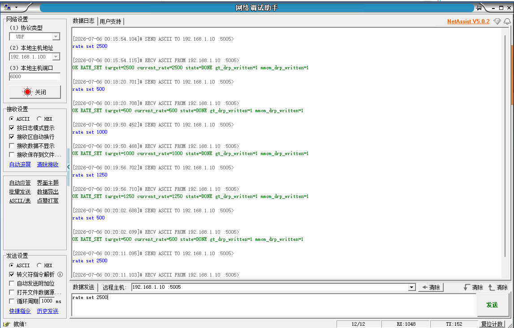
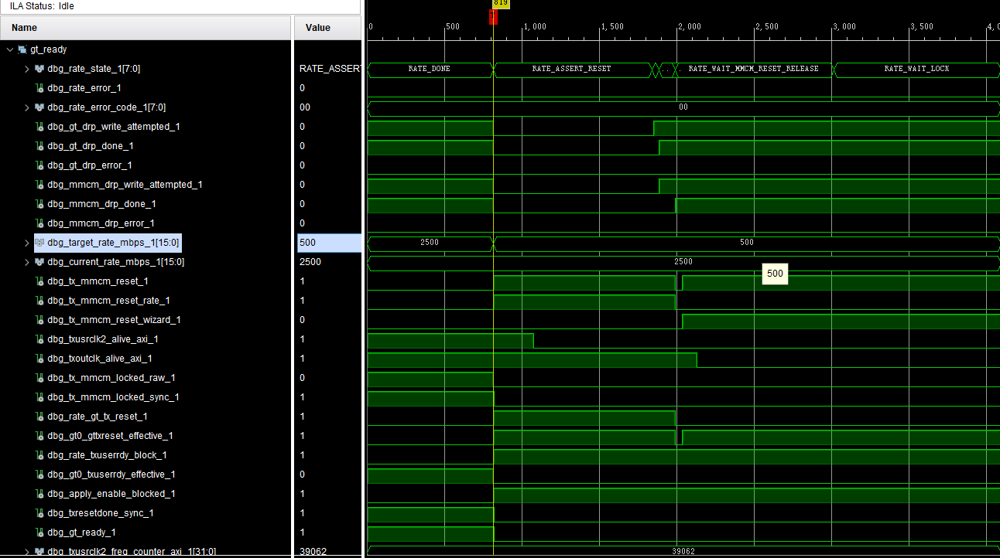
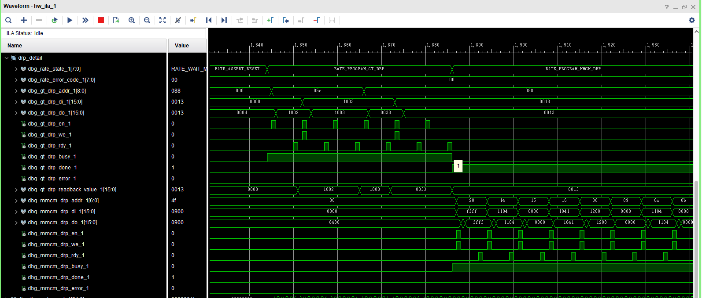

# 2500M CPLL dynamic profile 上板验证报告

## 1. 本阶段目标

本阶段目标是在已经验证的 500M / 1000M / 1250M / 2000M dynamic profile 基础上，新增并验证 2500M profile。

2500M 属于 125MHz REFCLK + CPLL 条件下的固定速率 profile。本阶段不涉及 QPLL、不涉及 156.25MHz REFCLK、不涉及 AD9528 动态输出、不涉及 GT refclk 动态切换，也不代表任意连续速率或宽范围动态调速已经完成。

本轮只整理已有上板证据截图并生成报告，不修改 RTL、Vitis、BD、XDC、Tcl、DRP 参数、ILA probe 或 Vivado 工程文件。

## 2. 2500M profile 参数

| 项目 | 2500M profile |
|---|---:|
| REFCLK | 125MHz |
| PLL | CPLL |
| CPLL M/N1/N2 | 1/4/5 |
| CPLL divider DRP value | 0x1003 |
| TXOUT_DIV | 2 |
| TXUSRCLK2 | 39.0625MHz |
| `txusrclk2_freq_counter_axi` 约 1ms 统计窗口预期 | 约 39062 |
| frequency window | 38400..39750 |
| AD9528 dynamic required | 0 |
| QPLL required | 0 |

2500M 与 1250M 同属 CPLL divider `0x1003` 参数组。二者之间切换不需要改变 CPLL divider，只需要改变 TXOUT_DIV 和 MMCM 配置；而从 500M / 1000M / 2000M 切到 2500M 时，需要将 CPLL divider 从 `0x1002` 切换到 `0x1003`。

## 3. UDP 验证结果

UDP 日志显示，2500M、500M、1000M、1250M 等多档 `rate set` 均返回 OK，`current_rate` 与目标一致，`state=DONE`，`gt_drp_written=1`，`mmcm_drp_written=1`。

该结果说明 PS UDP 命令解析、PS->PL rate request、PL rate controller、GT/MMCM DRP 执行以及状态回读链路均能覆盖 2500M profile。

## 4. 2500M DONE / lock / ready / frequency 证据

ILA 图中，光标处 `current_rate_mbps=2500`，`error_code=0`，`gt_ready=1`，`txresetdone_sync=1`，`tx_mmcm_locked_raw/sync=1`，`txoutclk_alive_axi=1`，`txusrclk2_alive_axi=1`，`txusrclk2_freq_counter_axi` 约为 39062。

由于 2500M profile 的 TXUSRCLK2 预期为 39.0625MHz，在约 1ms 统计窗口下计数约为 39062，因此该频率计数落入预期窗口 38400..39750。

如果图中 `target_rate_mbps` 已经进入下一次切换目标，不应误判为当前 2500M 证据失效。`target_rate_mbps` 表示下一次请求目标，`current_rate_mbps` 才表示已经通过 VERIFY_RATE 的当前速率。本图以 `current_rate=2500`、`freq_counter≈39062`、`gt_ready=1`、`error_code=0` 作为 2500M DONE 稳态证据。

## 5. DRP 细节证据

ILA DRP 细节图显示，切入 2500M 时 GT DRP 访问 `addr=0x05E`，CPLL divider 相关值从原 `0x1002` 切换到 `0x1003`；同时 GT DRP 访问 `addr=0x088`，执行 TXOUT_DIV 相关写入；随后 MMCM DRP 连续写入发生，`gt_drp_done=1`、`mmcm_drp_done=1`、`error_code=0`。

该图说明 2500M 动态切换不是单纯软件状态更新，而是实际执行了 CPLL / GT / MMCM DRP 配置链路。

## 6. 5000M 暂不加入原因

本轮没有加入 5000M。原因不是 CPLL `0x1003` 参数组不可用，而是当前 `expected_min_count / expected_max_count` 以及相关 frequency counter 比较路径为 16-bit。

5000M 的 TXUSRCLK2 预期为 78.125MHz，在约 1ms 统计窗口下计数约为 78125，预期窗口约为 76800..79500，超过 16-bit 最大值 65535。因此 5000M 需要后续单独进行 frequency counter 位宽扩展或测量窗口参数化后再加入。

本阶段结论不是“5000M 不支持”，而是“当前频率验证计数路径不满足安全加入 5000M profile 的条件”。

## 7. 当前结论

2500M CPLL dynamic profile 已完成初步上板验证。UDP 日志显示 2500M 与既有 500M / 1000M / 1250M profile 之间可完成动态切换并返回 DONE；ILA 显示 2500M 下 MMCM lock、GT ready、txresetdone 和 TXUSRCLK2 frequency counter 均满足预期；DRP 细节图进一步证明 CPLL / GT / MMCM DRP 写入链路真实发生。

因此，可以认为 2500M 这一档 125MHz REFCLK + CPLL 固定 profile 的动态切换初步验证通过。

## 8. 边界声明

当前不能声明：

- 所有 CPLL 经典速率均已支持；
- 任意速率动态调速完成；
- 宽范围连续调速完成；
- QPLL 已支持；
- 156.25MHz REFCLK 已支持；
- AD9528 动态输出已支持；
- 5000M 已支持；
- 外部光口质量 / BER / 长期稳定性通过。

本阶段只证明 2500M 这一档固定 CPLL profile 的动态切换初步上板通过。
