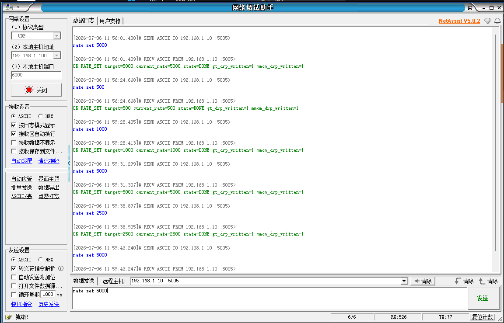
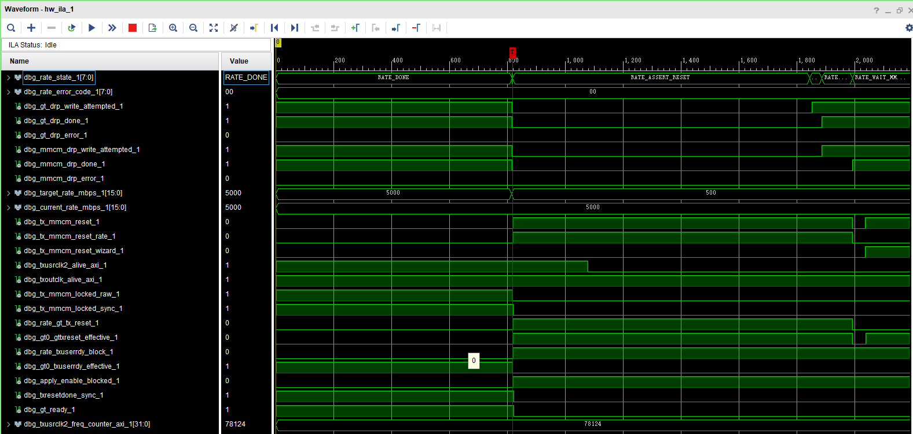
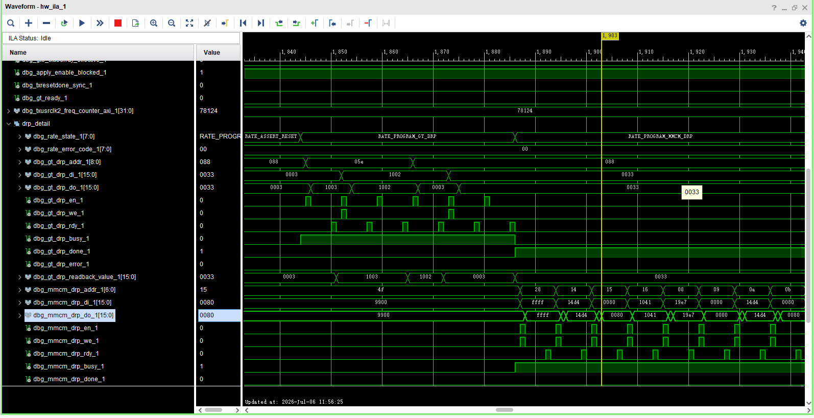

# 5000M CPLL dynamic profile 集成与上板验证报告

## 1. 本阶段目标

本阶段目标是在已完成 500M / 1000M / 1250M / 2000M / 2500M dynamic profile 的基础上，对新增 5000M CPLL dynamic profile 的上板验证证据进行收口整理。

本报告只整理 5000M 上板验证结果和截图证据，不修改 RTL、Vitis、BD、XDC、Tcl、DRP 参数、ILA probe 或 Vivado 工程文件。

本阶段验证对象为固定 profile：

```text
500M / 1000M / 1250M / 2000M / 2500M / 5000M
```

本阶段不涉及：

- 任意速率动态调节；
- 宽范围连续调速；
- QPLL；
- 156.25MHz REFCLK；
- AD9528 动态输出；
- GT refclk 动态切换；
- laser_tx_core 数据宽度或发送逻辑修改；
- 外部光口质量、BER 或长期稳定性验证。

## 2. 5000M profile 参数

5000M 继续使用当前 125MHz REFCLK 与 CPLL，不引入 AD9528、QPLL 或 refclk 切换。

| 字段 | 5000M profile |
|---|---:|
| rate_id | 6 |
| rate_mbps | 5000 |
| REFCLK | 125MHz |
| PLL | CPLL |
| CPLL M / N1 / N2 | 1 / 4 / 5 |
| CPLL divider DRP value | `0x1003` |
| TXOUT_DIV | 1 |
| TXOUT_DIV encoding | `3'b000` |
| TXOUTCLK | 156.25MHz |
| TXUSRCLK | 156.25MHz |
| TXUSRCLK2 | 78.125MHz |
| txusrclk2 1ms counter 预期 | 约 78125 |
| 初始窗口 | 76800..79500 |
| AD9528 dynamic required | 0 |
| QPLL required | 0 |

TXOUT_DIV 编码仍沿用已有 GTXE2_CHANNEL DRP map：

```text
GTXE2_CHANNEL TXOUT_DIV DRP address = 0x088
TXOUT_DIV bitfield = [6:4]
OUT_DIV=1 -> encoding 0
OUT_DIV=2 -> encoding 1
OUT_DIV=4 -> encoding 2
OUT_DIV=8 -> encoding 3
```

## 3. frequency counter 位宽扩展说明

5000M 下 `TXUSRCLK2 = 78.125MHz`。当前 `txusrclk2_freq_counter_axi` 采用约 1ms 统计窗口，因此 5000M 对应计数值约为：

```text
78.125MHz × 1ms ≈ 78125
```

该数值超过 16-bit 可表达范围，因此 5000M profile 集成阶段已将硬件频率窗口比较路径扩展到可覆盖 5000M 的计数范围。5000M 的初始验证窗口设置为：

```text
76800..79500
```

本次上板 ILA 图中 `txusrclk2_freq_counter_axi ≈ 78124`，落入该窗口，说明 5000M 运行时 `TXUSRCLK2` 频率与 profile 预期一致。

需要注意：frequency counter 只能证明 TXUSRCLK2 频率落入预期统计窗口，不等价于外部光口质量、BER 或长期稳定性验证。

## 4. UDP 验证结果



图中 UDP 日志显示，`rate set 5000`、`rate set 500`、`rate set 1000`、再次 `rate set 5000`、以及 `rate set 2500` 均返回 `DONE`。每次返回中 `current_rate` 与目标速率一致，并且 `gt_drp_written=1`、`mmcm_drp_written=1`。

这说明在当前测试序列中，5000M profile 能与既有 500M / 1000M / 2500M profile 共同参与 UDP 动态切换流程，且软件状态回读与目标速率一致。

## 5. 5000M DONE / lock / ready / frequency 证据



该 ILA 图用于证明 5000M profile 在切换后进入稳定 DONE 状态。图中关键信号如下：

| 信号 | 观测结果 | 说明 |
|---|---:|---|
| `rate_state` | `RATE_DONE` | rate controller 已完成本次切换 |
| `target_rate_mbps` | 5000 | 目标 profile 为 5000M |
| `current_rate_mbps` | 5000 | 当前速率已在验证成功后更新为 5000M |
| `error_code` | 0 | 无错误 |
| `gt_drp_write_attempted` | 1 | GT DRP 写入流程已执行 |
| `gt_drp_done` | 1 | GT DRP 流程完成 |
| `mmcm_drp_write_attempted` | 1 | MMCM DRP 写入流程已执行 |
| `mmcm_drp_done` | 1 | MMCM DRP 流程完成 |
| `tx_mmcm_locked_raw` / `tx_mmcm_locked_sync` | 1 / 1 | MMCM 原始 lock 和同步后 lock 均为 1 |
| `txresetdone_sync` | 1 | GT TX reset done 已恢复 |
| `gt_ready` | 1 | GT ready 已恢复 |
| `txoutclk_alive_axi` | 1 | TXOUTCLK 活动状态存在 |
| `txusrclk2_alive_axi` | 1 | TXUSRCLK2 域活动状态存在 |
| `txusrclk2_freq_counter_axi` | 约 78124 | 落入 5000M 窗口 76800..79500 |

5000M profile 的理论 `TXUSRCLK2 = 78.125MHz`。在约 1ms 统计窗口下，期望计数约为 78125。图中约 78124 的计数值与预期一致，说明 5000M 切换后的 TXUSRCLK2 频率验证通过。

如果截图后半段出现下一次切换请求导致 `target_rate_mbps` 变化，应按状态机语义理解：`target_rate` 表示下一次请求目标，而 `current_rate` 表示已经完成 VERIFY_RATE 并确认生效的当前速率。判断 5000M 是否完成，应以同一光标附近的 `RATE_DONE`、`current_rate_mbps=5000`、`error_code=0`、`gt_ready=1` 和 frequency counter 落窗为准。

## 6. DRP 细节证据



该 ILA 图用于证明 5000M 切换过程中实际发生了 CPLL、GT TXOUT_DIV 和 MMCM DRP 事务，而不是仅有 UDP 命令或软件状态变化。

图中可见：

- GT DRP 访问 `0x05E`，CPLL divider 相关值从 `0x1002` 切换到 `0x1003`；
- GT DRP 访问 `0x088`，用于写入 TXOUT_DIV 相关字段；
- 随后进入 MMCM DRP 连续写入流程；
- `gt_drp_done=1`；
- `mmcm_drp_done=1`；
- `error_code=0`。

这组证据说明 5000M profile 的关键动态切换动作已经在 PL 内部执行：CPLL 参数组切换、GT TXOUT_DIV 更新、MMCM 参数更新均有 ILA 观测证据支持。

## 7. 当前结论

本轮 5000M CPLL dynamic profile 已完成初步上板验证：

1. UDP 证据显示，5000M 与既有 500M / 1000M / 2500M profile 的多速率切换均返回 `DONE`，且 `current_rate` 与目标一致；
2. AXI/FCLK ILA 证据显示，5000M 下 rate controller 进入 `RATE_DONE`，`error_code=0`，`tx_mmcm_locked_raw/sync=1`，`txresetdone_sync=1`，`gt_ready=1`；
3. frequency counter 显示 `txusrclk2_freq_counter_axi≈78124`，落入 5000M 预期窗口 76800..79500；
4. DRP 细节 ILA 证据显示，CPLL divider、GT TXOUT_DIV 和 MMCM DRP 流程均实际发生并完成。

因此，可以将阶段性结论写为：

```text
5000M 这一档 125MHz REFCLK + CPLL dynamic profile 已完成初步上板验证。
```

## 8. 边界声明

本报告结论仅覆盖当前工程中固定 profile 的 5000M 上板初步验证。即使本轮 5000M 验证通过，也不能扩大解释为：

- 所有 CPLL classic rates 均已支持；
- 任意速率动态调速完成；
- 宽范围连续动态调速完成；
- QPLL 支持完成；
- 156.25MHz REFCLK 支持完成；
- AD9528 动态输出完成；
- 外部光口质量 / BER 验证完成；
- 长期稳定性验证完成。

后续如继续扩展 CPLL classic profile，仍应逐档确认 DRP 参数、MMCM 参数、reset/relock sequence、frequency counter 窗口、UDP 状态回读和 ILA 证据。
