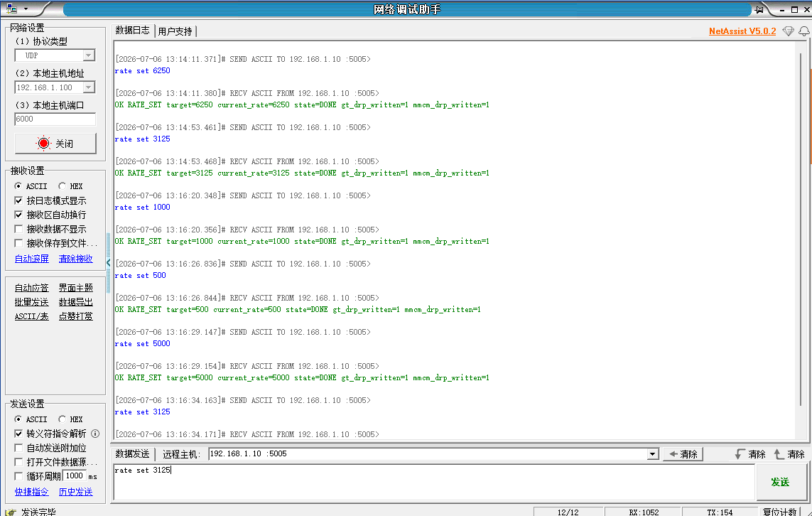
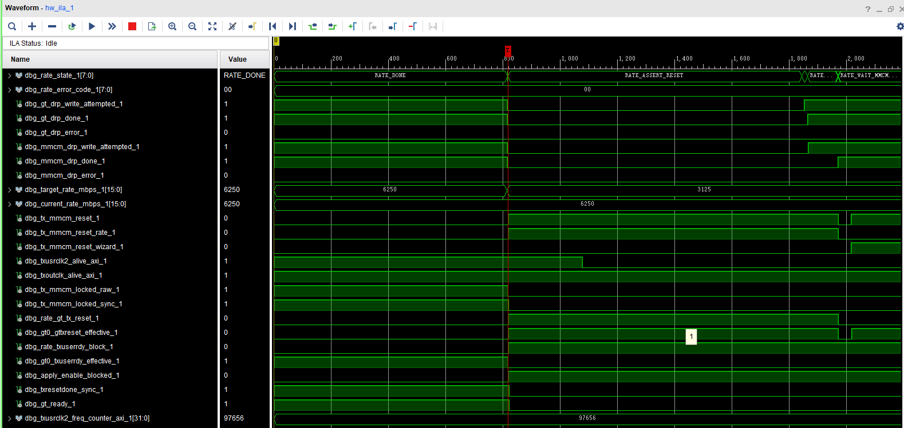
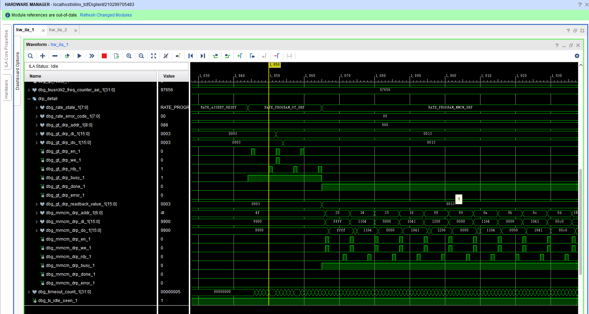

# 3.125G / 6.25G CPLL dynamic profile 集成与上板验证报告

## 1. 本阶段目标

本阶段目标是在已验证的 500M / 1000M / 1250M / 2000M / 2500M / 5000M dynamic profile 基础上，新增并验证 3.125G 和 6.25G 两个 125MHz REFCLK + CPLL 固定 profile。

本阶段不涉及 QPLL、156.25MHz REFCLK、AD9528 动态输出或任意连续速率；也不修改 `laser_tx_core` 数据宽度、`pattern_tx_engine`、GT refclk 动态切换或外部时钟树。

## 2. Profile 参数

### 2.1 3125M profile

| 项目 | 参数 |
|---|---:|
| rate_id | 7 |
| REFCLK | 125MHz |
| PLL | CPLL |
| CPLL M/N1/N2 | 1/5/5 |
| CPLL divider DRP value | 0x1083 |
| TXOUT_DIV | 2 |
| TXOUT_DIV encoding | 3'b001 |
| TXUSRCLK2 expected | 48.828125MHz |
| 约 1ms 频率计数 | 约 48828 |
| RTL frequency window | 48000..49700 |
| AD9528 dynamic required | 0 |
| QPLL required | 0 |

### 2.2 6250M profile

| 项目 | 参数 |
|---|---:|
| rate_id | 8 |
| REFCLK | 125MHz |
| PLL | CPLL |
| CPLL M/N1/N2 | 1/5/5 |
| CPLL divider DRP value | 0x1083 |
| TXOUT_DIV | 1 |
| TXOUT_DIV encoding | 3'b000 |
| TXUSRCLK2 expected | 97.65625MHz |
| 约 1ms 频率计数 | 约 97656 |
| RTL frequency window | 96000..99500 |
| AD9528 dynamic required | 0 |
| QPLL required | 0 |

3.125G 和 6.25G 共用 CPLL 参数组 `M/N1/N2=1/5/5`，区别主要在 TXOUT_DIV 和 MMCM DRP sequence。`current_rate` 仍只在 `VERIFY_RATE` 成功后更新；切换失败时不得提前更新为目标速率。

## 3. UDP 验证结果

UDP 日志显示 6250M、3125M、1000M、500M、5000M 等多档 `rate set` 均返回 OK，`current_rate` 与目标一致，`state=DONE`，`gt_drp_written=1`，`mmcm_drp_written=1`。该结果说明 PS UDP 命令解析、PS->PL rate request、PL rate controller、DRP 执行和状态回读链路已经覆盖 3125M / 6250M profile。

需要注意的是，UDP DONE 证明软件命令链路和 PL 状态机返回链路闭合；具体时钟与 DRP 细节仍需结合 ILA 证据判断。

## 4. 6250M DONE / lock / ready / frequency 证据

ILA 图中 6250M profile 已进入稳定完成状态，关键信号包括：

- `rate_state = RATE_DONE`；
- `target_rate_mbps = 6250`；
- `current_rate_mbps = 6250`；
- `error_code = 0`；
- `gt_drp_write_attempted = 1`；
- `gt_drp_done = 1`；
- `mmcm_drp_write_attempted = 1`；
- `mmcm_drp_done = 1`；
- `tx_mmcm_locked_raw = 1`；
- `tx_mmcm_locked_sync = 1`；
- `txresetdone_sync = 1`；
- `gt_ready = 1`；
- `txoutclk_alive_axi = 1`；
- `txusrclk2_alive_axi = 1`；
- `txusrclk2_freq_counter_axi ≈ 97656`。

6250M profile 的 TXUSRCLK2 预期为 97.65625MHz。当前频率计数器采用约 1ms 统计窗口，因此预期计数约为 97656。图中计数值落入 RTL 中 6250M 预期窗口 `96000..99500`，可作为 6250M frequency verify 通过证据。

如果图中后半段已经出现下一次 `target_rate` 变化，应以 `current_rate` 判断已经通过 VERIFY_RATE 的当前速率；`target_rate` 表示后续请求目标。本图以 `current_rate=6250`、`freq_counter≈97656`、`gt_ready=1`、`error_code=0` 作为 6250M 稳态证据。

## 5. DRP 细节证据

ILA DRP 细节图显示，切入 6250M 时 CPLL/GT/MMCM DRP 写入链路真实发生：

- GT DRP 访问 `addr=0x05E`；
- CPLL divider 从原参数组切换到 6.25G 所需参数组；
- GT DRP 访问 `addr=0x088`；
- TXOUT_DIV 相关写入发生；
- MMCM DRP 连续写入发生；
- `gt_drp_done=1`；
- `mmcm_drp_done=1`；
- `error_code=0`。

该图说明 6250M dynamic 切换不是单纯软件状态更新，而是实际执行了 CPLL / GT / MMCM DRP 配置链路。该图作为代表性 DRP 细节证据；本轮不要求保存每个方向的 DRP 细节图。

## 6. 当前结论

3.125G / 6.25G CPLL dynamic profile 已完成初步上板验证。UDP 日志显示 3125M、6250M 与既有 500M / 1000M / 5000M 等 profile 之间可完成动态切换并返回 DONE；ILA 显示 6250M 下 MMCM lock、GT ready、txresetdone 和 TXUSRCLK2 frequency counter 均满足预期；DRP 细节图进一步证明 CPLL / GT / MMCM DRP 写入链路真实发生。因此可以认为 3.125G / 6.25G 这两个 125MHz REFCLK + CPLL 固定 profile 的动态切换初步验证通过。

当前没有单独保存 3125M DONE / frequency ILA 图；3125M 的硬件证据主要来自 UDP DONE、多档循环切换结果，以及与 6250M 共用的 CPLL DRP / dynamic executor 路径。6250M 额外保存了 DONE / lock / ready / frequency ILA 图和 DRP 细节图，因此 6250M 的板级证据更完整。

## 7. 边界声明

当前结论只能覆盖 3.125G / 6.25G 两个 125MHz REFCLK + CPLL 固定 profile 的 dynamic 切换初步上板验证。

当前不能声明：

- 任意速率动态调速完成；
- 宽范围连续调速完成；
- 所有 CPLL 经典速率均已完全验证；
- QPLL 已支持；
- 156.25MHz REFCLK 已支持；
- AD9528 动态输出已支持；
- GT refclk 动态切换已支持；
- 外部光口质量 / BER / 长期稳定性通过。

## 8. 后续建议

后续如果要继续扩展更高或更多 CPLL profile，建议保持当前节奏：先确认 CPLL/GT/MMCM DRP 参数可追溯，再加入 profile table，最后用 UDP + AXI/FCLK ILA 验证 `DONE / lock / ready / txusrclk2_freq_counter`。对于 6250M 这种高 TXUSRCLK2 profile，建议在后续长时间循环测试中重点观察 `txusrclk2_freq_counter_axi` 稳定性和 `rate_error_code` 是否保持为 0。
