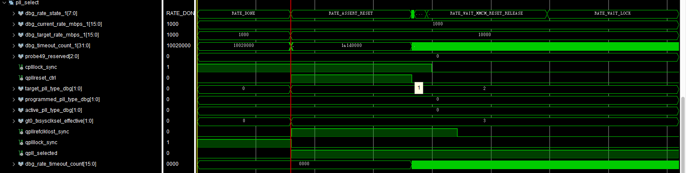
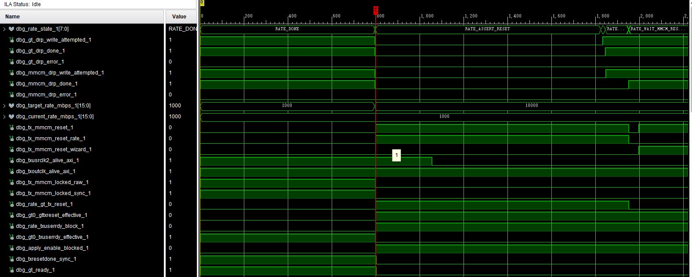
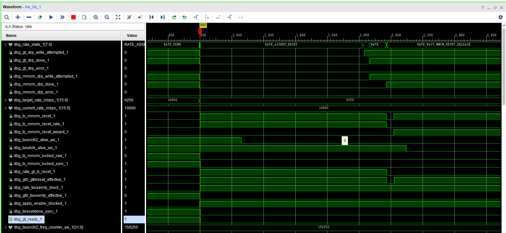
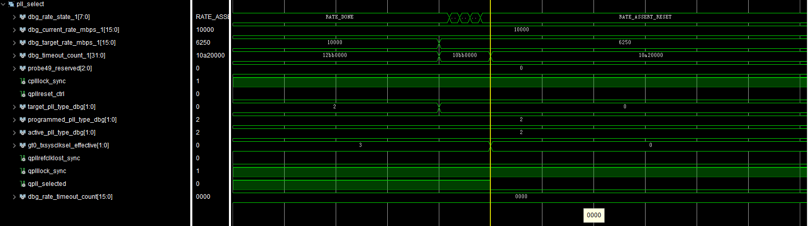
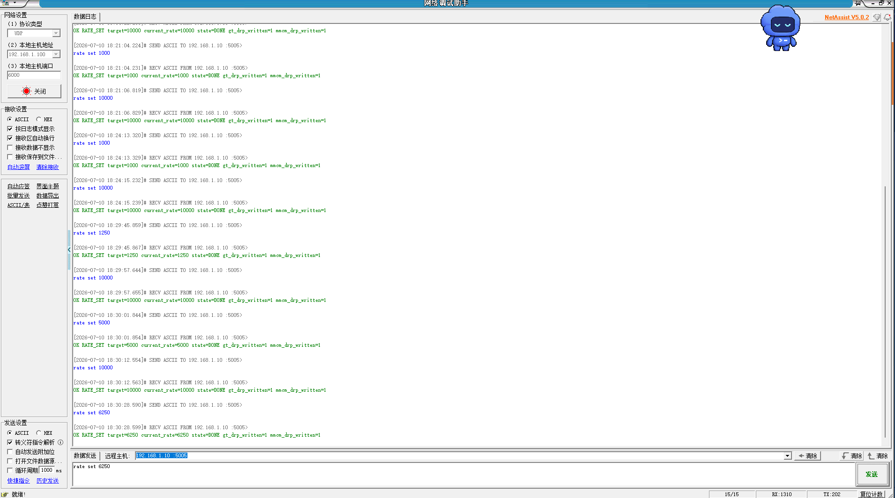

# 10G QPLL dynamic profile 集成报告

## 1. 本阶段目标

本阶段目标是在已有 500M / 1000M / 1250M / 2000M / 2500M / 3125M / 5000M / 6250M CPLL dynamic profile 基线之上，加入一个固定的 10.000Gbps QPLL profile。

本轮使用内部 UDP status、AXI/FCLK ILA、TX domain ILA、QPLL lock/refclk-lost、GT/MMCM DRP readback 和 txusrclk2 frequency counter 作为 bring-up 依据；不增加外部示波器 GPIO。

## 2. 为什么示波器后移

实验室示波器当前不可用，而且普通 500MHz 示波器也不能证明 10Gb/s 串行眼图或 BER。因此本阶段先推进内部控制链路：QPLL static attributes、PLL source select、QPLL reset/lock/refclk-lost、GT channel DRP、MMCM DRP、VERIFY_RATE、UDP rate set/status。

Oscilloscope low-speed control/clock validation was not run.

## 3. 基线 commit

本阶段基于以下已完成提交继续：

| Commit | 内容 |
|---|---|
| `5403350` | Add QPLL wrapper architecture foundation |
| `b7cac81` | Harden Vitis rate completion checks |
| `c787251` | Guard rate requests while switching |
| `86223d4` | Track programmed CPLL DRP state |
| `5c1624e` | Confirm 10G QPLL parameters |
| `b39c2a6` | Configure QPLL common for 10G |
| `83fbe6b` | Add 10G MMCM DRP sequence |
| `a61e731` | Add QPLL PLL source state semantics |

## 4. 10G 参数来源

10G 参数以隔离 GT Wizard 参数包为主要依据：

```text
reports/qpll_10g_parameter_compare/10g_125m_qpll_n80/
```

采用参数：

| 项目 | 数值 |
|---|---:|
| Line rate | 10.000Gbps |
| MGT REFCLK | 125MHz |
| PLL | QPLL |
| QPLL_N / QPLL_FBDIV_TOP | 80 |
| QPLL_M / QPLL_REFCLK_DIV | 1 |
| QPLL_FBDIV encoding | `10'b0100100000` |
| QPLL_FBDIV_RATIO | `1'b1` |
| TXOUT_DIV | 1 |
| TXSYSCLKSEL | `2'b11` |
| TXOUTCLK | 312.5MHz |
| TXUSRCLK | 312.5MHz |
| TXUSRCLK2 | 156.25MHz |
| MMCM VCO | 625MHz |

## 5. 10.000G 与 10.3125G 区分

本轮加入的是 10.000Gbps，不是 10.3125Gbps。125MHz REFCLK 下采用 QPLL_N=80、M=1、TXOUT_DIV=1：

```text
125MHz × 80 / (1 × 1) = 10.000Gbps
```

当前没有使用 156.25MHz MGT REFCLK，也没有把 10.3125G 参数冒充为 10G。

## 6. QPLL 静态属性策略

当前工程只有一个 10G QPLL profile，因此本阶段不新增 QPLL DRP controller。QPLL COMMON 采用静态 attributes：

| GTXE2_COMMON 参数 | 数值 |
|---|---|
| `QPLL_FBDIV` | `10'b0100100000` |
| `QPLL_FBDIV_RATIO` | `1'b1` |
| `QPLL_REFCLK_DIV` | `1` |
| `QPLL_CFG` | `27'h0680181` |
| `QPLL_CP` | `10'b0000011111` |
| `QPLL_LPF` | `4'b1111` |
| `QPLL_LOCK_CFG` | `16'h21E8` |
| `QPLL_INIT_CFG` | `24'h000006` |
| `QPLL_CLKOUT_CFG` | `4'b0000` |

## 7. Profile table

新增 profile：

| 字段 | 10G profile |
|---|---|
| rate_id | `RATE_ID_10000M = 9` |
| rate_mbps | 10000 |
| refclk | 125MHz |
| pll_type | QPLL |
| qpll_required | 1 |
| QPLL_N | 80 |
| TXOUT_DIV | 1 |
| TXOUT_DIV encoding | `3'b000` |
| MMCM profile | `MMCM_DRP_SEQ_PROFILE8_10000M` |
| expected TXUSRCLK2 | 156.25MHz |
| freq counter window | `153000..159500` |
| AD9528 dynamic | 0 |

原有 CPLL profiles 仍保持 `PLL_TYPE_CPLL`。

## 8. PLL 状态语义

本轮新增/接入以下 PLL 状态语义：

| 状态 | 含义 |
|---|---|
| `target_pll_type` | 当前请求目标使用 CPLL 或 QPLL |
| `active_pll_type` | 最后一次通过 VERIFY_RATE 的 PLL 类型 |
| `programmed_pll_type` | 最近实际完成 PLL source 选择和 lock 流程的 PLL 类型 |
| `qpll_selected` | 送入 GT channel 的 QPLL source select 控制 |
| `rate_qpll_reset` | rate controller 控制的 QPLL reset |

`current_rate` 和 `active_pll_type` 仍只在 VERIFY_RATE 成功后更新。失败时保留 last-good 状态。

## 9. CPLL -> QPLL 状态序列

10G profile 进入路径复用现有 rate switch executor，并在 reset 已断言、TXUSERRDY 已关闭后切换 PLL source：

```text
QUIESCE_TX
ASSERT_RESET
select QPLL / assert-release QPLL reset
PROGRAM_GT_DRP
PROGRAM_MMCM_DRP
RELEASE_RESET
WAIT_MMCM_RESET_RELEASE
WAIT_LOCK(QPLL lock/refclk-lost + MMCM lock + txresetdone + gt_ready)
VERIFY_RATE
DONE / ERROR
```

## 10. QPLL -> CPLL 状态序列

回切 CPLL profile 时，目标 profile 的 `pll_type=CPLL`，`qpll_selected` 在 GTTXRESET 已断言、TXUSERRDY 已关闭期间切回 CPLL encoding。CPLL divider restore 仍沿用已修复的 programmed/active CPLL 语义：

```text
target_cpll_drp_value != programmed_cpll_drp_value
```

时执行 CPLL DRP，否则只写 TXOUT_DIV 和 MMCM DRP。

## 11. QPLL reset / lock / refclk lost

新增错误码：

| Error code | 含义 |
|---|---|
| `QPLL_LOCK_TIMEOUT` | QPLL 未在 timeout 内 lock |
| `QPLL_REFCLK_LOST` | QPLL refclk lost 置位 |

QPLL raw lock/refclk-lost 先同步到 `gt_ctrl_clk` 域，再参与状态机判断。没有使用常量伪造 QPLLLOCK。

## 12. GT channel DRP

10G profile 使用现有 GT channel DRP executor 写 TXOUT_DIV。10G 的 TXOUT_DIV=1，对应当前 DRP encoding `3'b000`。本轮没有新增 QPLL DRP。

## 13. MMCM DRP

新增 `MMCM_DRP_SEQ_PROFILE8_10000M`，目标：

| 项目 | 数值 |
|---|---:|
| MMCM input | TXOUTCLK 312.5MHz |
| CLKIN period | 3.2ns |
| CLKFBOUT_MULT | 2.0 |
| DIVCLK_DIVIDE | 1 |
| CLKOUT1_DIVIDE | 2 |
| CLKOUT0_DIVIDE | 4 |
| TXUSRCLK | 312.5MHz |
| TXUSRCLK2 | 156.25MHz |
| VCO | 625MHz |

DRP 序列复用当前工程已有的 Xilinx VPHY MMCME2 encoding 方法，没有手写未经生成方法验证的 magic number。

## 14. TXUSRCLK2 frequency window

当前 txusrclk2 frequency counter 采用约 1ms 统计窗口。10G profile 预期 TXUSRCLK2=156.25MHz，因此预期计数约 156250。初始窗口设置为：

```text
153000 .. 159500
```

该窗口需要后续上板实测确认。VERIFY_RATE 未被绕过，不能仅凭 QPLLLOCK 或 gt_ready 判定成功。

## 15. ILA probe

本轮继续使用稳定 AXI/FCLK ILA，不让 debug hub 依赖 TXUSRCLK2。新增/保留的关键 mark_debug 信号包括：

- `target_pll_type_dbg`
- `active_pll_type_dbg`
- `programmed_pll_type_dbg`
- `qpll_selected`
- `gt0_txsysclksel_effective`
- `qpllreset_ctrl`
- `qplllock_sync`
- `qpllrefclklost_sync`
- `txusrclk2_freq_counter_axi`
- GT/MMCM DRP addr/data/en/we/rdy/done/error

## QPLL / PLL source ILA 可观测性

为补齐 10G QPLL bring-up 的 PLL source 证据链，本轮将 QPLL/PLL source 状态加入现有稳定 AXI/FCLK 域 ILA。现有 `ila_laser_axi_cfg` 已有 50 个 probe，且 probe0-probe48 均用于 rate、reset、DRP、MMCM lock、GT ready、txusrclk2 frequency 等关键证据。为避免修改 BD ILA probe 数量、capture depth 和 clock，本轮复用 32-bit `ila_laser_axi_cfg/probe49`，将其从单一 `dbg_timeout_count` 升级为 debug-only PLL/QPLL status bus。

该 probe 仍接在 `gt_ctrl_clk / AXI FCLK` 域，不依赖 TXUSRCLK2、TXOUTCLK 或 QPLL/CPLL 输出时钟。新增观测不反馈到 rate controller、GT DRP、MMCM DRP、profile table 或 VERIFY_RATE 逻辑。

### 新增/暴露的 QPLL 关键观测

| 信号 | 位宽 | 所属时钟域 | ILA 承载位置 | 含义 |
|---|---:|---|---|---|
| `qpll_selected` | 1 | `gt_ctrl_clk` | `probe49[16]` | 真实驱动 `TXSYSCLKSEL` mux 的 QPLL source select。 |
| `qplllock_sync` | 1 | `gt_ctrl_clk` 同步后 | `probe49[17]` | 同步后的 QPLLLOCK，用于证明 QPLL lock 已建立。 |
| `qpllrefclklost_sync` | 1 | `gt_ctrl_clk` 同步后 | `probe49[18]` | 同步后的 QPLL reference clock lost，10G DONE 稳态预期为 0。 |
| `gt0_txsysclksel_effective[1:0]` | 2 | `gt_ctrl_clk` 组合稳定选择 | `probe49[20:19]` | 实际送入 GTXE2_CHANNEL 的 `TXSYSCLKSEL`。当前 encoding：CPLL=`2'b00`，QPLL=`2'b11`。 |
| `active_pll_type_dbg[1:0]` | 2 | `gt_ctrl_clk` | `probe49[22:21]` | 最后一次通过 VERIFY_RATE 后正式接受的 PLL 类型。当前 RTL encoding：CPLL=`2'd0`，QPLL=`2'd1`。 |
| `programmed_pll_type_dbg[1:0]` | 2 | `gt_ctrl_clk` | `probe49[24:23]` | 最近一次实际完成 PLL source 选择 / lock 流程后的 PLL 类型。 |

同时在同一 probe 中加入推荐辅助项：

| 信号 | 位宽 | ILA 承载位置 | 用途 |
|---|---:|---|---|
| `target_pll_type_dbg[1:0]` | 2 | `probe49[26:25]` | 本轮请求目标 PLL 类型。 |
| `qpllreset_ctrl` | 1 | `probe49[27]` | 观察 QPLL reset 控制。 |
| `cplllock_sync` | 1 | `probe49[28]` | 观察 QPLL->CPLL 回切时 CPLL lock 是否恢复。 |
| `dbg_rate_timeout_count[15:0]` | 16 | `probe49[15:0]` | 保留原 timeout counter 的低 16 位，用于观察 WAIT/timeout 推进。 |

`active_pll_type_dbg` 与 `programmed_pll_type_dbg` 的区别是本阶段 10G/QPLL 恢复语义的关键：`programmed_pll_type_dbg` 表示硬件 source 最近实际切换到哪一类 PLL；`active_pll_type_dbg` 只有在 VERIFY_RATE 成功后才更新，代表当前 rate controller 认可的 last-good PLL 类型。因此，当 source 已切换但 VERIFY 尚未成功时，两者允许短暂不同。

本轮只是增加 ILA 可观测性，不修改动态切换功能逻辑。后续上板应重点保存：

```text
docs/images/dynamic_rate/qpll_10g_profile/ila_cpll_to_qpll_10g_pll_select_lock_sequence.png
docs/images/dynamic_rate/qpll_10g_profile/ila_qpll_10g_done_pll_state_freq.png
docs/images/dynamic_rate/qpll_10g_profile/ila_qpll_10g_to_cpll_pll_restore_sequence.png
```

### Hardware Manager 用户自定义 probe 位序

当前 RTL 的 PLL type 编码以 `laser_gt_rate_switch_500m_1000m.v` 中的 localparam 为准：CPLL=`2'd0`，QPLL=`2'd1`。`probe49` 的物理位分配没有变化；问题只发生在 Hardware Manager 对 2-bit 用户自定义 probe 的 `-map` 列表解释上。Vivado 的 `-map` 列表按用户 probe 的 **MSB 到 LSB** 排列。

Hardware Manager 中已直接观察到 `active_pll_type_dbg` 被创建为 `probe49[21] probe49[22]`，即按物理低位到高位填写，导致 RTL 的 QPLL 值 `2'b01` 被解释为 `2'b10`、显示为十进制 2。其余三项应按同一规则在 GUI 中核对；若它们同样按低位到高位创建，则当前错误 map 与应使用的 map 如下：

| 用户 probe | 物理 RTL bit 定义 | 低位到高位创建时的错误 MAP | 正确 MAP（MSB → LSB） |
|---|---|---|---|
| `gt0_txsysclksel_effective` | `probe49[20:19]` | `probe49[19] probe49[20]` | `probe49[20] probe49[19]` |
| `active_pll_type_dbg` | `probe49[22:21]` | `probe49[21] probe49[22]`（已观察） | `probe49[22] probe49[21]` |
| `programmed_pll_type_dbg` | `probe49[24:23]` | `probe49[23] probe49[24]` | `probe49[24] probe49[23]` |
| `target_pll_type_dbg` | `probe49[26:25]` | `probe49[25] probe49[26]` | `probe49[26] probe49[25]` |

修正仅需删除并按表中 MSB→LSB 顺序重建 Hardware Manager 用户 probe；不修改 `probe49`、RTL、ILA core、bitstream 或 LTX。10G 稳态下，修正后的用户 probe 应显示：`gt0_txsysclksel_effective=2'b11`（十进制 3）、`target_pll_type_dbg=1`、`programmed_pll_type_dbg=1`、`active_pll_type_dbg=1`，同时 `qpll_selected=1`、`qplllock_sync=1`、`qpllrefclklost_sync=0`。CPLL 稳态下三个 PLL type 应均显示 0，TXSYSCLKSEL 应显示 `2'b00`。

## 16. Vitis / UDP 修改

软件新增：

- `LASER_RATE_ID_10000M = 9`
- `rate set 10000`
- `rate plan 10000`
- `rate list` 显示 10000
- QPLL error code 字符串
- `rate status` mode 字符串包含 `10000m_qpll`

UDP 命令格式、UDP 端口、GPIO bitfield、AXI 地址均未改变。

## 17. Synth / implementation / timing

执行命令：

```text
D:/Vivado/2022.2/bin/vivado.bat -mode batch -source scripts/run_qpll_wrapper_architecture_project_flow.tcl
```

结果：

| 项目 | 结果 |
|---|---|
| synthesis | passed |
| implementation | passed |
| write_bitstream | passed |
| write_debug_probes | passed |
| WNS | 7.029ns |
| TNS | 0.000ns |
| WHS | 0.049ns |
| THS | 0.000ns |
| Timing summary | All user specified timing constraints are met |

生成文件：

```text
D:/FPGA_Learn/laser_tx/laser_tx.runs/impl_1/laser_tx_board_top.bit
D:/FPGA_Learn/laser_tx/laser_tx.runs/impl_1/laser_tx_board_top.ltx
```

报告路径：

```text
D:/FPGA_Learn/laser_tx/reports/qpll_wrapper_architecture/timing_summary_qpll_wrapper_architecture.rpt
D:/FPGA_Learn/laser_tx/reports/qpll_wrapper_architecture/utilization_qpll_wrapper_architecture.rpt
D:/FPGA_Learn/laser_tx/reports/qpll_wrapper_architecture/debug_cores_qpll_wrapper_architecture.rpt
```

## 18. Vitis build

执行目录：

```text
D:/FPGA_Learn/laser_tx/vitis_bringup/bringup/Debug
```

执行命令：

```text
cmd /c "call D:\Vitis\2022.2\settings64.bat && make clean && make all"
```

结果：

```text
text = 149279
data = 3432
bss  = 3201088
dec  = 3353799
```

ELF：

```text
D:/FPGA_Learn/laser_tx/vitis_bringup/bringup/Debug/bringup.elf
```

ELF strings 已确认包含 `10000`、`QPLL`、`OK RATE_LIST`、`OK RATE_PLAN`、`QPLL_LOCK_TIMEOUT`、`QPLL_REFCLK_LOST`。

## 19. CPLL 回归

本轮完成 build/timing 级回归，确认现有 CPLL profile 仍可综合实现，且 supported list 已保留：

```text
500,1000,1250,2000,2500,3125,5000,6250
```

本轮截图的硬件回归实际覆盖 1000M、1250M、5000M 和 6250M 与 10G 的指定路径，详见第 23 节；500M、2000M、2500M、3125M 等未出现在本轮 UDP 截图中的 CPLL profile 不计为本轮已上板回归。

## 20. 10G QPLL 上板验证结果

五张真实 Hardware Manager / UDP 截图表明，固定 10.000Gbps QPLL profile 已完成初步上板验证。10G 稳态可观察到 QPLL lock 有效、QPLL refclk-lost 为 0、GT/MMCM/txresetdone/ready 恢复，且 `txusrclk2_freq_counter_axi` 为约 `156250`，符合约 1ms 统计窗口下 156.25MHz TXUSRCLK2 的预期。

当前 RTL 的 PLL type 编码为 CPLL=`2'd0`、QPLL=`2'd1`。截图中 QPLL type 显示为 `2` 的原因是 Hardware Manager 用户自定义 probe 的 bit map 使用了低位到高位顺序；修正为 MSB→LSB map 后，10G QPLL 将显示为 1。以下 ILA 分析的 PLL source 证据由 `qpll_selected` 和 `TXSYSCLKSEL` 交叉确认。

## 21. CPLL -> QPLL 动态切换过程分析

### 21.1 1000M CPLL 到 10G QPLL 的 PLL source 选择



图中初始状态为 1000M 的 `RATE_DONE`：`target_rate_mbps=current_rate_mbps=1000`，`qpll_selected=0`，`gt0_txsysclksel_effective=2'b00`，同时 `qplllock_sync=1`、`qpllrefclklost_sync=0`。这说明固定 10G QPLL COMMON 可以在 TX 尚使用 CPLL 时预先保持 lock；QPLL lock 本身并不表示 TX channel 已经选择 QPLL。

10G 请求到达后，`target_rate_mbps` 先变为 10000，状态机离开 `RATE_DONE` 进入 `RATE_ASSERT_RESET`；`qpllreset_ctrl` 出现受控动作，随后 `qpll_selected` 由 0 变为 1，`gt0_txsysclksel_effective` 由 `2'b00` 变为 `2'b11`，而 `qpllrefclklost_sync` 保持 0。截图窗口内 `current_rate_mbps`、`active_pll_type` 和 `programmed_pll_type` 仍保留 last-good CPLL 状态，符合“target 先变、active/current 仅在 VERIFY_RATE 成功后更新”的设计语义。截图里 QPLL type 的显示值 2 属于用户 probe 位序反转；按修正 map 重建后，应显示当前 RTL 定义的 QPLL=1。

这证明 CPLL 到 QPLL 不是仅改变软件状态，而是在 GT reset 保护期间实际把 TXSYSCLKSEL 从 CPLL encoding 切到 QPLL encoding。

### 21.2 1000M CPLL 到 10G QPLL 的 reset / MMCM 过程



该图记录同一次切换的 reset/clocking 视角：10000M 目标到达后进入 `RATE_ASSERT_RESET`，`tx_mmcm_reset`、GT TX reset 和 TXUSERRDY block 均进入受控状态；随后出现 GT DRP、MMCM DRP attempted/done 以及 MMCM reset release/wait 过程，`txusrclk2_alive` 在重配置窗口内发生相应变化。

图末端停在 WAIT 类状态是过程捕获的正常结果，不是失败证据。该图与上一图共同说明 PLL source 选择和 GT/MMCM reset/DRP 操作在同一受控切换流程中完成。最终 10G DONE 由 UDP 成功记录、10G 稳态以及下一节回切图的初始状态交叉证明。

## 22. QPLL -> CPLL 动态回切过程分析

### 22.1 10G QPLL 回切 6250M CPLL 的 reset / MMCM 过程



切换前为 10G 稳态：`current_rate_mbps=target_rate_mbps=10000`，`gt_ready=1`、`txresetdone_sync=1`、`tx_mmcm_locked_sync=1`、`txoutclk_alive_axi=1`、`txusrclk2_alive_axi=1`，且 `txusrclk2_freq_counter_axi` 约为 156250。该计数与 10G profile 的 156.25MHz TXUSRCLK2 预期一致，是 frequency verify 的实际硬件证据。

6250M 请求到达后，`target_rate_mbps` 变为 6250，但 `current_rate_mbps` 保持 10000；状态机进入 `RATE_ASSERT_RESET`，GT reset、TXUSERRDY block 和 MMCM reset 均出现受控动作。只有后续 VERIFY_RATE 成功，current_rate 才允许更新为 6250。

### 22.2 10G QPLL 回切 6250M CPLL 的 PLL source 恢复



图中初始 10G 状态满足 `qpll_selected=1`、`gt0_txsysclksel_effective=2'b11`、`qplllock_sync=1`、`qpllrefclklost_sync=0`。6250M 请求后，`qpll_selected` 从 1 恢复为 0，`gt0_txsysclksel_effective` 从 `2'b11` 恢复为 `2'b00`，同时 `cplllock_sync` 保持有效。

截图窗口中 current/active/programmed PLL-type 调试字段仍保持 QPLL，说明它们没有在请求到达时提前更新：target 表示请求目标；programmed 表示完成硬件 source/lock 流程后的实际状态；active/current 仅表示最后一次经 VERIFY_RATE 接受的 last-good 状态。图中的 QPLL type 显示值 2 由用户 probe 位序反转造成，修正后应显示 RTL 定义的值 1。`qpll_selected` 和 TXSYSCLKSEL 的 1→0、11→00 变化则直接证明了 QPLL 到 CPLL 的真实 source 恢复。

## 23. UDP 多档循环回归



实际 UDP 记录覆盖：1000 -> 10000 -> 1000 -> 10000 -> 1250 -> 10000 -> 5000 -> 10000 -> 6250 Mbps。每次 `rate set` 均返回 `state=DONE`，并且 target/current rate 一致、`gt_drp_written=1`、`mmcm_drp_written=1`。

因此，本轮已实际覆盖 1000M、1250M、5000M 与 10G 的双向切换，以及 10G 回切 6250M 的路径。该证据覆盖 UDP 命令、GPIO request、PL 状态机、PLL source select、GT/MMCM DRP、VERIFY_RATE 与状态回读；未在截图中出现的其他速率或路径不计为本轮已测试。

## 24. 当前结论

10.000Gbps QPLL 固定 profile 已完成初步上板验证。ILA 显示 1000M CPLL 切入 10G QPLL 时，target 先切换，GT 在 reset 保护期间将 `qpll_selected` 从 0 切到 1，并将 `TXSYSCLKSEL` 从 CPLL encoding `2'b00` 切到 QPLL encoding `2'b11`；10G 稳态下 QPLL lock 有效、QPLL refclk-lost 为 0，TXUSRCLK2 频率计数约 156250。

ILA 同时显示 10G QPLL 回切 6250M CPLL 时，`qpll_selected` 从 1 恢复到 0，`TXSYSCLKSEL` 从 `2'b11` 恢复到 `2'b00`，而 current_rate 和 active PLL 类型在 VERIFY_RATE 前维持 last-good 语义。UDP 日志显示 10G 与 1000M、1250M、5000M、6250M 的实际测试路径均返回 DONE。因此，所测试的 CPLL/QPLL 双向动态切换控制链路已初步上板通过。

截图中 PLL-type 数值 2 的问题已定位为 Hardware Manager 用户自定义 probe 位序反转，不涉及 RTL 或已下载 bitstream。按本报告的 MSB→LSB map 重建四个用户 probe 后，10G QPLL 稳态的 PLL type 将显示为 1，与当前 RTL 定义一致。

## 25. 示波器与 BER 边界

Oscilloscope validation was not run.

10G eye / BER / external optical-link validation was not run.

## 26. 当前未验证边界

本报告证明固定 10G QPLL profile 与上述已列出的 CPLL 路径完成了初步 UDP/ILA 上板验证；不将该范围扩大为所有 CPLL/QPLL 组合、任意速率或连续调速。

当前仍不能声明：

- 10G 高速串行眼图通过；
- BER 通过；
- SFP+ 或外部光口链路通过；
- 长期稳定性通过；
- 示波器低速观测通过；
- 所有可能的 CPLL/QPLL 回切路径均已验证；
- 任意速率或宽范围连续调速已完成；
- 支持多个 QPLL profile。
