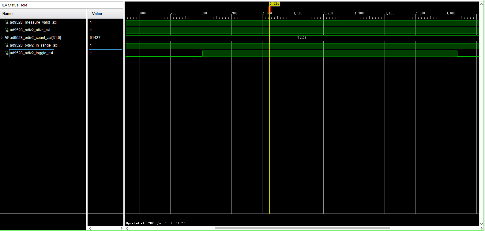

# AD9528 OUT0 实际频率 ILA 测量路径实现报告

## 1. 修改摘要

本阶段将 AD9528 OUT0 的 Bank110 差分输入接入主工程的只读频率测量路径：

```text
AA8/AA7 (Bank110 MGTREFCLK0)
-> IBUFDS_GTE2.ODIV2
-> BUFG
-> 32-bit 自由运行计数器
-> 源域寄存 Gray code
-> 2FF Gray CDC
-> 50MHz gt_ctrl_clk 域 1ms delta
-> 独立 AXI/FCLK ILA
```

测量逻辑不反馈功能路径，未把 `IBUFDS_GTE2.O` 接入 Bank111 GT，也未修改 GT profile、RATE_ID、supported list、CPLL/QPLL/MMCM DRP 或普通 `rate set` 行为。

## 2. 修改前问题

此前只有 AD9528 candidate 寄存器 readback，可证明配置值已经写入，却不能证明 OUT0 引脚实际存在 122.88MHz 时钟。隔离 route probe 也没有形成可下载主工程 bit/LTX 和 ILA 观测链路，因此 `measured_out0_hz` 必须保持 UNKNOWN。

## 3. 修改后结构

### 3.1 输入和专用时钟路径

顶层新增 `ad9528_ref0_clk_p/n`，分别约束到 AA8/AA7。差分输入使用 `IBUFDS_GTE2`；`ODIV2` 经 BUFG 形成 fabric 测量时钟，直通 `O` 只接未使用网，不接 Bank111。未使用普通 IBUFDS，也未设置 `CLOCK_DEDICATED_ROUTE FALSE`。

根据 7-series `IBUFDS_GTE2` 语义，ODIV2 为输入频率的二分频。candidate 配置为 OUT0=122.88MHz 时，预期 ODIV2=61.44MHz。

### 3.2 计数和 CDC

ODIV2 域运行 32-bit 自由计数器，并在源域寄存下一计数值对应的 Gray code，避免组合 XOR 毛刺直接进入 CDC。Gray bus 经带 `ASYNC_REG` 属性的两级寄存器同步到 50MHz `gt_ctrl_clk` 域，再解码为二进制。

`gt_ctrl_clk` 域每 50,000 周期取一次 delta，窗口为 1ms。第一次窗口只用于建立基线，从第二个完整窗口开始置 `ad9528_measure_valid_axi=1`。

### 3.3 测量判定

预期计数和初始窗口为：

| 项目 | 数值 |
| --- | ---: |
| OUT0 配置目标 | 122,880,000Hz |
| ODIV2 预期 | 61,440,000Hz |
| gt_ctrl_clk | 50,000,000Hz |
| 测量窗口 | 1ms（50,000周期） |
| 预期 delta | 61,440 |
| 初始有效窗口 | 60,000～62,900 |

RTL 不执行频率除法；ILA 直接显示 ODIV2 delta，OUT0 频率按两倍换算。

### 3.4 ILA

通过 implementation pre-hook 插入独立 `ila_ad9528_out0_measure`，不修改 BD 内原有 ILA。ILA 时钟保持稳定的 `gt_ctrl_clk`，深度 2048，probe 为：

| Probe | 信号 | 位宽 |
| --- | --- | ---: |
| probe0 | `ad9528_odiv2_alive_axi` | 1 |
| probe1 | `ad9528_odiv2_toggle_axi` | 1 |
| probe2 | `ad9528_odiv2_count_axi` | 32 |
| probe3 | `ad9528_odiv2_in_range_axi` | 1 |
| probe4 | `ad9528_measure_valid_axi` | 1 |

## 4. 修改前后差异表

| 项目 | 修改前 | 修改后 | 影响 |
| --- | --- | --- | --- |
| Bank110 OUT0 输入 | 主工程未接入 | AA8/AA7 顶层差分输入 | 新增只读输入 |
| 时钟 buffer | 无 | IBUFDS_GTE2 ODIV2 + BUFG | 专用合法路径 |
| 频率测量 | 无 | 32-bit Gray CDC、1ms delta | 只读 debug |
| CDC | 无主工程路径 | 源域寄存 Gray + 2FF | AXI/FCLK 域观测 |
| ILA | 无 OUT0 计数 probe | 独立 5-probe ILA | 原 BD ILA 不变 |
| Bank111 GT refclk | 原有 125MHz结构 | 未修改 | 功能不变 |
| GT profile / rate | 现有11档 | 未修改 | 功能不变 |
| pipeline/接口延迟 | 不适用 | 功能数据路径未增加 pipeline | 无功能影响 |

## 5. 接口、BD、时钟与板级一致性

- 新增顶层输入：`ad9528_ref0_clk_p/n`；没有删除、重命名或改变其他端口。
- `report_io` 确认 P/N 分别为 AA8/AA7、`MGTREFCLK0P_110/MGTREFCLK0N_110`。
- 未设置普通 IO `IOSTANDARD`，由专用 MGT reference-clock input primitive 接收。
- BD 未修改，HDL wrapper 未重新生成，AXI 地址映射未修改。
- XSA / Platform / BSP dependency unchanged。
- Clock/reset behavior changed intentionally：仅新增独立 ODIV2 测量时钟域；功能 GT 时钟、复位和速率执行器不变。
- 新增时钟只与 `gt_ctrl_clk` 通过明确 Gray CDC 相交；pre-hook 对这两个具体时钟域设置 asynchronous clock group，没有添加宽泛 false path。

## 6. 功能等价性说明

Expected system behavior unchanged。该结论基于代码结构检查和 Vivado build：测量结果只连接 debug ILA，不参与 GT refclk 选择、reset、DRP、rate controller、TX data/valid 或 Vitis 状态路径。

- 数据/valid 对齐：未修改；
- start/end、trigger、reset sequence：未修改；
- rate state/current/target：未修改；
- CPLL/QPLL 和 MMCM：未修改；
- GPIO/AXI/UDP：未修改；
- Bank111 GT 输入结构：实现检查未发现新增 `GTNORTHREFCLK0` 网络。

## 7. Build、实现和调试核查

执行：

```text
vivado -mode batch -source scripts/run_ad9528_out0_measurement_build.tcl
```

结果：

- `synth_1`: complete；
- `impl_1`: `write_bitstream Complete!`；
- bitstream 和 debug probes 成功生成；
- route status：0 routing errors；
- DRC：0 errors，未出现 UCIO-1、NSTD-1、Bank/VCCO 或 MGT refclk routing error；
- `IBUFDS_GTE2=u_ad9528_out0_ibufds_gte2`；
- `ODIV2_BUFG=u_ad9528_out0_odiv2_bufg`；
- `ila_ad9528_out0_measure` 为 implemented/inserted，时钟为 `gt_ctrl_clk`；
- build 中仍有既有/工具生成的 PDCN-1569 和 RTSTAT-10 warnings，本阶段未将其误写为 AD9528 路由错误。

本地生成物：

```text
D:/FPGA_Learn/laser_tx/laser_tx.runs/impl_1/laser_tx_board_top.bit
D:/FPGA_Learn/laser_tx/laser_tx.runs/impl_1/laser_tx_board_top.ltx
```

bit/LTX 不提交 Git。

## 8. QoR / timing

| Metric | 首轮（CDC未分组） | 最终 | 说明 |
| --- | ---: | ---: | --- |
| Setup WNS | -4.531ns | 7.029ns | 首轮唯一违例为异步 ODIV2→FCLK CDC |
| Setup TNS | -144.550ns | 0.000ns | 最终通过 |
| Setup failing endpoints | 33 | 0 | 最终通过 |
| Hold WHS | 0.054ns | 0.044ns | 通过 |
| Hold THS | 0.000ns | 0.000ns | 通过 |
| LUT | 未作为正式基线 | 23,927 | 当前实现 |
| FF | 未作为正式基线 | 23,290 | 当前实现 |
| IBUFDS_GTE2 | 1个GT基线输入 | 2 | 新增Bank110测量输入 |
| BUFG | 6 | 7 | 新增ODIV2 BUFG |

首轮负 WNS 来自把异步 Gray CDC 当同步路径分析；最终只对 ODIV2 与 FCLK 两个具体域设置异步关系，域内路径继续正常计时。当前 122.88MHz 输入约束为本 candidate 的目标约束，不代表以后任意 OUT0 profile 的最终约束。

## 9. 上板测量结果

用户已在 2026-07-13 执行：

```text
ad9528 candidate set vcxo_122p88
```

UDP返回：

```text
OK AD9528_CANDIDATE_SET profile=VCXO_122P88
state=READY_UNMEASURED
configured_out0_hz=122880000
runtime_active_likely=1
measured_out0_hz=UNKNOWN
vcxo_status_ok=1
readback_ok=1
config_writes=7
io_update_writes=1
board_verified=0
```

该结果说明 candidate 的七项寄存器写入、IO_UPDATE、masked readback 和 VCXO status 均已通过。第一次较早抓取 ILA 时，`ad9528_odiv2_count_axi` 显示为：

```text
82883
```

按当前 RTL 的 1ms 统计窗口换算：

| 项目 | 预期 | 实测/推算 | 说明 |
| --- | ---: | ---: | --- |
| ODIV2 count | 61,440 | 82,883 | 未落入 60,000～62,900 窗口 |
| ODIV2 frequency | 61.44MHz | 82.883MHz | 假设窗口为1ms |
| OUT0 frequency | 122.88MHz | 165.766MHz | 假设 ODIV2=OUT0/2 |

随后用户等待数秒后再次抓取，`ad9528_odiv2_count_axi` 回到：

```text
61437
```

该值与预期 61440 只差 3 个计数，换算为：

| 项目 | 预期 | 稳定后实测/推算 | 说明 |
| --- | ---: | ---: | --- |
| ODIV2 count | 61,440 | 61,437 | 落入 60,000～62,900 窗口 |
| ODIV2 frequency | 61.44MHz | 61.437MHz | 假设窗口为1ms |
| OUT0 frequency | 122.88MHz | 122.874MHz | 假设 ODIV2=OUT0/2 |



图中 `ad9528_measure_valid_axi=1`、`ad9528_odiv2_alive_axi=1`、`ad9528_odiv2_count_axi=61437`、`ad9528_odiv2_in_range_axi=1`，说明测量窗口有效且 ODIV2 稳态计数落入预设范围。

因此，82883 不应被解释为最终稳态频率。更合理的解释是：第一次抓取窗口发生在 AD9528 IO_UPDATE 后的时钟切换/分频器稳定过程附近，1ms delta 窗口可能跨越了过渡状态，因此得到一个非稳态计数。等待数秒后，ODIV2 计数回到约 61440，说明当前 `VCXO_122P88` candidate 在稳态下已经通过 ILA 计数支持 OUT0 约为 122.88MHz。

当前必须保持：

```text
measured_out0_hz=UNKNOWN
board_verified=0
```

这里的 `measured_out0_hz=UNKNOWN` 是指软件状态字段尚未接入 ILA 计数回读，`board_verified=0` 是 candidate 状态机尚未自动升级为正式已验证 profile。工程结论可以写成“ILA 观测到稳态 ODIV2 计数约 61437，支持 OUT0≈122.874MHz”，但还不能自动推进到 Bank111 GT 接入或 GT 细步进 profile。

## 9.1 失败定位建议

下一步不应修改 GT profile 或 Bank111 参考时钟。建议先补三项最小证据：

1. 在同一 ILA 窗口确认 `ad9528_measure_valid_axi=1`、`ad9528_odiv2_alive_axi=1`、`ad9528_odiv2_in_range_axi=1`，并确认 count 稳定在约 61437～61440。
2. 执行 `ad9528 candidate restore` 后再次抓取 ILA，确认 count 离开约 61440；如果 restore 后仍稳定为 61440，说明当前 OUT0 测量点可能没有被该 candidate profile 控制，或 OUT0 原本已有相同频率时钟源。
3. 在 candidate set 后保存 `ad9528 dump` 中 `0x0108/0x0109/0x0300/0x0301/0x0302/0x0500/0x0501/0x0503/0x0508/0x0509` 的真实值，用于复核 source/divider/power/status 位域。

若后续仍偶发 82883，但等待后稳定回到约 61440，应把 82883 归类为切换后过渡窗口或捕获时机问题；若 82883 在多个有效窗口中持续复现，才需要重新复核 AD9528 OUT0 source encoding、divider encoding、VCXO input/source path 和 `IBUFDS_GTE2.ODIV2` 换算关系。

## 9.2 Restore 与默认镜像回读

用户补充验证：执行 `ad9528 candidate restore` 后，ILA count 已离开约 82883。这一点很重要，说明 Bank110 `IBUFDS_GTE2.ODIV2` 测量点不是一个与 AD9528 candidate 无关的固定时钟；candidate set/restore 至少能够改变该测量点的运行状态。

restore 后保存的 AD9528 dump 显示 SPI identity 仍正确：

```text
0x0003 = 0x05
0x0006 = 0x03
0x000C = 0x56
```

关键寄存器回到默认/未初始化镜像：

| Register | Value | 说明 |
| --- | ---: | --- |
| `0x0108` | `0x00` | PLL1/VCXO path 默认值 |
| `0x0109` | `0x00` | PLL1 bypass bits 未置位 |
| `0x010A` | `0x00` | PLL1 ctrl 默认值 |
| `0x0300` | `0x00` | OUT0 source 默认值 |
| `0x0301` | `0x00` | OUT0 driver 默认值 |
| `0x0302` | `0x04` | OUT0 divider 默认值，解析为 out0_div=5 |
| `0x0500` | `0x10` | global power-down默认镜像 |
| `0x0501` | `0x00` | channel power-down低字节 |
| `0x0503` | `0xFF` | OUT0 LDO status |
| `0x0508` | `0x10` | readback status low byte |
| `0x0509` | `0x08` | readback status high byte |

软件解析结果为：

```text
pll1_bypass_likely=0
pll2_direct_vcxo_likely=0
pll1_lock=0
pll2_lock=0
out0_source=0
out0_div=5
out0_cfg_enabled=1
out0_hz=UNKNOWN
```

因此，restore 路径和默认镜像恢复是有效的；但这份 dump 是 restore 后状态，不能解释 candidate set 后早期窗口中 `ad9528_odiv2_count_axi=82883` 的瞬态来源。由于等待数秒后计数回到 61437，set 状态下仍建议保存同一组寄存器，作为稳态 122.88MHz 证据链的一部分，尤其是：

```text
0x0108 0x0109 0x0300 0x0301 0x0302 0x0500 0x0501 0x0503 0x0508 0x0509
```

如果 set 状态下这些寄存器与计划值一致，且 ILA count 稳定约 61437～61440，则可把本阶段结论收口为：AD9528 OUT0 VCXO 122.88MHz candidate 已完成 ILA 频率验证。若 set 状态下寄存器没有进入计划值，则问题应回到 candidate apply/IO_UPDATE/readback 路径。

## 9.3 Set 状态寄存器回读

用户已补充 candidate set 状态下的完整 dump。SPI identity 仍正确：

```text
0x0003 = 0x05
0x0006 = 0x03
0x000C = 0x56
```

关键寄存器与计划值一致：

| Register | Set状态值 | 计划意义 |
| --- | ---: | --- |
| `0x0108` | `0x01` | 使能差分 OSC/VCXO input |
| `0x0109` | `0x38` | PLL1 REFA/REFB/feedback bypass bits |
| `0x010A` | `0x00` | PLL1 ctrl保持默认 |
| `0x0300` | `0x20` | OUT0 source = VCXO |
| `0x0301` | `0x00` | OUT0 driver = LVDS |
| `0x0302` | `0x00` | OUT0 divider = 1 |
| `0x0500` | `0x1C` | PLL1/PLL2 power-down bits置位，保留原bit4 |
| `0x0501` | `0x00` | OUT0 channel未power-down |
| `0x0503` | `0xFF` | OUT0 LDO status有效 |
| `0x0508` | `0x30` | VCXO status bit有效，保留原bit4 |
| `0x0509` | `0x08` | readback status高字节 |

软件解析结果为：

```text
pll1_bypass_likely=1
pll2_direct_vcxo_likely=1
pll1_lock=0
pll2_lock=0
out0_source=1
out0_div=1
out0_driver=0
out0_cfg_enabled=1
out0_hz=UNKNOWN
```

由于 set 状态寄存器与计划值一致，并且 ILA 稳态计数为 61437，本阶段可以把硬件证据收口为：AD9528 OUT0 VCXO 122.88MHz candidate 的寄存器配置和 FPGA侧 ODIV2频率观测一致。`out0_hz=UNKNOWN` 仍只是当前软件解析没有把 ILA测量值回填到 AD9528 status，不代表频率证据缺失。

## 10. 修改文件

| 文件 | 修改 |
| --- | --- |
| `rtl/laser_tx_board_top.v` | Bank110输入、IBUFDS_GTE2/BUFG、Gray CDC计数器 |
| `constraints/laser_tx_board_io.xdc` | AA8/AA7和122.88MHz输入约束 |
| `scripts/add_ad9528_out0_measurement_ila.tcl` | 插入独立5-probe ILA |
| `scripts/gt_profile0_impl_pre.tcl` | 精确CDC分组并调用ILA插入脚本 |
| `scripts/run_ad9528_out0_measurement_build.tcl` | clean build和报告输出 |
| `docs/debug_reports/ad9528_out0_frequency_measurement_report.md` | 本报告 |

## 11. 风险与边界

Oscilloscope hardware validation was not run。ILA measurement was run: early capture once showed 82883, but a later stable capture showed 61437, matching the expected 122.88MHz candidate result within the configured window。

因此当前可以声明测量路径 build、routing、DRC、timing 和 bit/LTX 生成通过，且 ILA 稳态计数支持 OUT0≈122.874MHz。仍不能声明：

- 示波器实测 OUT0 已完成；
- 软件 `measured_out0_hz` 字段已经回读真实频率；
- candidate 已成为 `board_verified`；
- OUT0 已接入 Bank111 GT；
- 新的 GT line-rate profile 已支持。

下一步可进入“把 ILA 测量值回读到软件状态”或“Bank110→Bank111 GTNORTHREFCLK0 接入”的后续独立阶段；两者仍应拆成独立任务。
