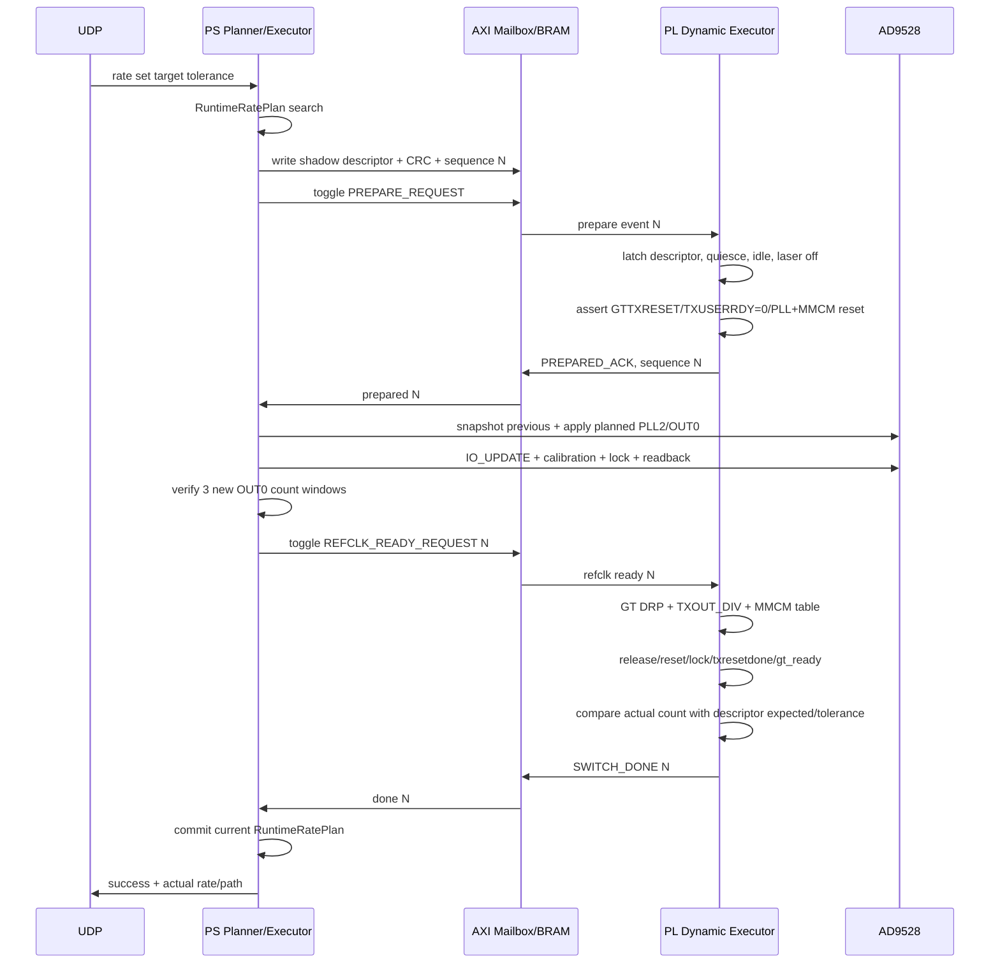

# AD9528 辅助 GTX 运行时速率规划与安全执行接口设计

## 1. 设计目标与当前停止点

本设计替代“为每个 AD9528 实验速率分配固定 `rate_id`”的旧方向。新路径为：

```text
UDP目标速率
-> PS运行时精确规划
-> 独立AXI mailbox写入GT/MMCM descriptor
-> PL PREPARE并进入安全复位
-> PS配置并验证AD9528 OUT0
-> PL执行GT/MMCM参数
-> VERIFY_RATE
-> 成功提交或恢复previous plan
```

本文是进入大规模 RTL/BD/Vitis 修改前的设计冻结稿。当前未实现 mailbox、未修改 RTL/BD/XDC/Vitis、未生成新 bit/LTX/XSA/ELF。

现有固定路径保持：

- `rate_id=0..11` 编码和普通固定 profile 行为不变；
- 500/625/1000/1250/2000/2500/3125/4000/5000/6250/10000 Mbps 正式 profile 不重编号；
- `3000M + FIXED_125M_CPLL` 保持 `BLOCKED / NO_LEGAL_VERIFIED_125M_CPLL_PROFILE`；
- 新运行时 descriptor 不占用 `rate_id=12..15`。

用户提供的 TEST0 上板证据记录为 AD9528 功能能力证据：

```text
configured_out0_hz=124416000
measured_out0_hz=124412000
measurement_windows=3
measurement_alive=1
measurement_in_range=1
readback_ok=1
pll2_functionally_measured=1
snapshot_restored=1
rollback_success=1
restore后GT_STATUS=0x00000017
```

该证据等级为 `AD9528_PLL2_FUNCTIONAL_OUTPUT_VERIFIED`，不等价于任何新 GTX 线速率已 board verified。

## 2. 运行时规划器数据模型

规划器运行在 PS/Vitis，不进入 PL。所有频率、误差和合法性判断使用整数、有理数或交叉相乘，不用二进制浮点决定合法性。

建议接口：

```c
typedef struct {
    uint64_t requested_line_rate_bps;
    uint32_t preferred_error_ppm;
    uint32_t maximum_error_ppm;
    uint8_t allowed_pll_type;          /* CPLL/QPLL/BOTH */
    uint8_t allowed_implementation;    /* default AD9528_OUT0 */
} RuntimeRatePlanRequest;

typedef struct {
    uint64_t requested_line_rate_bps;
    uint64_t actual_line_rate_bps;
    int32_t line_rate_error_ppm;

    uint8_t ad9528_r1;
    uint16_t ad9528_n2;
    uint8_t ad9528_m1;
    uint16_t ad9528_out_div;
    uint32_t ad9528_pfd_hz;
    uint32_t ad9528_vco_hz;
    uint32_t ad9528_out0_hz;
    uint32_t ad9528_expected_count;
    Ad9528RegisterPlan ad9528_register_plan;

    uint8_t gt_pll_type;
    uint8_t gt_refclk_div;
    uint8_t gt_fbdiv;
    uint8_t gt_fbdiv_45;
    uint8_t gt_txout_div;
    uint32_t gt_vco_hz;

    MmcmRegisterPlan mmcm_register_plan;
    uint32_t txoutclk_hz;
    uint32_t txusrclk_hz;
    uint32_t txusrclk2_hz;
    uint32_t verify_expected_count;
    uint32_t verify_tolerance;

    uint8_t implementation_path;
    uint8_t plan_executable;
    uint8_t evidence_level;
    uint16_t rejected_reason;
} RuntimeRatePlan;
```

`RuntimeRatePlan` 是一次事务对象，不分配永久 `rate_id`。PS 只把 GT/MMCM descriptor 写入 PL mailbox；AD9528 参数留在 PS 内执行。

## 3. 合法参数集合与搜索方法

离线生成器只生成合法集合，不生成目标速率 profile：

| 集合 | 当前规模审计 | 运行时用途 |
|---|---:|---|
| 唯一 AD9528 OUT0 合法配置 | 1319 | 按所需 refclk 搜索邻近值 |
| CPLL 原始参数组合 | 80 | 与 AD9528 OUT0 联合求 line rate |
| QPLL 原始参数组合 | 160 | 与 AD9528 OUT0 联合求 line rate |
| TXOUT_DIV | 包含于上述组合 | line-rate 计算和排序 |
| MMCM ratio 候选 | 每个 GT 候选最多约 63 个 multiplier | 验证 VCO/output divider 和生成 XAPP888 DRP 表 |

运行时不做 1319×240×全部 MMCM 的无界暴力搜索。建议流程：

1. 遍历有限 GT 参数元组；
2. 根据目标线速率反推所需 MGT refclk 有理数；
3. 在按 OUT0 频率排序的 1319 项 AD9528 表中二分查找邻近配置；
4. 用 64-bit 交叉相乘计算 line-rate 和 signed ppm；
5. 只对误差在 maximum tolerance 内的少量候选执行 MMCM 搜索；
6. 按误差、AD9528 VCO margin、GT VCO margin、MMCM margin、寄存器差异和当前 PLL/TXOUT_DIV 进行稳定排序。

同一输入、当前配置和约束必须得到确定的首选候选。若无候选落入 maximum tolerance，返回 `NO_LEGAL_PLAN_WITHIN_TOLERANCE` 和最近候选，但 `plan_executable=0`。

预计静态表约 40–80 KiB，取决于字段压缩方式。预计单次搜索评估数为数百个 GT 反推点加少量 MMCM 候选，而不是数十万完整组合。目标运行时间建议小于 100 ms，硬上限建议 500 ms；实际 Cortex-A9 时间必须在实现后基准测试，当前不宣称已满足。

## 4. UDP 输入与十进制定点语义

命令：

```text
rate plan <target_mbps>
rate plan <target_mbps> tolerance_ppm=<value>
rate set <target_mbps>
rate set <target_mbps> tolerance_ppm=<value>
rate status
rate abort
```

目标速率使用十进制定点解析。示例：

```text
2999.5 Mbps -> 2999500000 bps
```

解析规则：

- 最多接受 3 位 Mbps 小数，即 1 kbps 分辨率；
- 拒绝负数、指数形式、空字符串、多余字符和 uint64 overflow；
- 不经 `double`/`float`；
- `rate plan` 永不写 mailbox、AD9528 或 PL；
- `rate set` 只有在 `plan_executable=1` 时进入事务。

`rate plan` 返回 requested/actual/error、AD9528、GT、user-clock、verify 和 executable/reason。`rate set` 额外返回 transaction sequence、事务状态、failed stage 和 rollback 结果。

## 5. PS/PL 职责边界

| 功能 | PS/Vitis | PL |
|---|---|---|
| 目标字符串解析 | 是 | 否 |
| 合法参数联合搜索/排序 | 是 | 否 |
| AD9528 R1/N2/M1/OUT divider | 计算并执行 | 不可见 |
| AD9528 SPI/IO_UPDATE/calibration/lock/readback | 是 | 否 |
| OUT0 三窗口测频判定 | 读取并判定 | 提供原始计数/status |
| GT 参数 shadow descriptor | 写入 | PREPARE 时锁存 |
| MMCM DRP 表 | 生成并写 mailbox RAM | 锁存并执行 |
| TX quiesce/reset/TXUSERRDY | 发起事务 | 执行 |
| CPLL/QPLL/TXOUT_DIV/MMCM DRP | 否 | 执行 |
| current rate/plan commit | SWITCH_DONE 后 | VERIFY_RATE 后产生 DONE |
| previous-plan rollback 编排 | 主控 | 恢复已锁存 previous GT/MMCM |

PL 不接收 AD9528 register plan，不理解 R1/N2/M1，也不维护目标速率目录。

## 6. 独立动态参数 mailbox 架构

当前实际地址图为：

```text
0x40000000 现有laser control/status AXI GPIO
0x40020000 GT status AXI GPIO
0x40030000 AD9528 measurement AXI GPIO
0x41200000 现有pattern/config BRAM
```

建议新增两个独立外设，最终地址需由 Vivado address editor 验证：

```text
0x40040000 dynamic mailbox control/status AXI GPIO，64 KiB
0x42000000 dynamic descriptor AXI BRAM，建议4 KiB映射
```

不得复用或覆盖现有 pattern BRAM。

### 6.1 Control GPIO channel 1：PS -> PL

| Bit | 名称 | 语义 |
|---:|---|---|
| 0 | PREPARE_TOGGLE | 新 PREPARE 事件 |
| 1 | REFCLK_READY_TOGGLE | AD9528 已验证事件 |
| 2 | ABORT_TOGGLE | PS 阶段失败，要求恢复 previous |
| 3 | ROLLBACK_READY_TOGGLE | PL 阶段失败后，PS 已恢复 previous AD9528 |
| 31:4 | reserved | 必须写 0 |

### 6.2 Status GPIO channel 2：PL -> PS

| Bit | 名称 | 语义 |
|---:|---|---|
| 0 | BUSY | 动态事务占用 |
| 1 | PREPARED_ACK | 已锁存 descriptor 并进入安全复位 |
| 2 | SWITCH_DONE | VERIFY_RATE 成功 |
| 3 | SWITCH_ERROR | 切换失败，TX保持安全状态 |
| 4 | ROLLBACK_DONE | previous GT/MMCM 已恢复并验证 |
| 5 | DESCRIPTOR_VALID | magic/version/count/CRC/范围检查通过 |
| 6 | VERIFY_PASS | 当前 transaction verify 通过 |
| 7 | SEQUENCE_ERROR | 请求 sequence 与锁存值不一致 |
| 15:8 | FAILED_STAGE | 失败阶段枚举 |
| 31:16 | TRANSACTION_SEQUENCE_LOW | 快速轮询用低 16 位 |

完整 32-bit sequence、error code 和 previous state 放入 descriptor status region，避免截断。

### 6.3 Descriptor BRAM shadow 区

| Word offset | 字段 |
|---:|---|
| 0x00 | magic=`RTP1` |
| 0x01 | version / descriptor word count |
| 0x02 | TRANSACTION_SEQUENCE |
| 0x03 | descriptor CRC32 |
| 0x04 | flags / implementation path |
| 0x05..0x06 | requested_line_rate_bps |
| 0x07..0x08 | actual_line_rate_bps |
| 0x09 | signed error_ppm |
| 0x0A | GT_PLL_TYPE / REFCLK_DIV / FBDIV_45 / FBDIV |
| 0x0B | TXOUT_DIV / GT parameter flags |
| 0x0C | VERIFY_EXPECTED_COUNT |
| 0x0D | VERIFY_TOLERANCE |
| 0x0E | MMCM_DRP_WRITE_COUNT，最大16 |
| 0x0F | reserved |
| 0x20..0x3F | 16项MMCM：每项2 words，address/mask + value |
| 0x60 | PL status完整sequence echo |
| 0x61 | ERROR_CODE / FAILED_STAGE / ROLLBACK_STATE |
| 0x62 | PREVIOUS_GT_STATE摘要 |
| 0x63 | FINAL_GT_STATUS |

PS 完成整个 shadow descriptor 和 CRC 后才能翻转 PREPARE。PL 在 PREPARE 时把 header、GT 参数、verify 参数和 MMCM 表一次性复制到 active registers/RAM；事务执行期间不再读取可被 PS 改写的 shadow 区。

## 7. 两阶段握手时序



必须同时匹配 state 和完整 transaction sequence。旧 ACK/DONE 不得满足新事务。

## 8. 失败与 previous-plan 回滚

### 8.1 PS/AD9528 阶段失败

```mermaid
sequenceDiagram
    participant PS
    participant CLK as AD9528
    participant PL
    PS->>CLK: apply target fails
    PS->>CLK: restore previous register image
    PS->>CLK: verify previous lock/readback/3 windows
    PS->>PL: ABORT_REQUEST sequence N
    PL->>PL: restore latched previous GT/MMCM/verify parameters
    PL->>PL: lock/ready/previous-rate verify
    PL-->>PS: ROLLBACK_DONE N
    PS->>PS: keep previous current plan; restore laser enable
```

### 8.2 PL 阶段失败

```mermaid
sequenceDiagram
    participant PS
    participant CLK as AD9528
    participant PL
    PL-->>PS: SWITCH_ERROR N + failed_stage
    PL->>PL: keep TX in safe reset
    PS->>CLK: restore previous AD9528 image/profile
    PS->>CLK: verify previous OUT0
    PS->>PL: ROLLBACK_READY N
    PL->>PL: restore previous GT PLL/TXOUT_DIV/MMCM/verify
    PL->>PL: lock/ready/previous-rate verify
    PL-->>PS: ROLLBACK_DONE N
    PS->>PS: keep previous current plan; restore laser enable
```

若 previous plan 是 board baseline，才允许恢复 baseline；否则必须恢复上一运行时 plan。任何 rollback 分支都不能只恢复 AD9528 或只恢复 GT/MMCM。

## 9. PL 状态机定义

建议动态 executor 独立于 legacy rate-id FSM：

```text
IDLE
QUIESCE
PREPARED
WAIT_REFCLK_READY
APPLY_GT
WAIT_PLL_LOCK
APPLY_MMCM
WAIT_MMCM_LOCK
RELEASE_GT
WAIT_TXRESETDONE
VERIFY_RATE
DONE
ERROR
WAIT_ROLLBACK_READY
ROLLBACK
ROLLBACK_VERIFY
```

Legacy FSM 与 dynamic executor 对同一 GT/MMCM DRP/reset 资源必须经过唯一 arbiter；任一 executor busy 时拒绝另一类请求。禁止复制两套同时可驱动 DRP/reset 的逻辑。

## 10. 现有 rate_id 兼容方案

- `gpio_ctrl[16:13]` 和 `gpio_ctrl[17]` 保持原定义；
- 固定 `rate set 500...10000` 可以继续走 legacy exact profile；
- 新动态路径只通过独立 mailbox；
- 不把 12–15 解释为运行时目标速率；
- 若内部需要命令类型，使用 mailbox 的 `DYNAMIC_PLAN_MODE` flag，不占用 legacy `rate_id`；
- `rate status` 同时报告 legacy current ID（若适用）和当前 runtime requested/actual bps/implementation path。

同一目标可以同时有：

```text
3000M / FIXED_125M_CPLL / BLOCKED
3000M / AD9528_OUT0 / runtime search result
```

二者是路径相关记录，不能按速率数字互相覆盖。

## 11. ILA 规划

ILA 时钟保持 `gt_ctrl_clk` 或 `clk_fpga_0`。至少观察：sequence、四种 request/ack、dynamic state、active GT parameters、MMCM DRP、PLL/MMCM/GT reset-lock-ready、verify expected/actual/pass、failed stage 和 rollback state。

不得让 debug hub 使用 TXUSRCLK2，也不得因为 probe 数量不足截断 sequence、expected count 或实际 count。若现有 probe 容量不足，应在 BD 变更阶段先给出 probe/depth/resource 取舍，再刷新 ILA。

## 12. 实施分阶段与验证门

后续实现应拆为可审计提交，但属于同一 feature：

1. 运行时合法集合生成器、十进制定点解析、PS planner 和 host tests；
2. mailbox RTL + BRAM descriptor + 两阶段握手 testbench；
3. GT/MMCM executor 资源仲裁与 previous-state rollback；
4. 通用 AD9528 runtime apply/previous restore；
5. UDP 集成、ILA、BD/XDC/XSA；
6. Vivado/Vitis 全构建；
7. 用户上板日志后才更新 board-verified 结论。

进入 RTL 前必须先确认：

- mailbox GPIO/BRAM 最终 base address；
- descriptor 最大 MMCM 写项是否固定为 16；
- dynamic executor 与 legacy executor 的唯一 DRP/reset arbiter；
- Bank110 `IBUFDS_GTE2.O -> GTNORTHREFCLK0` 专用路由主工程实现方式；
- CPLL/QPLL REFCLKSEL 仅在安全 reset 状态改变；
- Vitis platform/BSP 将从新 XSA 重新生成。

## 13. 当前结论与边界

修正后的架构不受 4-bit rate ID 剩余编号限制，允许用户输入任意十进制目标速率并由 PS 搜索合法的 AD9528/GT/MMCM 组合。PL 只执行经过 mailbox 锁存和校验的 descriptor。

当前仅完成设计确认，尚未实现或证明：

- 任意目标速率规划器已经在 Vitis 上运行；
- mailbox/BRAM/两阶段握手已实现；
- Bank110 到 Bank111 主工程 GTNORTHREFCLK 已接通；
- 动态 AD9528 + GT + MMCM 联合切换已上板；
- rollback fault injection 已通过；
- 新速率、外部光口、BER、眼图或长期稳定性已验证。
