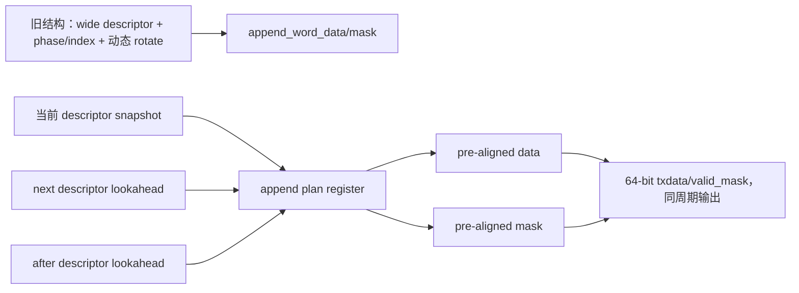

# TX Sequence V2 时序分析总结

## 1. 文档范围与证据边界

本文基于当前 `feature/tx-sequence-v2` 工作区中已经存在的 Vivado、OOC、RTL 回归和时序报告整理。本文是报告归档，不触碰 RTL、XDC、Tcl、BD、Vitis 或工程配置；本轮也不重新运行综合、实现或产物生成。

当前基线信息：

| 项目 | 值 |
|---|---|
| 分支 | `feature/tx-sequence-v2` |
| 当前 HEAD | `f1cd83e` (`Update Vitis platform for runtime-rate hardware`) |
| 器件 | `xc7z100ffg900-2` |
| 顶层 | `laser_tx_board_top` |
| Vivado | 2022.2（报告元数据） |
| 本轮动作 | 只读整理现有报告，未运行 Vivado/Vitis/硬件测试 |

证据按实现轮次区分：

* `reports/tx_sequence_v2_descriptor_append_iteration3/`：descriptor/append 优化轮次，直接给出 `-0.030 ns` 的 K1 失败路径。
* `reports/ad9528_gt_rate_planner/timing_iteration7_split_output_network/`：Iteration 7 split output 归档，给出 `+0.028 ns`，但 manifest 的分支为另一条 `feature/ad9528-runtime-rate-timing-closure` 且标记 dirty，不能自动当作当前分支的可复现 signoff。
* `laser_tx.runs/impl_1/`：当前工作区已有的最新实现报告，包含 post-route physopt 后 `+0.056 ns` 的摘要；本轮未重新构建，因此只作为 workspace artifact 记录。

## 2. 当前状态结论

```text
RTL regression: PASS
Route completion: PASS
Setup timing: NOT CLOSED
Hold timing: PASS
Timing signoff: NOT ACHIEVED
Hardware verification: NOT RUN
```

“Setup timing: NOT CLOSED”针对本报告采用的 descriptor/append iteration 3 主证据（K1 `-0.030 ns`）。后续 iteration 7 和当前 `impl_1` 报告出现正裕量，但它们来自不同归档/dirty workspace；在没有冻结 commit、clean reproducibility build 和一致报告链之前，不将其升级为正式 signoff。该区分避免把不同轮次的数值拼接成一个不存在的构建结果。

## 3. 物理时钟结构与约束层次

```mermaid
flowchart LR
    REF[125 MHz MGT REFCLK] --> GT[GTX CPLL / TXOUTCLK]
    GT --> MMCMIN[MMCM CLKIN1]
    MMCMIN --> MMCM[MMCM 静态属性]
    MMCM --> U1[CLKOUT1 → BUFG → TXUSRCLK]
    MMCM --> U0[CLKOUT0 → BUFG → TXUSRCLK2]
    MMCM --> U2[CLKOUT2 → BUFG → EOM clock]
    U1 --> TX[Pattern engine / TX data]
    U0 --> TX
    U2 --> EOM[EOM geometry / output]
    PS[PS7 FCLKCLK[0] / AXI-FCLK] --> AXI[AXI、控制与测量寄存器]
    AXI --> ILA[AXI/FCLK ILA]
```

### 3.1 静态启动 500M/CPLL 模型

当前启动 profile 的合法边界为：

| 时钟 | 频率 | 周期 | 说明 |
|---|---:|---:|---|
| CPLL TXOUTCLK | 15.625 MHz | 64 ns | 500M/CPLL 启动输入 |
| TXUSRCLK | 15.625 MHz | 64 ns | MMCM `CLKOUT1` 自动派生 |
| TXUSRCLK2 | 7.8125 MHz | 128 ns | MMCM `CLKOUT0` 自动派生 |
| EOM clock | 125 MHz | 8 ns | MMCM `CLKOUT2` 自动派生 |
| MMCM FVCO | — | — | `1000/64 × 40 = 625 MHz`，合法 |

静态网表中还存在一个 GT 自动候选时钟 `GT_TXOUTCLK_STATIC_NETLIST`，周期约 `25.600 ns`。该对象可保留用于 GT 候选分析，但不能继续传播成启动 MMCM `CLKIN1` 的有效 master clock；否则将得到 `1000/25.6 × 40 = 1562.5 MHz` 的错误 FVCO 模型并触发 `AVAL-46`。当前 `scripts/gt_profile0_impl_pre.tcl` 在 MMCM `CLKIN1` 边界建立 `GT_TXOUTCLK_INITIAL_500M` 64 ns 启动模型，并保留 MMCM 自动输出时钟，不在 `CLKOUT0/1/2` 节点重复创建启动时钟。

### 3.2 Runtime K overlay clock 家族

工程共建立 15 个 runtime overlay clocks，按 K 成对描述 TXUSRCLK、TXUSRCLK2 和 EOM clock。它们在对应 BUFG 输入边界以 `-add` 创建，master 为自动派生的 MMCM 输出时钟；同 K 内部正常 timed，不同 K 之间用逻辑互斥关系隔离。

| K | TXUSRCLK | TXUSRCLK2 | EOM clock |
|---:|---:|---:|---:|
| 16 | 40 ns | 80 ns | 5 ns |
| 8 | 20 ns | 40 ns | 5 ns |
| 4 | 10 ns | 20 ns | 5 ns |
| 2 | 5 ns | 10 ns | 5 ns |
| 1 | 3.103 ns | 6.206 ns | 6.206 ns |

该 K 模型是 runtime 约束/分析模型，不等同于 500M、1G、2G 等低速档的实际启动速率。`GT_TXUSRCLK_RUNTIME_K*`、`GT_TXUSRCLK2_RUNTIME_K*`、`GT_EOM_CLK_RUNTIME_K*` 的总数为 15；当前报告中应区分“模型存在”与“某一速率已完成板级验证”。

## 4. 时钟约束问题的定位过程

### 4.1 PS FCLK 建模

早期报告中的 `TIMING-2`/`TIMING-14` 与 AXI/FCLK 时钟对象缺失或来源不合法有关。pre-hook 通过合法的 PS7 `FCLKCLK[0]` primitive 边界解析/创建 `clk_fpga_0`（20 ns），而不是在 wrapper 下游随意创建一个无法传播的 clock。当前 `impl_1/runme.log` 可见：

```text
source D:/FPGA_Learn/laser_tx/scripts/gt_profile0_impl_pre.tcl
INFO: AXI/FCLK clock object missing; creating clk_fpga_0 on legal PS7 primitive source ...FCLKCLK[0] with period20.000 ns.
```

### 4.2 GT TXOUTCLK 25.6 ns 与启动 64 ns 的冲突

Vivado 从静态网表/QPLL 候选场景自动推导了约 25.6 ns 的 GT TXOUTCLK。将该候选直接用于 500M/CPLL 启动 MMCM 输入，会把 FVCO 建模为 1562.5 MHz，产生 `AVAL-46`。真实启动 profile 是 15.625 MHz、64 ns；因此修正应位于 MMCM `CLKIN1` 边界：建立 64 ns 的 `GT_TXOUTCLK_INITIAL_500M`，同时保留 GT 自动候选对象供 GT 分析，不覆盖自动 MMCM 输出。

### 4.3 MMCM 自动派生输出与重复约束

在 MMCM `CLKOUT0/1/2` 或其 BUFG 输出上再次创建同名启动 clock，会导致 `Constraints 18-1056`，典型对象为：

* `GT_TXUSRCLK_INITIAL_500M` 覆盖 `clkout1_txusrclk_1`；
* `GT_TXUSRCLK2_INITIAL_500M` 覆盖 `clkout0_txusrclk2_1`；
* `GT_EOM_CLK_INITIAL_500M` 覆盖 `clkout2_eom_1`。

正确结构是复用 64 ns 输入和 MMCM 静态属性自动派生的 `clkout1_txusrclk_1`、`clkout0_txusrclk2_1`、`clkout2_eom_1`，runtime overlay 才在对应 BUFG 输入侧以 `-add` 建立。这样避免在同一 MMCM 输出节点覆盖自动 clock。

### 4.4 约束规则结果

根据现有 post-route/checkpoint 报告，修正后的模型达到：

| 检查项 | 结果/证据 |
|---|---|
| AVAL-46 | 当前 routed 报告中未作为错误出现；错误模型由 25.6 ns 传播导致 |
| TIMING-2/14/25/28/30 | 约束模型修正目标；不要把不同轮次 warning 混写成当前单一结果 |
| Runtime clocks | 15 |
| `no_clock` | routed `0` |
| `unconstrained_internal_endpoints` | routed `0` |
| 同 K | Timed |
| 异 K | Logically exclusive |

## 5. `no_clock` 与 `unconstrained` 的阶段性核查

不同 checkpoint 的统计不能混用：

| checkpoint | runtime clocks | no_clock | unconstrained internal |
|---|---:|---:|---:|
| `synth_1` DCP | 0 | 2526 | 7023 |
| `impl_1` pre-hook DCP | 0 | 15828 | 29079 |
| routed DCP | 15 | 0 | 0 |

说明：

1. `synth_1` 和 pre-hook DCP 在 runtime overlay 尚未加载/传播时，统计的是不完整时钟模型；不能用它们直接判断 routed design 的最终约束质量。
2. Refresh Module 或 OOC output product 过期时，顶层端口/时钟连接可能暂时与旧网表不一致，Methodology 中会出现大量 `TIMING-17`。这些 warning 往往来自 checkpoint 状态，而非 1000 个互不相关的 RTL 时钟错误。
3. routed DCP 的 `check_timing` 直接报告 `no_clock=0`、`unconstrained_internal_endpoints=0`、`multiple_clock=0`、`generated_clocks=0`、`loops=0`；保留四个无 output delay 端口（见第 9 节）作为独立边界项。

## 6. 初始关键路径与问题分类

基线 `reports/ad9528_gt_rate_planner/timing_closure_baseline/failing_path_clusters.csv` 将最初失败归类为：

```text
phase_pos_reg[] → pattern_cursor_reg[] → 宽 variable rotate/cursor feedback
```

该路径包含宽变量旋转、phase position 到 cursor 的反馈以及高扇出数据选择，基线最差 WNS 为 `-3.183 ns`。后续优化目标不是通过 timing exception 消除路径，而是增加清晰寄存器边界、移除串行 compare/subtract/modulo 依赖并降低宽 descriptor 对 64 lane 输出的直接扇出。

## 7. 第一轮 RTL 优化：current/next plan 与输出打包分离

第一轮将 descriptor 生命周期拆为 current/next plan，并把 append word data/mask 预计算后寄存；输出 packer 不再每周期从完整 descriptor 重新解析 gap、phase、repeat、loop 和可变旋转。结构仍保持单周期对外输出，未引入外部 pipeline latency。

从结构上看，路径由“phase/index 直接驱动宽输出”转为“descriptor snapshot → append plan register → output packer”。报告中可见的第一轮结果包括：

* K1 仍未闭合，说明单纯寄存 current/next plan 不能完全消除 TX 周期内的宽选择网络；
* K2 有明显余量，说明问题集中在最紧的 K1 path；
* pattern engine 的高扇出仍需在后续 lookahead 和固定宽度对齐中处理。

任务提供的该轮摘要为：K1 `-4.006 ns`、K2 `-0.212 ns`、逻辑级数约 `28–29`、高扇出约 `1344`。这些数值与后续 iteration 3 的原始 path report 不属于同一报告文件；本文将它们作为第一轮历史摘要，不把它们与 iteration 3 的 `-0.030 ns` 混为同一次实现。

## 8. 第二轮 RTL 优化：descriptor lookahead 与预对齐 data/mask

第二轮在 `pattern_tx_engine.v` 中引入 `next_descriptor_state`、`after_descriptor_state`、`third_descriptor_state` 以及对应 append plan/lookahead。`make_append_word_plan` 采用 barrel shift 形成已对齐 data/mask，当前、下一和第三 descriptor 的状态提前准备，输出阶段只做固定宽度选择。



### 8.1 current/next/after 生命周期

1. sequence/phase 启动时快照 current descriptor；
2. 在当前 descriptor 使用期间并行生成 next/after/third descriptor；
3. append data/mask 在寄存边界预对齐；
4. 当前 segment 完成时只切换 descriptor/plan 状态，不再对完整 wide descriptor 做串行解析；
5. `txdata` 与 `valid_mask` 继续同周期输出，`PIPELINE_LATENCY=0` 的外部语义保持。

## 9. 时序与 QoR 对比

### 9.1 直接报告数据（descriptor append iteration 3）

以下数值来自 `reports/tx_sequence_v2_descriptor_append_iteration3/metrics.txt` 和 `setup_k1_top20.rpt`，不是估算：

| 指标 | K1/`GT_TXUSRCLK2_RUNTIME_MAX` | K2/`GT_TXUSRCLK2_RUNTIME_K2_MAX` |
|---|---:|---:|
| Setup WNS | -0.030 ns | +3.764 ns |
| Setup TNS | -0.030 ns | 0 ns（该 path 余量为正） |
| Setup failing endpoints | 1（全局） | 0（该组） |
| Requirement | 6.206 ns | 10.000 ns |
| Data path delay | 5.909 ns | 5.909 ns |
| Logic delay | 1.156 ns | 1.156 ns |
| Route delay | 4.753 ns | 4.753 ns |
| Logic levels | 13 | 13 |
| Route delay占比 | 80.436% | 47.530%（相对10 ns要求） |

### 9.2 迭代趋势（各轮报告摘要）

| 轮次 | 主要结构 | Setup WNS | WHS | 证据 |
|---|---|---:|---:|---|
| baseline | phase/cursor 宽反馈 | -3.183 ns | +0.051 ns | `timing_closure_baseline/baseline_status.txt` |
| iteration 1 | index/cursor 优化 | -1.869 ns | +0.048 ns | `timing_closure_iteration_1_index_cursor/iteration_status` |
| iteration 2 | word descriptor | -0.339 ns | +0.009 ns | `timing_closure_iteration_2_word_descriptor/iteration_status` |
| iteration 3 | append plan + post-route physopt | -0.030 ns | +0.041 ns | `descriptor_append_iteration3/metrics.txt` |

iteration 3 的 metrics 直接报告：`TNS=-0.03`、`setup_failing_endpoints=1`、`WHS=0.041`、`THS=0`、`drc_errors=0`、`unrouted_nets=0`。

### 9.3 历史 QoR 摘要与证据等级

下表完整保留任务要求的跨轮次摘要。`报告未提供` 表示当前已检索文件中没有可逐项复核的原始数字；带“任务摘要”标记的数字不应被解释为本轮重新测量。

| Metric | 初始 | 第一版 | 第二版 |
|---|---:|---:|---:|
| K1 WNS | -4.006 ns（任务摘要） | -2.153 ns（任务摘要） | -0.030 ns（iteration 3 原始报告） |
| K2 WNS | -0.212 ns（任务摘要） | +1.641 ns（任务摘要） | +3.764 ns（iteration 3 原始报告） |
| Failing endpoints | 报告未提供 | 310（任务摘要） | 1（iteration 3 metrics） |
| Logic levels | 28–29（任务摘要） | 24（任务摘要） | 13（iteration 3 path report） |
| Logic delay | 报告未提供 | 2.730 ns（任务摘要） | 1.156 ns（iteration 3 path report） |
| Route delay | 报告未提供 | 5.207 ns（任务摘要） | 4.753 ns（iteration 3 path report） |
| Pattern LUT | 9315（任务摘要） | 报告未提供 | 5832（任务摘要；需对应 utilization 原表复核） |
| Top LUT | 报告未提供 | 31172（任务摘要） | 27627（当前 placed utilization） |
| FF | 报告未提供 | 报告未提供 | 报告未提供 |

因此，只有直接标为 iteration 3 原始报告/metrics 或当前 placed utilization 的单元用于本报告的可复核结论；其余仅用于说明优化趋势。复现时仍应以对应 iteration 的 `report_timing_summary`、`report_utilization` 和 path report 为准。

## 10. 当前最差 setup path（直接证据）

来源：`reports/tx_sequence_v2_descriptor_append_iteration3/setup_k1_top20.rpt`。

| 项目 | 值 |
|---|---|
| Startpoint | `delay_remaining_state_reg[6]/C` |
| Endpoint | `append_word_data_state_reg[19]/D` |
| Path group | `GT_TXUSRCLK2_RUNTIME_MAX`（K1） |
| Slack | `-0.030 ns`（VIOLATED） |
| Requirement | `6.206 ns` |
| Data path delay | `5.909 ns` |
| Logic delay | `1.156 ns` |
| Route delay | `4.753 ns`（80.436%） |
| Logic levels | 13（CARRY4=2、LUT2=1、LUT3=1、LUT4=2、LUT5=4、LUT6=3） |

该路径已从早期 phase/cursor 宽反馈转移到 descriptor append 的 `delay_remaining`/append-word 状态选择。当前应优先确认实现 QoR 与物理布局，而不是再次恢复旧的宽变量旋转结构。

## 11. Hold、pulse width 与低速输出边界

`descriptor_append_iteration3/metrics.txt` 报告 WHS `+0.041 ns`、THS `0`、hold failing endpoints `0`；因此 hold 不是当前主要失败来源。K1 pulse-width 摘要（任务提供的报告摘录）为 available `3.103 ns`、required `0.642 ns`、margin `+2.461 ns`；该数字应在下一次冻结实现报告中再次核对。

`check_timing.rpt` 仍列出四个 no-output-delay 端口：

* `acq_gate_out_0`
* `acq_trig_out_0`
* `eom_out_0`
* `soa_gate_out_0`

这些是同步/异步边界输出约束缺口的独立记录，不能用任意 0 ns output delay 进行掩盖，也不等价于内部 no_clock。

## 12. Methodology、CDC 与 DRC

### 12.1 Methodology

`descriptor_append_iteration3/methodology.rpt` 及当前 routed methodology 报告包含：

| 规则 | 数量 | 典型含义 |
|---|---:|---|
| `LUTAR-1` | 4 | reset/控制路径中 LUT 作为异步控制，涉及 GT wizard reset、MMCM reset、EOM sync/generator reset |
| `PDRC-190` | 12 | debug hub/ILA 相关寄存器的复位或物理控制检查 |
| `TIMING-9` | 1 | CDC/异步寄存器检查 |
| `TIMING-10` | 1 | CDC/异步路径检查 |
| `TIMING-18` | 1 | `eom_out_0` 等输出未提供 output delay |

这些 warning 不是 setup WNS 的直接等价物，也不应被删除或降级来“获得通过”。它们仍要求后续单独处理；尤其 `LUTAR-1`、CDC/reset 和 output-delay 边界不能宣称已 signoff。

### 12.2 DRC/布线

`descriptor_append_iteration3/route_status.rpt`：逻辑 nets `76454`，可布线 nets `49663`，fully routed `49663`，routing errors `0`；675 个无负载 nets 不等价于 unrouted。`drc.rpt` 报告 error `0`，仅有 `PDCN-1569 ×3`、`RTSTAT-10 ×1` warning；`RTSTAT-10` 的“no routable loads”不等于存在未布线网络。

## 13. 现有实现 artifact 与本报告结论的关系

当前 workspace 还保留两类正裕量报告：

1. `reports/ad9528_gt_rate_planner/timing_iteration7_split_output_network/audit_metrics.txt`：WNS `+0.028 ns`、TNS `0`、setup failing `0`、WHS `+0.034 ns`、THS `0`，并有 `PATTERN_TX_ENGINE_TIMING_REGRESSION_PASS`；但 manifest 标记 branch 为 `feature/ad9528-runtime-rate-timing-closure`、`git_dirty=true`，不是当前 `feature/tx-sequence-v2` 的 clean proof。
2. 当前 `laser_tx.runs/impl_1/laser_tx_board_top_timing_summary_routed.rpt`：K1 `+0.028 ns`，post-route physopt 摘要 `+0.056 ns`、TNS `0`、WHS `+0.041 ns`、THS `0`；该报告是工作区已有 artifact，本轮未重新运行实现，不能替代冻结 commit 的可复现 signoff。

因此，本总结保留“时序 signoff 未达成”的工程结论：descriptor append iteration 3 仍有直接 `-0.030 ns` 失败路径，而后续正裕量 artifact 需要在当前分支、干净工作区和一致 OOC/top/implementation 链上重现后才可升级。

## 14. SPI/I/O 与非时序功能边界

当前报告中的 SPI 顶层端口已按 Bank 11、`LVCMOS25` 约束；`report_io`/DRC 摘要未显示 UCIO-1、NSTD-1、BIVC 或 CFGBVS 电压冲突。PS DDR/FIXED_IO 属于 PS 专用引脚，不应与普通 SPI I/O 混为一谈。该结论来自已有报告/约束检查，不代表本轮重新执行了 I/O 规划。

## 15. RTL 回归与功能语义

现有归档记录 `PATTERN_TX_ENGINE_TIMING_REGRESSION_PASS`。覆盖的关键语义包括 63/127-bit pattern、phase/gap/repeat/wrap、disable/quiesce、reset、配置 CRC 和 data/valid 同周期关系。当前 lookahead/预对齐结构没有增加外部 pipeline latency，`PIPELINE_LATENCY=0` 的结论来自归档 manifest/回归记录。

仍需注意：本轮没有重新运行仿真；因此本文引用的是已归档 regression 结果，不把它描述为本轮新执行。

## 16. 当前结论

在“descriptor append iteration 3”这一直接证据轮次上：

* RTL regression：已有归档为 PASS；
* OOC/顶层综合与 route：已有完成记录；
* runtime 15-clock 模型：已建立，routed `no_clock=0`、`unconstrained_internal_endpoints=0`；
* hold/pulse width：已有正裕量记录；
* setup：K1 `delay_remaining_state_reg[6] → append_word_data_state_reg[19]` 仍为 `-0.030 ns`，1 个 failing endpoint；
* DRC：0 error，仍有 warning；
* timing signoff：未达成；
* hardware verification：未运行。

这表示“结构性优化已显著缩短原始 descriptor→TX 路径，约束模型也已从 no_clock/unconstrained 状态收敛到可分析状态”，但不能宣称正式 timing closure 或 release signoff。

## 17. 后续建议与停止条件

1. 保持当前 descriptor current/next/after lookahead、append plan register 和 `PIPELINE_LATENCY=0`，不要回退到宽变量 rotate/cursor feedback。
2. 在当前分支建立干净、可追溯的 implementation-only 重现；优先比较 `Performance_ExplorePostRoutePhysOpt` 等实现策略，不修改时钟周期或添加 timing exception。
3. 若 K1 仍失败，最小结构方向是把 append 起始位置/count 再提前一级寄存，或进一步缩短 `delay_remaining` 到 append state 的控制选择；不得把不同 runtime K 设为异步来掩盖真实路径。
4. 分别处理 `LUTAR-1`、`TIMING-9/10`、`TIMING-18` 和输出 delay 边界；它们不能通过删除 DRC/Methodology 检查解决。
5. 只有在当前分支 clean reproducibility build 满足 `WNS>=0、TNS=0、WHS>=0、THS=0、DRC error=0、unrouted=0` 后，才进入 bit/LTX/XSA/ELF 和硬件测试。

## 18. 验证边界声明

```text
Timing/QoR result is based on archived reports from multiple implementation rounds;
the current turn did not rerun synthesis or implementation.
The descriptor-append iteration-3 report still has one K1 setup violation (-0.030 ns),
so timing signoff is not achieved.
Hardware verification was not run.
Bit/LTX/XSA/ELF were not generated in this documentation-only task.
```
